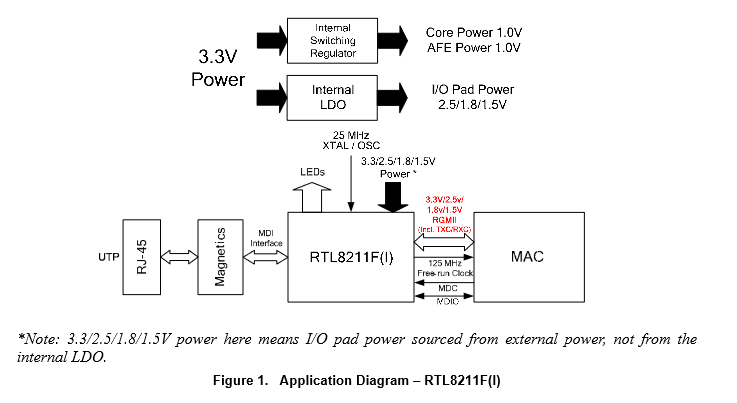

# 以太网基础
## 通信原理图

> [!info] CLOCK
> 125/25MHz Reference Clock Generated from Internal PLL.  This pin should be kept floating if this clock is not used by MAC

1. 首先保证 PHY 的 25MHz 外部晶振正常工作
2. PHY产生125MHz时钟信号（CLKOUT）--->MAC；
3. MAC 通过 MDC、MDIO 进行配置 PHY；

* 如果没有 MDC 和 MIDIO 信号，或者不稳定，就要考虑 PHY-->MAC (CLKOUT 引脚) 的 125M 时钟信号是否匹配，注意测量时钟的幅值和频率，通常需要串一个电阻例如 22 欧，进行匹配。

* 有些情况是 RTL8211 给 MAC 的 125MHz 参考时钟脉冲太大，将 CPU 对应的时钟输入管脚击穿了（可以测一下该管脚的对地阻抗是否正常，来判断是否是此原因）。

## MAC 端驱动配置
-   **phy-mode**： 根据板上所使用的 PHY 的接口进行配置，一般千兆 PHY 为 RGMII， 百兆 PHY 为 RMII。
-   **clock_in_out** ： input 表示由 PHY 提供，output 表示由 GMAC 提供。
-   **clock-frequency**：只有在时钟方向为input时才会使用到，RMII接口时，设为 50M,RGMII接口时设为125M。125M由外部 PHY （CLKOUT）提供，这是因为 RK 主控分出的 clock 不精准，会造成 GMAC 丢包或无法工作。由外部输入的时钟相对于内部 PLL 产生的时钟更加独立，不受内部分频策略的影响，因此更加稳定。而对于 PHY 来说，本身就需要一个 25M 的晶振作为时钟源。
-   **tx\_delay/rx\_delay**： RGMII 接口才需要去配置时序，因为时钟频率更高后更容易受到 PCBlayout走线，电磁干扰等影响，需要更加精确调整。如果有出现测试吞吐率不足的情况，可以适当调整这两个值，范围是 0x0—0x7F。
-   从kernel 4.4 版本开始，各驱动尽可能使用官方 Linux kernel 的代码，官方kernel 中已包含了支持 RK 所使用的 GMAC 的代码框架（很多RK的驱动已经上传到官方kernel,也包括GMAC）。所以往后芯片的 GMAC 驱动会套用此框架。
-   代码位置在 `drivers/net/ethernet/stmicro/stmmac/`，RK 平台相关代码主要位于 `dwmac-rk.c` 中。

 **RGMII: Reduced Gigabit Media Independent Interface**
 

### RGMII
* RGMII 相比于 GMII 减小将近一半的管脚数（**_24_** → **_12_**）
- **1000Mbps**模式下，在时钟的**上***\/**下**边沿均采样数据
- **10/100Mbps**模式，数据仅在时钟**上**升沿采样
-   取消不重要的如 _**CRS**_, **_COL_** 等信号

在RGMII接口中 _**MAC**_ 在 _**TXC**_ 上一直提供时钟信号，而不像在GMII接口中那样，_**10/100Mbps**_ 模式下时钟是由 _**PHY**_ 提供（_**TXCLK**_），而 **_1000Mbps_** 模式下时钟是由 **_MAC_** 提供（_**GTXCLK**_）。在RGMII中应用到源同步时钟，即数据与时钟信号是同步的。这要求在PCB设计中，要对时钟信号额外增加 **_1.5~2 ns_** 的延迟以保证接收端的建立/保持时间满足要求。在 _**RGMII v2.0**_ 规范中有定义MAC/PHY内部延迟（_**RGMII-ID**_），由此避免PCB设计中再要增加这个延迟。

_**RXCTL**_ 和 _**TXCLT**_ 为复用的传输控制信号。**_RXCTL_** 在时钟的上升沿代表 **_RXDV_**，在时钟的下降沿代表（**_RXDV_** xor _**RXER**_）；**_TXCTL_** 在时钟的上升沿代表 **_TXEN_**，在时钟的下降沿代表（**_TXEN_** xor _**TXER**_）。

