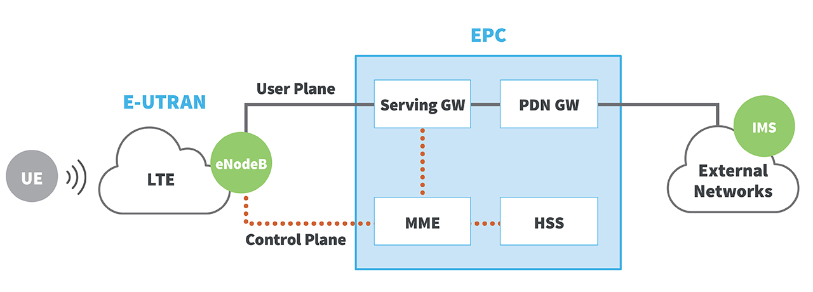

# 蜂窝网络技术
## 名词释义
* **LTE**：代表长期演进

# 网络连接
* **wwan0** - Wireless Wide Area Network Zero
* **ppp0** - Point to Point Protocol Zero
* **GSM** - Global System for Mobile Communications
	* 第二代（2G）移动电话系统
~~~shell
++++++++++++++++ 
+  Cellphone   +  
+  IPad        +  => GSM  
+  Laptop      +    
++++++++++++++++
~~~
GSM connect to the Internet
~~~shell
++++++++++++++++++++++ 
+  GSM               +  
+  -----             +  => Internet  
+  Username/Password +    
++++++++++++++++++++++ 
~~~

~~~txt
wwan0                 ppp0
++++++++++++++++     ++++++++++++++++++++++++++
+  Cellphone   +  => +   GSM                  +
+  IPad        +     +   ----------------     + => Internet
+  Laptop      +     +   Username/Password    +
++++++++++++++++     ++++++++++++++++++++++++++
~~~

> [!info] What is the difference between wwan0 & ppp0 and why do I see ppp0 in addition to wwan0
> * wwan0 is a network interface exposed by the modem via usb
> * ppp0 is the PPP interface created by pppd when the modem gets connected using ATD call in the serial port

# Link & References
* <https://sookocheff.com/post/networking/how-does-lte-work/>
