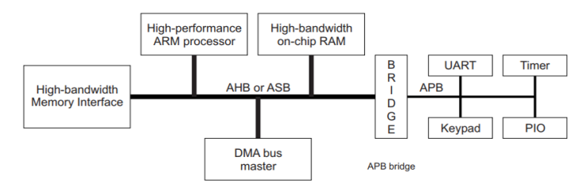
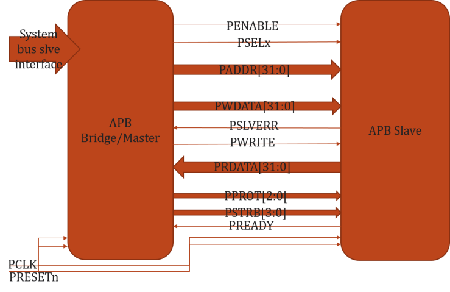
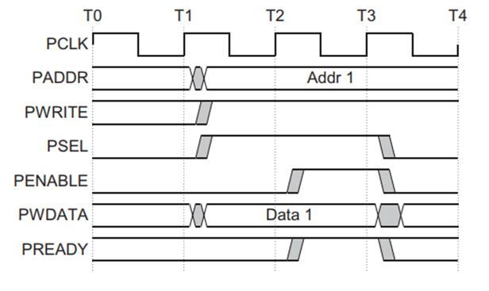
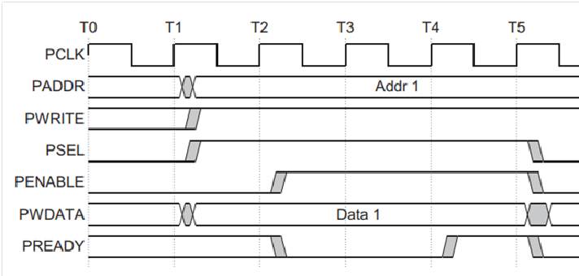
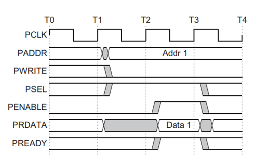
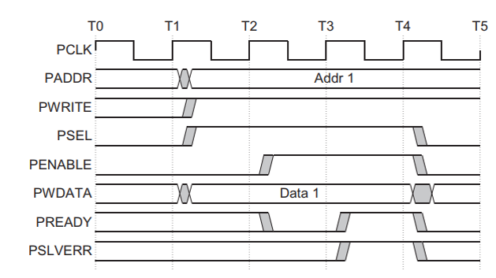
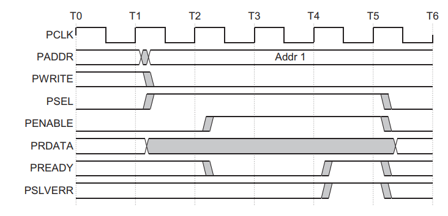
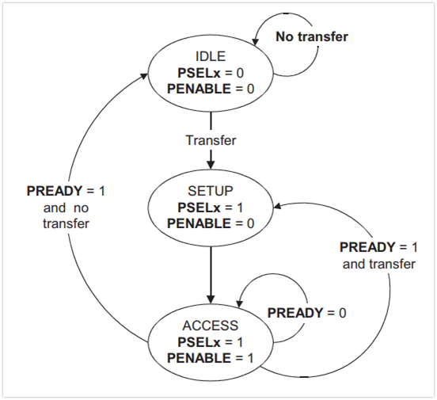

_**Introduction**_  
Advanced Peripheral Bus (APB) is the part of Advanced Microcontroller Bus Architecture (AMBA) family protocols. The latest version of APB is v2.0, which was a part of AMBA 4 realease. It is a low-cost interface and it is optimized for minimal power consumption and reduced interface complexity. Unlike AHB, it is a Non-Pipelined protocol, used to connect low-bandwidth peripherals. Mostly, used to connect the external peripheral to the SOC. In APB, every transfer takes at least two clock cycles (SETUP Cycle and ACCESS Cycle) to complete. It can also interface with AHB and AXI protocols using the bridges in between.

The above diagram depicts a block diagram of a System. The High-performance ARM processor is the Core of the system. The other components like High-bandwidth on-chip RAM, DMA bus master and High-bandwidth Memory Interface are connected to the Core by System bus,which is AHB in this case. The other low bandwidth peripherals like UART, Timer, Keypad and PIO are connected to the System bus through the Bridge by using Peripheral bus, here it is APB bus. In this scenario, the Bridge acts as the AHB Slave corresponding to the Core Master. And it also acts as the APB Master corresponding to remaining low-bandwidth external peripherals.

Generally there won’t be any component that produces the APB transfers. The AHB to APB Bridge is the only component that acts as the APB master in a system.

_**Block Diagram & Signal Description**_

From the block diagram shown above,

-   **System bus slave Interface** – This is the System bus interface which transfers the AHB/AXI transactions to APB Bridge
-   **PCLK** – Generally System clock is directly connected to this
-   **PRESETn** – Active Low Asynchronous Reset
-   **PADDR\[31:0\]** – Address bus from Master to Slave, can be up 32 to bit wide
-   **PWDATA\[31:0\]** – Write data bus from Master to Slave, can be up to 32 bit wide
-   **PRDATA\[31:0\]** – Read data us from Slave to Master, can be up to 32 bit wide
-   **PSELx** – Slave select signal, there will be one PSEL signal for each slave connected to master. If master connected to ‘n’ number of slaves, PSELn is the maximum number of signals present in the system. (Eg: PSEL1,PSEL2,..,PSELn)
-   **PENABLE** – Indicates the second and subsequent cycles of transfer. When PENABLE is asserted, the ACCESS phase in the transfer starts.
-   **PWRITE** – Indicates Write when HIGH, Read when LOW
-   **PREADY** – It is used by the slave to include wait states in the transfer. i.e. whenever slave is not ready to complete the transaction, it will request the master for some time by de-asserting the PREADY.
-   **PSLVERR** – Indicates the Success or failure of the transfer. HIGH indicates failure and LOW indicates Success

Let’s see how a typical Write and Read transfers are done in APB Protocol

_**WRITE Transfer –** Without Wait States_

-   At T1, a write transfer with address PADDR,PWDATA,PWRITE and PSEL starts.
-   They will registered at the next rising edge of PCLK, T2.
-   This is Setup Phase of Transfer.
-   After T2, PENABLE and PREADY are registered at the rising edge of PCLK.
-   When asserted, PENABLE indicates starting of ACCESS Phase
-   When asserted, PREADY indicates that slave can complete the transfer at the next rising edige of PCLK.
-   PADDR, PDATA and control signals all should remain valid till the transfer completes at T3.
-   PENABLE signal will be de-asserted at the end of transfer.

PSEL is also de-asserted, if next transfer is not to the same slave.

_**WRITE Transfer –** With Wait States_

-   During the ACCESS Phase, when PENABLE is high, the slave extends the transfer by driving PREADY low.
-   The PADDR, PWRITE, PSEL, PENABLE, PWDATA, PSTRB, PPROT signals should remain unchanged while PREADY is low
-   PREADY can take any value when PENABLE is low.
-   It is recommended that the address and write signals are not changed immediately after a transfer, but remain stable until another access occurs.

_**READ Transfer –** Without Wait States_

-   At T1, a READ transfer with address PADDR, PWRITE and PSEL starts.
-   They will be registered at rising edge of PCLK.
-   This is SETUP Phase of the transfer.
-   After T2, PENABLE and PREADY are registered at the rising edge of PCLK.
-   When asserted, PENABLE indicates the starting of ACCESS phase.
-   When asserted, PREADY indicates that slave can complete the transfer at next rising edge of PCLK by providing the data on PRDATA.
-   Slave must provide the data before the end of read transfer. i.e. before T3.

_**READ Transfer –** With Wait States_

-   During the ACCESS Phase, when PENABLE is high, the slave extends the transfer by driving PREADY low.
-   The PADDR, PWRITE, PSEL, PENABLE, PPROT signals should remain unchanged while PREADY is low

_**ERROR Response**_

Whenever there is a problem in the transfer, Slave indicates the error response for the transfer by asserting the PSLVERR signal. PSLVERR is only considered valid during the last cycle f and APB transfer, when PSEL, PENABLE and PREADY are all HIGH. It is recommended, but not mandatory that you drive PSLVERR low when it is not being sampled.

Transactions that receive an error response, might or might not have changed the state of peripheral. For example, If APB master performs a write transaction to an APB slave and received an error response, it is not guaranteed that the data is not written on the slave peripheral.

Error Response for a read transfer:

Error Response for a write transfer:

_**Protection Unit Support:**_

             To support complex system designs, it is often necessary for both the interconnect and other devices in the system to provide protection against illegal transactions.  It is provided by Protection Unit in APB Protocol. The signals indicating the protection unit are PPROT\[2:0\].

The three levels of access protection are

-   **PPROT\[0\]:**
    -   LOW indicates Normal Access
    -   HIGH indicates Privileged Access
-   **PPROT\[1\]:**
    -   LOW indicates Secure Access
    -   HIGH indicates Non-Secure Access
-   **PPROT\[2\]:**
    -   LOW indicates Data Access
    -   HIGH indicates Instruction Access

_**Operating States**_

The APB Protocol operates in three operating states as shown below.

**IDLE :**  This is the default state of APB.

**SETUP :** When transfer is required, PSELx is asserted then the bus moves in setup state. Bus only remains in SETUP for only one clock cycle and always moves to ACCESS state on next rising edge of clock. So, the slave must be able to sample the Address and control information in the SETUP cycle itself.

**ACCESS :**  PENABLE is asseted to enter into the ACCESS state. The PADDR, PWRITE, PSELx and PWDATA signals must remain stable during ACCESS state.