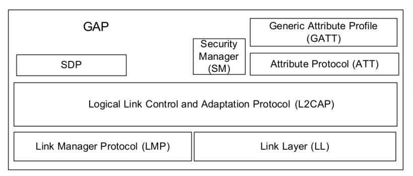
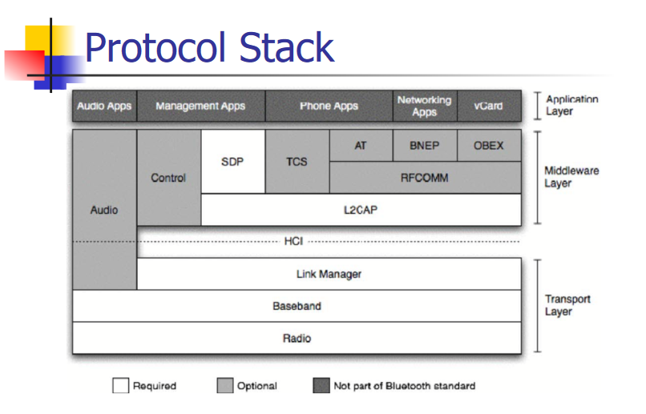

# 蓝牙基本概念
## 蓝牙服务
- 服务
- 属性：Read、Notify、Write、WriteWithout Response
- 特性

### 
## GATT
- BLE 蓝牙的通信协议
- GATT 是一个在蓝牙连接之上的发送和接收很短的数据段的通用规范，这些很短的数据段被称为属性（Attribute）

### GAP 
**GAP 包含**：搜索蓝牙设备（Discovery）、管理连接（Link establishment），还有不同的安全等级（Security）。以及从用户层面访问一些参数的方式。GAP 给设备定义了若干角色，其中主要的两个是：外围设备（Peripheral）和中心设备（Central）。
- **外围设备**：这一般就是非常小或者简单的低功耗设备，用来提供数据，并连接到一个更加相对强大的中心设备，例如：蓝牙手环
- **中心设备**：中心设备相对比较强大，用来连接其他外围设备，例如手机。
GATT 定义两个 BLE 设备通过叫做 Service 和 Characteristic 的东西进行通信，他使用了 ATT（Attribute Protocol）协议，需要说明的是，GATT 连接必需先经过 GAP 协议

> [!attention]
> 特别注意的是：GATT连接是独占的。也就是一个BLE外设同时只能被一个中心设备连接。一旦外设被连接，它就会马上停止广播，这样它就对其他设备不可见了。当设备断开，它又开始广播。中心设备和外设需要双向通信的话，唯一的方式就是建立GATT连接。

## 蓝牙协议栈
