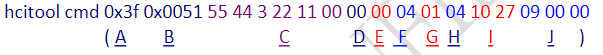

# Android 调试
1. `cat /sys/bus/sdio/devices/mmc2/`
2. Android 蓝牙 HAL 层源码：`android/hardware/broadcom/libbt/src/`

# Linux 调试
1. 关闭蓝牙电源：
~~~shell
echo 0 > /sys/class/rfkill/rfkill0/state
~~~

2. 打开蓝牙电源
~~~shell
echo 1 > /sys/class/rfkill/rfkill0/state
~~~

## 测试条件
1. hcconfig, hcitool (Compiled out from BlueZ)
2. brcm_patchram_plus (Provided by Ampak)
3. bcmdhd.hcd (provided by Ampak)

* BT Test Mode Command (Enable_Device_Under_Test_Mode)
	1. `hcittool cmd 0x03 0x0003`
	2. `hcitool cmd 0x03 0x1a 0x03`
	3. `hcitool cmd 0x03 0x05 0x02 0x00 0x22`
	4. `hcitool cmd 0x06 0x03`

* BT continuous Tx command (Tx_Test)
	1. `hcitool cmd 0x03 0x0003`
	2. `hcitool cmd 0x3f 0x0051 55 44 3 22 11 00 00 00 04 01 04 10 27 09 00 00`

| C: Local_Device_BD_ADDR) | Hex_value         |
| ------------------------ | ----------------- |
| 00:11:22:33:44: 55       | 55 44 33 22 11 00 |

| D: Hopping_Mode  | Hex value |
| ---------------- | --------- |
| 79 Channel       | 00        |
| Single Frequency | 01        |
| Fixed pattern    | 02        |

| E: Frequency         | Hex value |
| -------------------- | --------- |
| 0 - 78 (2402 - 2480) | 00-4E     |

| F: Modulation_Type   | Hex value |
| -------------------- | --------- |
| 00000000 bit pattern | 01        |
| 11111111 bit pattern | 02        |
| 01010101 bit pattern | 03        |
| 11110000 bit pattern | 09        |
| PRBS9 pattern        | 04        |

| G: Logical_Channel | Hex value |
| ------------------ | --------- |
| ACL EDR            | 00        |
| ACL Basic          | 01        |
| eSCO EDR           | 02        |
| eSCO Basic         | 03        |
| SCO Basic          | 04        |

| H: BB_Packet_Type | Hex value |
| ----------------- | --------- |
| NULL              | 00        |
| POLL              | 01        |
| FHS               | 02        |
| DM1               | 03        |
| DH1/2-DH1         | 04        |
| HV1               | 05        |
| HV2/2-EV2         |      06     |
| HV3/EV3/3-EV3     |        07   |
| DV/3-DH1          |       08    |
| AUX1/PS           |       09    |
| DM3/2-DH3         |        0A   |
| DH3/3-DH3         |          0B |
| EV4/2-EV5         |          0C |
| EV5/3-EV5         |          0D |
| DM5/2-DH5         |           0E|
| DH5/3-DH5                  |   0F        |

| I: BB_Packet_Length  (The length of the payload in the Tx packets) | Hex value |
| --------------------------------------------------------------------- | --------- |
| 10000                                                                 |    10 27 (0x2710)       |
| 2000                                                                  |      20 4E (0x4E20)     |
| 65535                                                                      |   FF FF (0xFFFF)        |
