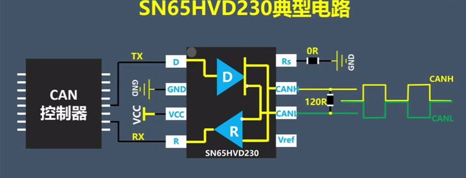
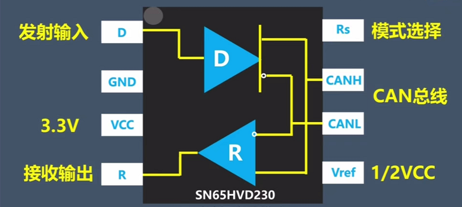

# CAN
* 驱动所在位置： `drivers/net/can/rockchip/rockchip_can.c`

## CAN 通信测试工具
canutils 是常用的 CAN 通信测试工具包，内含 5 个独立的程序：canconfig、candump、canecho、cansend、cansequence

1. canconfig
	用于配置 CAN 总线接口的参数，主要是波特率和模式
2. candump·
	从 CAN 总线接口接收数据并以十六进制形式打印到标准输出，也可以输出到指定文件
3. canecho
	把从 CAN 总线接口接收到的所有数据重新发送到 CAN 总线接口
4. cansend
	往指定的 CAN 总线接口发送指定的数据
5. cansequence
	往指定的 CAN 总线接口自动重复递增数字，也可以指定接收模式并校验检查接收的递增数字
6. ip
	CAN 波特率、功能等配置

> [!attention] busybox 集成 ip 工具
> busybox 里也有集成了 ip 工具，但 busybox 里的是阉割版本。不支持 CAN 的操作。故使用前请先确定 ip 命令的版本（iproute2）
---
# CAN 电路

