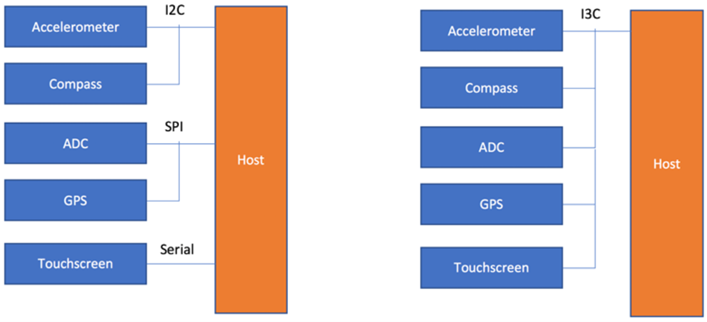

## What is MIPI I3C
- MIPI I3C 总线接口是一种基于传统 I2C 标准的进化规范。目的是减少传感器系统集成中使用的物理引脚数量，并支持通常与 UART 和 SPI 接口相关的低功耗、高速数字通信，从而使 I3C 成为结合了传统接口所有功能的单一接口.
- I3C 协议有一条多点总线，其频率为 12.5 MHz，比 I2C 支持的总线快 12 倍以上，同时功耗明显降低
