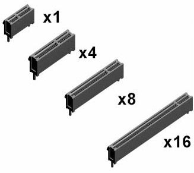

# PCIe

> [!info] PCIe
> peripheral component interconnect express

PCIe slots physical configurations: x1, x4, x8, x16, x32

* PCIe 仅应用于内部的互连
* PCIe 设备可以支持热插拔，目前支持的三种电压分别为+3.3V、3.3Vaux 以及+12V
* PCIe 是一个多层协议，由事务层，数据交换层和物理层构成。物理层又可进一步分为逻辑子层和电气子层。逻辑子层又可分为物理代码子层（PCS）和介质接入控制子层（MAC）
# Link & References
* <https://en.wikipedia.org/wiki/PCI_Express>
* 