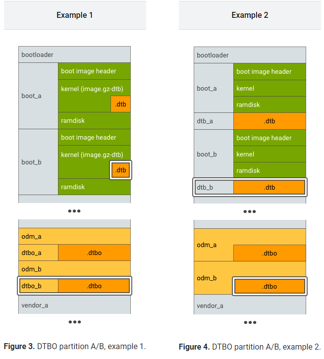
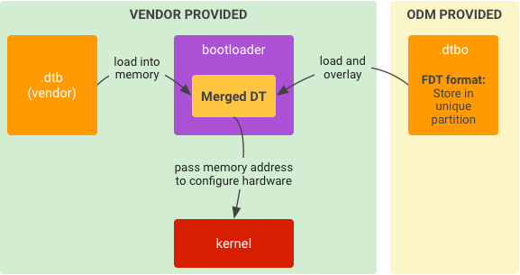

---
tags:
  - DTBO
---
## 术语
|术语|含义|
|---|---|
|DT|Device Tree|
|DTB|Device Tree Blob|
|DTBO|Device Tree Blob for Overlay|
|DTC|Device Tree Compiler|
|DTO|Device Tree Overlay|
|DTS|Device Tree Source|
|FDT|Flattened Device Tree, a binary format contained in a .dtb blob file|

## 分割 DT
- 主 DT: 一般在 kernel 中，由 SOC 厂商提供，包含 soc 的默认配置
- `Overlay DT`：由 ODM/OEM 提供，一般放在 device 中，包含某个 device 的特定配置

## 对 DT 进行分区
- 在闪存中确定 bootloader 在运行时可访问和可信的位置信息以放入 .dtb 和 .dtbo
### 主 DT 的示例位置
- 作为 boot 分区的一部分，附加到内核 (image. gz)
- 单独的 DT blob (. dtb)，位于专用分区 (dtb)
叠加 DT 的示例位置：
1. 如左图，将. dtbo 单独放在一个分区，如 dtbo 分区  
2. 如右图，将 .dtbo 放入 odm 分区中（仅在您的 bootloader 能够从 odm 分区的文件系统中加载数据时才这样做)
[Open: image324680aaf5cd2dde.png](assets/DT%20的示例位置.png)

#### 对于支持无缝 (A/B) 更新的设备，请用 A/B 来标识主 DT 和叠加 DT 分区
[Open: image8fa937ca73cce120.png](assets/image8fa937ca73cce120.png)

## 在 bootloader 中运行
[Open: imagee63f31817aa885d8.png](assets/在bootloader中运行.png)

1. 将 `.dtb` 从存储空间加载到内存中。
2. 将 `.dtbo` 从存储空间加载到内存中。
3. 用 `.dtb` 叠加 .dtbo 以形成合并的 DT。
4. 启动内核（已给定合并 DT 的内存地址）。

## link 
- [设备树叠加层](https://source.android.com/docs/core/architecture/dto?hl=zh-cn)