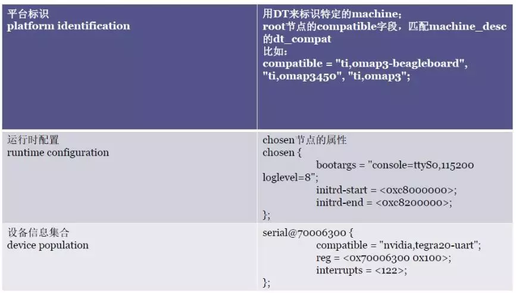

> [!info] Linux 使用 DT 数据有三个主要目的
> 1. 平台识别
> 	根据 root 节点下的 compatible 字段来匹配
> 2. 运行时配置
> 	ramdisk 配置、bootargs 配置、ramdisk 的起始和结束地址
> 3. 设备信息集合
> 

# 基础语法
* 节点名称：每个节点必须有一个“ `<名称>[@<设备地址>]` ”形式的名字
* `<设备地址>` 用来访问该设备的主地址，并且该地址也在节点的 reg 属性中列出，同级节点命名必须是唯一的，但只要地址不同，多个节点也可以使用一样的通用名称，当然设备地址也是可选的，可以有也可以没有

* 缩写名字解释
	* DT:   Device Tree
	* FDT： Flattened DeviceTree
	* OF:   Open Firmware
	* DTS：device tree source
	* DTSI :  device tree source include
	* DTB:  device tree blob
	* DTC (device tree compiler)

节点格式
```dts
[label:] node-name[@unit-address] {
  [properties definitions]
  [child nodes]
}
```
- “[]”表示option，因此可以定义一个只有node name的空节点，label方便在dts文件中引用
-   text string（以null结束），以双引号括起来，如：string-property = “a string”；
-   cells 是32位无符号整形数，以尖括号括起来，如：cell-property = <0xbeef 123 0xabcd1234>；
-   binary data 以方括号括起来，如：binary-property = [0x01 0x23 0x45 0x67]；
-   不同类型数据可以在同一个属性中存在，以逗号分格，如：mixed-property = “a string”, [0x01 0x23 0x45 0x67]，<0x12345678>；
-   多个字符串组成的列表也使用逗号分格，如：string-list = “red fish”,”blue fish”;
### 使用标签
```dts
/dts-v1/;  
/plugin/;
```
为了允许对编译时不存在的节点进行未定义的引用，叠加 DT `.dts` 文件的头文件中必须带有 `/plugin/` 标签

### 使用绝对路径引用
```dts
interrupt-parent = < &{/soc/pic@10000000} >;
```
* ote that no whitespace is allowed between '{' and '}'.
### 删除设备树属性
~~~dts
// LVDS
&lvds_panel {
        backlight = <&backlight4>;

        /** delete property that conflict with other panel, they are common */
        /delete-property/ power-supply;
        /delete-property/ reset-gpios;
        /delete-property/ pinctrl-names;
        /delete-property/ pinctrl-0;
};
~~~

# chosen 属性
```c
chosen {
        bootargs = "console=ttyS0,115200 loglevel=8";
        initrd-start = <0xc8000000>;
        initrd-end = <0xc8200000>;
};
```
# 预编译 DTS
1. 查看文件位置 `find -name "*dtb.dts.tmp"` / `fdfind .dtb.dts.tmp -HI`
2. 分析工具 *fdtdump*

# Link
* [DTO 语法  |  Android 开源项目  |  Android Open Source Project](https://source.android.com/devices/architecture/dto/syntax?hl=zh-cn)
* [Specifications - DeviceTree](https://www.devicetree.org/specifications/)
* [https://www.kernel.org/doc/Documentation/devicetree/booting-without-of.txt](https://www.kernel.org/doc/Documentation/devicetree/booting-without-of.txt)
* [GitHub - devicetree-org/devicetree-specification: Devicetree Specification document source files](https://github.com/devicetree-org/devicetree-specification)
* [Devicetree Source Format ](https://devicetree-specification.readthedocs.io/en/v0.1/source-language.html)
* [一文搞懂 | Linux 驱动的来龙去脉](https://mp.weixin.qq.com/s?__biz=MzA5NTMwMjIwNA==&mid=2650881450&idx=1&sn=0ec060d8b47cd2c3fd06910adccfd3f3&chksm=8bb4faf9bcc373ef72040afc1dfb0737af4e8c460e61b9bacc18ceafdb9e937a89612f6d974c&scene=90&subscene=93&sessionid=1644113362&clicktime=1644113363&enterid=1644113363&ascene=56&devicetype=android-30&version=28001339&nettype=WIFI&abtest_cookie=AAACAA%3D%3D&lang=zh_CN&exportkey=AXbZTpt7QRtnHPSD7aVu77c%3D&pass_ticket=BzsVO64bIKoSd5BcKkTnwsi5Eh75ilwKPfsKu7p%2Fc7L2hMeORdgi4COMT3Qvip1Y&wx_header=3)