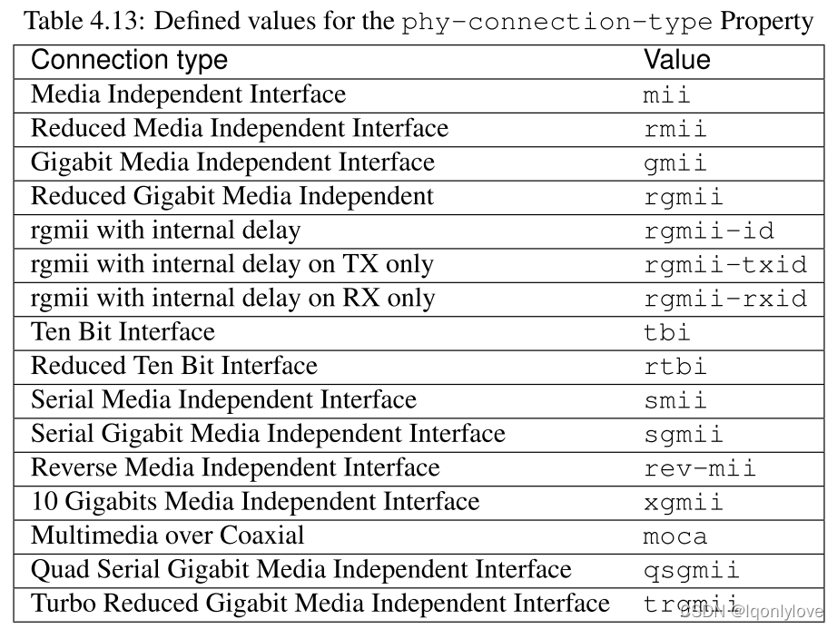
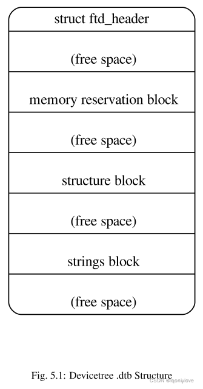

---
tags:
  - DTS
---
# 设备绑定

本章包含有关如何在**设备树**中表示**特定类型和类别的设备的要求**（称为绑定）。设备节点的 `compatible` 属性描述了节点遵守的特定绑定（或多个绑定）。

绑定可以定义为彼此的扩展。例如，可以将新的总线类型定义为简单总线绑定的扩展。在这种情况下， `compatible` 属性将包含几个字符串来标识每个绑定——**从最具体到最一般**

## 约束准则
### 一般原则
为设备创建新的设备树表示时，应创建一个绑定来完整描述设备所需的属性和值。这组属性应**具有足够的描述性**，以便为设备驱动程序提供所需的设备属性。

一些推荐的做法包括：
1. 使用约定定义兼容字符串。
2. 使用适用于新设备的标准属性，这种用法通常至少包括 `reg` 和 `interrupts` 属性。
3. 如果新设备适合 `DTSpec` 定义的设备类，则使用指定的约定。
4. 如果适用，请使用指定的其他属性约定。
5. 如果绑定需要新属性，则推荐的属性名称格式为：`“<company>,<property-name>“`，其中 `<company>` 是一个 `OUI` 或唯一的短字符串，如标识绑定创建者的股票代码。

**示例**：`“ibm,ppc-interrupt-server#s”`

### 其他属性
本节定义了可能**适用于多种类型**的**设备和设备类**的有用**属性列表**。此处定义它们是为了**促进名称和用法的标准化**。
#### clock-frequency
| 属性 | clock-frequency |
| --- | --- |
| 值类型 |  |
| 描述 | 以Hz 为单位指定时钟的频率。该值是两种形式之一的 ：  
一个 32 位整数，由一个组成，指定频率。  
一个 64 位整数，表示为指定频率。 |

#### reg-shift

| 属性 | reg-shift |
| --- | --- |
| 值类型 |  |
| 描述 | reg-shift 属性提供了**一种机制**来表示**除寄存器之间的字节数外在大多数方面都相同的设备**。  
- reg-shift 属性以字节为单位指定离散设备寄存器彼此分离的距离。  
- 单个寄存器位置使用以下公式计算：“寄存器地址” << reg-shift。  
- 如果未指定，则默认值为 0。  
例如，在 16540 个 UART 寄存器位于地址 0x0、0x4、0x8、0xC、0x10、0x14、0x18 和 0x1C 的系统中，  
将使用 `reg-shift = <2>` 属性来指定寄存器位置。 |

#### label
| 属性 | label |
| --- | --- |
| 值类型 |  |
| 描述 | label 属性**定义了一个描述设备的人类可读字符串**。  
给定设备的绑定指定了该设备属性的确切含义。 |

## 串口设备
### 串行类绑定

**串行设备类**由各种类型的**点对点串行线路设备组成**。串行线路设备的示例包括 `8250 UART`、`16550 UART`、`HDLC` 设备和 `BISYNC` 设备。在大多数情况下，与 `RS-232` 标准兼容的硬件适合串行设备类。

**`I2C`** 和 **`SPI`**（串行外设接口）设备**不应表示为串行端口设备**，因为它们有自己的特定表示
#### clock-frequency

| 属性 | clock-frequency |
| --- | --- |
| 值类型 |  |
| 描述 | 指定波特率发生器**输入时钟的频率**（以赫兹为单位）。 |
| 例子 | clock-frequency = <100000000>; |

#### 2、current-speed

| 属性 | current-speed |
| --- | --- |
| 值类型 |  |
| 描述 | 以每秒位数为单位**指定串行设备的当前速度**。  
如果启动程序已初始化串行设备，则应设置此属性。 |
| 例子 | 115,200 Baud: current-speed = <115200>; |

### 2、美国国家半导体 16450/16550 兼容 UART 要求

与 `National Semiconductor 16450/16550 UART`（通用异步接收器发射器）兼容的串行设备应使用以下属性在设备树中表示。

| 属性名称 | 用法 | 值类型 | 描述 |
| --- | --- | --- | --- |
| compatible | R | stringlist | 值应包括“ns16550”。 |
| clock-frequency | R | u32 | 指定波特率发生器**输入时钟的频率**（以 Hz 为单位） |
| current-speed | OR | u32 | 以每秒位数为单位指定当前**串行设备速度** |
| reg | R | prop encoded array | 指定寄存器设备在父总线地址空间内的**物理地址** |
| interrupts | OR | prop encoded array | 指定由此设备**产生的中断**。  
中断属性的值由一个或多个**中断说明符**组成。  
中断说明符的格式由描述节点的中断父级的绑定文档定义。 |
| reg-shift | O | u32 | 以字节为单位指定离散设备寄存器彼此分隔的距离。  
单个寄存器位置使用以下公式计算：“寄存器地址”<< reg-shift。  
如果未指定，则默认值为 0。 |
| virtual-reg | SD | u32或u64 | 见第 2.3.7 节。  
指定映射到 reg 属性中指定的**第一个物理地址的有效地址**。  
如果此设备节点是系统的控制台，则此属性是必需的。 |

**用法说明**：

-   `R = Required`（必须的）
-   `O = Optional`（可选的）
-   `OR = Optional but Recommended`（可选但推荐）
-   `SD = See Definition`（见定义）

**注意**：所有其他标准属性（第 2.3 节）都是允许的，但都是可选的。

## 3、网络设备

网络设备是**面向分组的通信设备**。**假定**此类中的**设备实现七层 `OSI` 模型**的数据链路层（第 `2` 层）并**使用媒体访问控制 (`MAC`) 地址**。网络设备的示例包括**以太网**、**`FDDI`**、**`802.11`** 和**令牌环**。

### 1、网络类绑定

#### 1、address-bits

| 属性 | address-bits |
| --- | --- |
| 值类型 |  |
| 描述 | 指定寻址此节点描述的设备所需的地址位数。  
此属性指定 MAC 地址中的位数。  
如果未指定，默认值为 48。 |
| 例子 | address-bits = <48>; |

#### 2、local-mac-address

| 属性 | local-mac-address |
| --- | --- |
| 值类型 | 编码为十六进制数数组 |
| 描述 | 指定分配给由包含此属性的节点描述的**网络设备的 MAC 地址**。 |
| 例子 | local-mac-address = \[ 00 00 12 34 56 78 \]; |

#### 3、mac-address

| 属性 | mac-address |
| --- | --- |
| 值类型 | 编码为十六进制数数组 |
| 描述 | 指定引导程序**上次使用的 MAC 地址**。  
如果引导程序分配给设备的 **MAC 地址与 localmac-address 属性不同**，则应**使用此属性**。  
仅当该值与 local-mac-address 属性值**不同时才应使用此属性**。 |
| 例子 | mac-address = \[ 01 02 03 04 05 06 \]; |

#### 4、max-frame-size

| 属性 | max-frame-size |
| --- | --- |
| 值类型 |  |
| 描述 | 指定物理接口可以发送和接收的最大数据包长度（以字节为单位）。 |
| 例子 | max-frame-size = <1518>; |

### 2、以太网特定注意事项

**除**了网络设备类指定的**属性之外**，还可以使用**以下属性**在**设备树**中表示基于 `IEEE 802.3 LAN` 标准集合（统称为以太网）的**网络设备**。

本节中列出的属性**扩充了网络设备**类中列出的**属性**。

#### 1、max-speed

| 属性 | max-speed |
| --- | --- |
| 值类型 |  |
| 描述 | 指定设备支持的**最大速度**（以每秒兆位为单位）。 |
| 例子 | max-speed = <1000>; |

#### 2、phy-connection-type

| 属性 | phy-connection-type |
| --- | --- |
| 值类型 |  |
| 描述 | 指定以太网设备和物理层 (PHY) 设备之间的**接口类型**。  
此属性的值特定于实现。  
推荐值如下表所示。 |
| 例子 | phy-connection-type = “mii”; |

**`phy-connection-type` 属性的定义值**：  


#### 3、phy-handle

| 属性 | phy-handle |
| --- | --- |
| 值类型 |  |
| 描述 | 指定对代表连接到此以太网设备的物理层 (PHY) 设备的节点的引用。  
如果以太网设备连接到物理层设备，则需要此属性。 |
| 例子 | phy-handle = <&PHY0>; |

## 4、电源 ISA 开放 PIC 中断控制器

本节规定了表示 `Open PIC` **兼容中断控制器的要求**。开放 PIC 中断控制器实现开放 `PIC` 架构（由 `AMD` 和 `Cyrix` 联合开发）并在开放可编程中断控制器 (`PIC`) 寄存器接口规范修订版 `1.2 [b18]` 中指定。

`Open PIC` 中断域中的**中断说明符**用**两个单元编码**。第一个单元格定义中断号。第二个单元格定义了意义和级别信息。

**感知和电平信息**应在中断说明符中**按如下方式编码**：

```
0 = low to high edge sensitive type enabled 
1 = active low level sensitive type enabled 
2 = active high level sensitive type enabled 
3 = high to low edge sensitive type enabled
```

| 属性 | 用法 | 值类型 | 描述 |
| --- | --- | --- | --- |
| compatible | R | string | 值应包括“open-pic” |
| reg | R | prop encoded array | 指定寄存器设备在父总线地址空间内的物理地址 |
| interrupt-controller | R | empty | 指定这个节点是一个中断控制器 |
| `#interrupt-cells` | R | u32 | 应为 2。 |
| `#address-cells` | R | u32 | 应为 0。 |

**用法说明**：

-   `R = Required`（必须的）
-   `O = Optional`（可选的）
-   `OR = Optional but Recommended`（可选但推荐）
-   `SD = See Definition`（见定义）

**注意**：所有其他标准属性（第 `2.3` 节）都是允许的，但都是可选的。

## 5、simple-bus 兼容值

**片上系统处理器**可能具有**无法探测设备的内部 `I/O` 总线**。**无需额外配置**即可**直接访问总线上的设备**。这种类型的总线被表示为具有 `“simple-bus”` 兼容值的节点。

| 属性 | 用法 | 值类型 | 描述 |
| --- | --- | --- | --- |
| compatible | R | string | 值应包括“simple-bus”。 |
| ranges | R | prop encoded array | 此属性表示**父地址**到**子地址**空间之间的**映射**（请参阅第 2.3.8 节，范围）。 |

**用法说明**：

-   `R = Required`（必须的）
-   `O = Optional`（可选的）
-   `OR = Optional but Recommended`（可选但推荐）
-   `SD = See Definition`（见定义）

## 四、扁平化设备树 (DTB) 格式

设备树 `Blob (DTB)` 格式是**设备树数据的平面二进制编码**。它用于在**软件程序之间交换设备树数据**。例如，在**启动操作系统**时，固件会将 `DTB` **传递给操作系统内核**。

**注意**：**`IEEE1275` 开放固件 `[IEEE1275]` 没有定义 `DTB` 格式**。在大多数开放固件兼容平台上，通过调用固件方法遍历树结构来提取设备树。

**`DTB` 格式**在**单个**、**线性**、**无指针数据结构**中对**设备树数据进行编码**。它由**一个小头部**（见 `5.2` 节）和**三个可变大小的部分组成**：**内存保留块**（见 `5.3` 节）、**结构块**（见 `5.4` 节）和**字符串块**（见 `5.5` 节）。这些应该以该顺序出现在展平的设备树中。因此，设备树结构作为一个整体，当加载到内存地址时，将类似于图 `5.1` 中的图（较低的地址在图的顶部）。  
  
**（自由空间）部分可能不存在**，但在某些情况下，它们可能需要满足各个块的**对齐约束**（参见第 `5.6` 节）。

## 1、版本控制

自从格式的原始定义以来，**已经定义了几个版本的扁平设备树结构**。**标头中的字段给出版本**，以便客户端程序可以**确定设备树是否以兼容格式编码**。

本文档仅描述了该格式的第 `17` 版。 `DTSpec` 兼容的引导程序应提供版本 `17` 或更高版本的设备树，并应提供与版本 `16` 向后兼容的版本的设备树。 `DTSpec` 兼容的客户端程序应接受向后兼容版本 `17` 的任何版本的设备树，并且可以接受其他版本以及。

**注意**：版本是关于设备树的二进制结构，而不是它的内容。

## 2、Header

`devicetree` 的**头布局**由以下 `C` 结构定义。所有的**头字段**都是 **`32` 位整数**，以**大端格式存储**。

```
struct fdt_header { 
uint32_t magic; 
uint32_t totalsize; 
uint32_t off_dt_struct; 
uint32_t off_dt_strings; 
uint32_t off_mem_rsvmap; 
uint32_t version; 
uint32_t last_comp_version; 
uint32_t boot_cpuid_phys; 
uint32_t size_dt_strings; 
uint32_t size_dt_struct;
};
```

| 字段 | 描述 |
| --- | --- |
| magic | 该字段应包含值 0xd00dfeed（大端）。 |
| totalsize | 该字段应包含设备树数据结构的**总大小**（以字节为单位）。  
此大小应**包含结构的所有部分**：标题、内存保留块、结构块和字符串块，以及块之间或最后一个块之后的任何空闲空间间隙。

| 字段 | 描述 |
| :---: | :---:|
| `off_dt_struct` | 该字段应包含结构块（见第 5.4 节）从头开始的以字节为单位的**偏移量**。 |
| `off_dt_strings` | 该字段应包含字符串块（参见第 5.5 节）从头开始的以字节为单位的**偏移量**。 |
| `off_mem_rsvmap` | 该字段应包含从头开始的内存保留块（见第 5.3 节）的字节**偏移量**。 |
| version | 该字段应包含**设备树数据结构的版本**。  
如果使用本文档中定义的结构，则版本为 17。  
DTSpec 引导程序可能会提供更高版本的设备树，在这种情况下，该字段应包含在提供该版本详细信息的较晚文档中定义的版本号。

| 字段 | 描述 |
| :---: | :---:|
| last_comp_version | 该字段应包含使用的版本向后兼容的**设备树数据结构的最低版本**。  
因此，对于本文档（版本 17）中定义的结构，该字段应包含 16，因为版本 17 向后兼容版本 16，但不兼容早期版本。  
根据第 5.1 节，DTSpec 引导程序应以向后兼容版本 16 的格式提供设备树，因此该字段应始终包含 16。 

| 字段 | 描述 |
| :---: | :---:|
| size_dt_strings | 该字段应包含设备树 blob 的字符串块部分的字节长度。 |
| size_dt_struct | 该字段应包含设备树 blob 的结构块部分的字节长度。 |

## 3、内存保留块

### 1、目的

**内存保留块为客户端程序提供物理内存中保留的区域列表**；也就是说，不应将其用于一般内存分配。它用于**保护重要数据结构不被客户端程序覆盖**。例如，在一些带有 `IOMMU` 的系统上，由 `DTSpec` 引导程序初始化的 `TCE`（翻译控制条目）表需要以这种方式进行保护。同样，在客户端程序运行时使用的任何引导程序代码或数据都需要保留（例如，开放固件平台上的 `RTAS`）。 `DTSpec` 不要求引导程序提供任何此类运行时组件，但它不禁止实现作为扩展这样做。

**更具体地说**，**客户端程序不应访问保留区域中的内存**，**除非引导程序提供的其他信息明确指示它应该这样做**。客户端程序然后可以以指示的方式访问保留存储器的指示部分。引导程序可以向客户端程序指示保留内存的特定用途的方法可能出现在本文档、它的可选扩展或特定于平台的文档中。

引导程序提供的保留区域可以但不要求包含设备树 `blob` 本身。客户端程序应确保在使用之前不会覆盖此[数据结构](https://so.csdn.net/so/search?q=%E6%95%B0%E6%8D%AE%E7%BB%93%E6%9E%84&spm=1001.2101.3001.7020)，无论它是否在保留区域中。

任何在内存节点中声明并被引导程序访问或在客户端进入后被引导程序访问的内存都必须保留。此类访问的示例包括（例如，通过不受保护的虚拟页面进行推测性内存读取）。

**这个要求是必要的**，因为任何未被保留的内存都可以被具有任意存储属性的客户端程序访问。

任何由引导程序或由引导程序引起的对保留内存的访问都必须在不禁止缓存和内存一致性要求（即 `WIMG = 0bx01x`）的情况下完成，另外对于第三册-S 实现，不要求直写（即，`WIMG = 0b001x`） 。此外，如果支持 VLE 存储属性，则必须在 `VLE=0` 时完成对保留内存的所有访问。

**此要求是必要的**，因为客户端程序被允许映射具有指定为不要求直写、不禁止缓存和要求内存一致性（即，`WIMG = 0b001x`）和 `VLE = 0` 的存储属性的内存。客户端程序可能会使用包含保留内存的大型虚拟页面。但是，客户端程序可能不会修改保留内存，因此引导程序可能会按照需要直写的方式执行对保留内存的访问，其中此存储属性的冲突值在体系结构上是允许的。

### 2、Format

**内存预留块**由一组 **`64` 位大端整数**对的**列表组成**，每对由以下 `C` 结构表示。

```
struct fdt_reserve_entry { 
uint64_t address; 
uint64_t size;
};
```

每对都给出了**保留内存区域**的**物理地址**和大小（以字节为单位）。这些给定区域**不应相互重叠**。保留块列表应以地址和大小都等于 `0` 的条目结束。注意地址和大小值始终为 `64` 位。在 `32` 位 `CPU` 上，值的高 `32` 位被忽略。

内存预留块中的每个 `uint64_t` 以及整个内存预留块都应位于距设备树 `blob` 开头的 `8` 字节对齐偏移处（参见第 5.6 节）。

## 4、结构块

结构块**描述了设备树本身的结构和内容**。它由**带有数据的令牌序列组成**，如下所述。这些被组织成线性树结构，如下所述。

结构块中的**每个标记**，以及**结构块本身**，都应位于距设备树 `blob` 开头的 **`4` 字节对齐偏移处**（见 5.6）。

### 1、词汇结构

**结构块由一系列片段组成，每个片段以一个标记开头，即一个大端 `32` 位整数**。一些令牌后跟额外的数据，其格式由令牌值决定。所有令牌都应在 `32` 位边界上对齐，这可能需要在前一个令牌数据之后插入填充字节（值为 `0x0`）。

五种令牌类型如下：

#### 1、FDT\_BEGIN\_NODE (0x00000001)

`FDT_BEGIN_NODE` 标记标志着**节点**表示的**开始**。后面应该跟节点的单元名称作为额外数据。名称存储为以空字符结尾的字符串，并且应包括单元地址（参见第 `2.2.1` 节），如果有的话。节点名称后跟零填充字节（如果需要对齐），然后是下一个标记，可以是除 `FDT_END` 之外的任何标记。

#### 2、FDT\_END\_NODE (0x00000002)

`FDT_END_NODE` 标记标志着**节点**表示的**结束**。这个令牌没有额外的数据；所以紧随其后的是下一个标记，它可以是除 `FDT_PROP` 之外的任何标记。

#### 3、FDT\_PROP (0x00000003)

`FDT_PROP` 标记标志着**设备树中一个属性**表示的**开始**。其后应是描述该属性的额外数据。该数据首先由属性的长度和名称组成，表示为以下 `C` 结构：

```
struct {
uint32_t len; 
uint32_t nameoff;
}
```

此结构中的两个字段都是 `32` 位大端整数。

-   `len` 以字节为单位给出**属性值的长度**（可能为零，表示一个空属性，请参阅第 `2.2.4.2` 节）。
-   `nameoff` 给出了**字符串块**（参见第 `5.5` 节）的**偏移量**，在该块中属性的名称存储为以空字符结尾的字符串。

在此结构之后，属性的值作为长度为 `len` 的字节字符串给出。该值后跟零填充字节（如有必要）以与下一个 `32` 位边界对齐，然后是下一个令牌，它可以是除 `FDT_END` 之外的任何令牌。

#### 4、FDT\_NOP (0x00000004)

`FDT_NOP` 令牌将被任何解析设备树的程序**忽略**。这个令牌没有额外的数据；因此紧随其后的是下一个令牌，它可以是任何有效的令牌。树中的属性或节点定义可以用 `FDT_NOP` 令牌覆盖以将其从树中删除，而无需移动设备树 blob 中树表示的其他部分。

#### 5、FDT\_END (0x00000009)

`FDT_END` 标记标记**结构块**的**结束**。应该只有一个 `FDT_END` 标记，它应该是结构块中的最后一个标记。它没有额外的数据；所以紧跟在 `FDT_END` 标记之后的字节从结构块的开头偏移等于设备树 `blob` 标头中 `size_dt_struct` 字段的值。

### 2、树状结构

`devicetree` 结构表示为**线性树**：**每个节点**的表示以 `FDT_BEGIN_NODE` 标记**开始**，以 `FDT_END_NODE` 标记**结束**。节点的属性和子节点（如果有）在 `FDT_END_NODE` 之前表示，因此这些子节点的 `FDT_BEGIN_NODE` 和 `FDT_END_NODE` 令牌嵌套在父节点的令牌中。

整个结构块由根节点的表示（其中包含所有其他节点的表示）组成，后跟 `FDT_END` 标记以标记整个结构块的结尾。

**更准确地说**，每个节点的表示由以下组件组成：

-   （可选）任意数量的 `FDT_NOP` 令牌
-   `FDT_BEGIN_NODE`令牌
    -   节点的名称作为以空字符结尾的字符串
    -   \[将填充字节归零以对齐 `4` 字节边界\]
-   对于节点的每个属性：
    -   （可选）任意数量的 `FDT_NOP` 令牌
    -   `FDT_PROP` 令牌
        -   第 `5.4.1` 节中给出的属性信息
        -   \[将填充字节归零以对齐 `4` 字节边界\]
-   这种格式的所有子节点的表示
-   （可选）任意数量的 `FDT_NOP` 令牌
-   `FDT_END_NODE` 令牌

请**注意**，此过程要求特定节点的所有属性定义在该节点的任何子节点定义之前。虽然如果属性和子节点混合在一起，结构不会有歧义，但是处理扁平树所需的代码被这个要求简化了。

## 5、字符串块

`strings` 块包含表示树中使用的所有属性名称的字符串。这些空终止的字符串在本节中简单地连接在一起，并从结构块中通过偏移量引用到字符串块中。

字符串块没有对齐约束，可以出现在距设备树 `blob` 开头的任何偏移处。

## 6、对齐

对于在没有未对齐内存访问的情况下使用的内存预留和结构块中的数据，它们应位于**适当对齐的内存地址**。具体而言，内存预留块应与 `8` 字节边界对齐，结构块应与 `4` 字节边界对齐。

此外，可以在不破坏子块对齐的情况下重新定位整个设备树 `blob`。

如前几节所述，结构块和字符串块应与设备树 `blob` 的开头对齐偏移。为了确保块在内存中的对齐，确保设备树作为一个整体被加载到与任何子块的最大对齐对齐的地址处，即 `8` 字节边界就足够了。符合 `DTSpec` 的引导程序应在这样的对齐地址加载设备树 `blob`，然后再将其传递给客户端程序。如果 `DTSpec` 客户端程序将设备树 `blob` 重新定位到内存中，它应该只将其重新定位到另一个 `8` 字节对齐的地址。