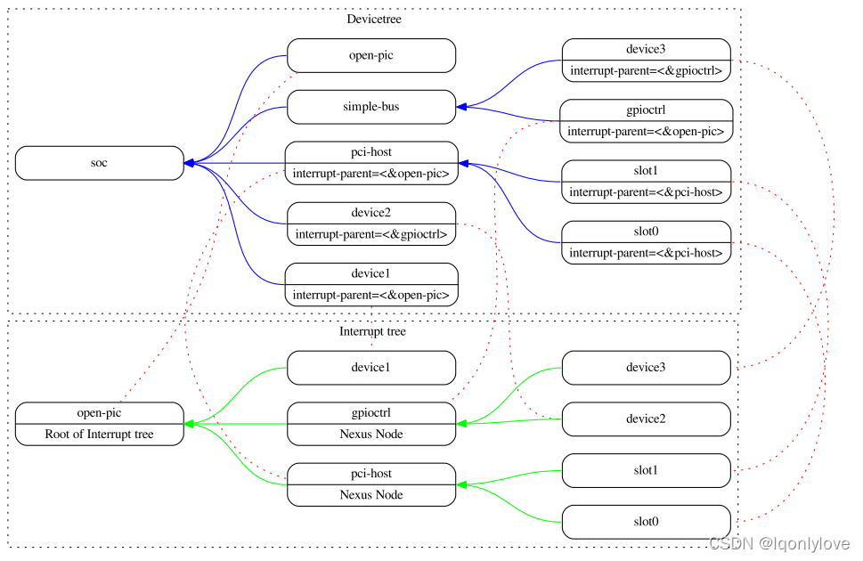
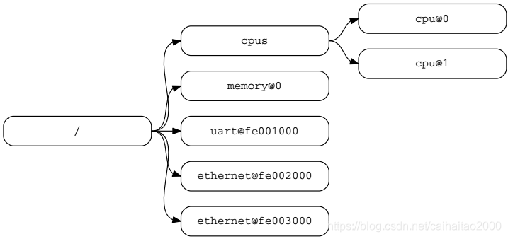
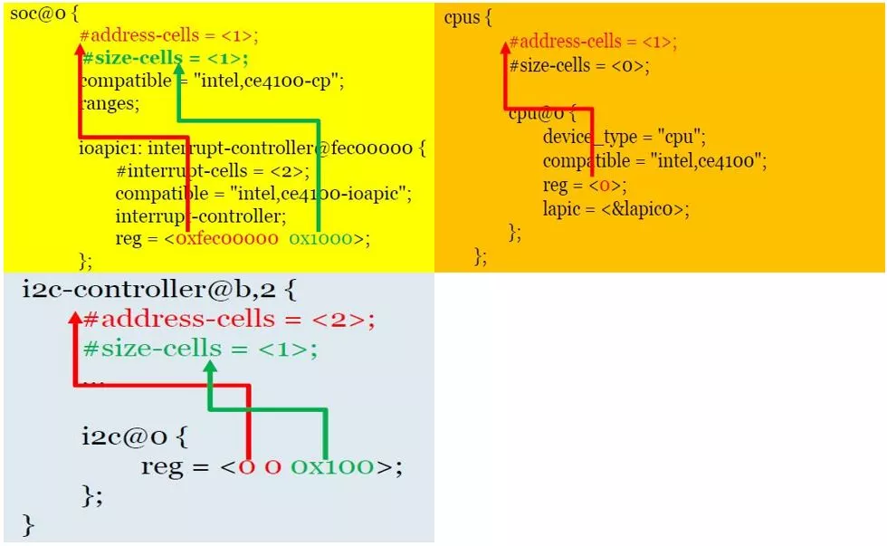

# 设备树的详细介绍

## 2 .1. 概述

DTSpec规范指定了一个名为devicetree的树状结构来描述系统硬件。bootloader将DTB文件加载到的内存中，并将指向DTB文件地址的指针(R2)传递给操作系统(kernel)。

devicetree是一种树数据结构，其中包含描述系统中设备树的节点。每个节点都有属性/值(键值对)对组成，用于描述所表示设备的特征。每个节点只有一个父节点，但根节点除外，它没有父节点。

符合 DTSpec 规范的设备树描述了系统中的[硬件设备信息](Linux/DTS/嵌入式系统%20DTS%20基础.md)，该信息不一定由客户端程序动态检测。例如，PCI 的体系结构客户端能够探测和检测连接的设备，因此可能不需要描述 PCI 设备的设备节点。但是，如果无法通过自动检测到硬件设备，则需要设备节点来描述系统中的 PCI 主桥设备。

示例：

图2.1显示了一个简单的设备树的示例，该设备几乎完全足以启动一个简单的操作系统，包含平台类型，CPU，内存和一个UART。在每个设备节点内都有属性和值。


  


# 设备树的结构和约定

## 2 .2.1. 节点名称

设备树中的每个节点都应遵守以下的约定命名：

```
node-name@unit-address
```

node-name指定节点的名称。它的长度应为1到31个字符，并且应该只包含表2.1中所示的字符。

表2.1：节点名称的有效字符

<table><tbody><tr><td>字符</td><td>描述</td></tr><tr><td>0-9</td><td>数字</td></tr><tr><td>a-z</td><td>小写字母</td></tr><tr><td>A-Z</td><td>大写字母</td></tr><tr><td>,</td><td>逗号</td></tr><tr><td>.</td><td>句号</td></tr><tr><td>_</td><td>下划线</td></tr><tr><td>+</td><td>加号</td></tr><tr><td>-</td><td>短斜杠</td></tr></tbody></table>

节点名称应以小写或大写字符开头，并应描述设备的常规类型。

名称中的单元地址组件特定于节点所在的总线类型。它由表2.1中的一组字符中的一个或多个ASCII字符组成。unit-address必须与节点的reg属性中指定的第一个地址匹配。如果节点没有reg属性，则必须省略@unit-address，并且节点名称将节点与树中同一级别的其他节点区分开来。特定总线的绑定可以为reg属性和unit-address的格式指定更多，更具体的要求。

根节点没有节点名和unit-address。它由正斜杠(/)标识。



图2.2：节点名称的示例

在图 2.2 中，
- 名称为 cpu 的节点通过其 unit-address 值 0 和 1 来区分。
- 名称为 ethernet 的节点由其 unit-address 值 fe002000 和 fe003000 来区分。

## 2 .2.2. [[通用名称建议]]
节点的名称应该有些通用的，反映设备的功能。

## 2 .2.3. 路径名称

通过指定从根节点到所有子节点的完整路径，可以唯一地标识设备树中的节点。表示设备路径的约定是：

```
/node-name-1/node-name-2/node-name-N
```

例如，在图2.2中，`cpu＃1`的设备路径为：

```
/cpus/cpu@1
```

根节点的路径是"/"。

如果节点的完整路径是明确的，则可以省略unit-address。如果内核发现某个不明确的路径，则表示为未定义节点。

## 2 .2.4. 属性

- 设备树中的每个节点都具有描述节点特征的属性。属性由属性名和值组成 (键值对)。
- 属性名称：属性名称是表 2.2 中所示的 1 到 31 个字符的字符串组成。

表2.2：属性名称的有效字符


| 字符 | 描述     |
| :----: | :--------: |
| 0-9  | 数字     |
| a-z  | 小写字符 |
| A-Z  | 大写字符 |
| ,    | 逗号     |
| .    | 句号     |
| _    | 下划线   |
| +    | 加号     |
| ?    | 问号         |

 非标准属性名称应指定唯一的字符串前缀，例如股票代码符号，用于标识定义该属性的公司或组织的名称。例如：

```
fsl,channel-fifo-lenibm,ppc-interrupt-serverlinux,network-index
```

属性值：属性值是包含零个或多个字节的数组，其中包含与属性关联的信息。如果传递真假信息，属性可能具有空值。在这种情况下，属性的存在与否是充分描述性的。表2.3描述了DTSpec规范定义的属性基本值集合。

表2.3：属性值

<table><tbody><tr><td>属性值</td><td>描述</td></tr><tr><td>空值</td><td>属性值为空，用来表示真假信息；</td></tr><tr><td>property=&lt;32&gt;</td><td>大端格式的32位整数；</td></tr><tr><td>u64</td><td>表示big-endian格式的64位整数</td></tr><tr><td>string</td><td>字符串是可打印的并且以空值终止；例如："hello"</td></tr><tr><td>phandle</td><td>一个u32的值；标定phandle值是引用设备树中另一个节点的方法；</td></tr><tr><td>stringlist</td><td>连接在一起的&lt;string&gt;值列表；例如："hello","world"</td></tr><tr><td>prop-encoded-array</td><td>格式特定于属性；请参阅属性定义；</td></tr></tbody></table>

2.3.标准属性

DTSpec规范为设备树节点指定一组标准属性。本节将详细介绍这些属性。DTSpec规范定义的设备树节点可以指定有关标准属性使用的附加要求或约束。第4章描述了特定设备的表示，还可以指定其他要求。

备注：本文档中的所有devicetree节点示例都使用DTS(Devicetree Source)格式来指定节点和属性。

## 2 .3.1. compatible 属性
- 属性名称：compatible
- 属性值类型: `<stringlist>` (字符串)

描述：
compatible属性的值由一个或多个字符串组成，这些字符串定义设备的特定编程模型。linux内核应使用此字符串列表来选择匹配特定的设备驱动程序。属性值由一系列字符串组成，从最具体到最常见。它们允许设备表达与一系列类似设备的兼容性，可能允许单个设备驱动程序与多个设备匹配。推荐的格式是`"manufacturer，model"`，其中manufacturer是描述制造商名称的字符串(例如股票代码)，model指定型号。

> [!example] 示例：
> ```
> compatible = "fsl, mpc8641", "ns16550";
> ```

在此示例中，操作系统将首先尝试查找支持"fsl，mpc8641"属性的设备驱动程序。如果找不到具体驱动程序，它将尝试找到支持更通用的ns16550属性设备类型的驱动程序。

## 2 .3.2. model 属性
- 属性名称：model
- 属性值：string (字符串)

描述：
model属性值是`<string>`类型，它指定制造商的设备型号。建议的格式为`"manufacturer，model"`，其中manufacturer是描述制造商名称的字符串，model指定型号。

> [!example] 示例：
> ```
> model = "fsl, MPC8349EMITX";
> ```

## 2 .3.3. phandle 属性
- 属性名称：phandle
- 属性值：u32 类型
### 描述 ：
phandle属性指定在devicetree中唯一的节点的数字标识符。phandle属性值由需要引用与该属性关联的节点的其他节点使用。

> [!example] 示例：
> 请参阅以下 devicetree 摘录：
>
> ```c
> pic@10000000 {
> 	phandle = <1>;
>	interrupt-controller;
> };
> ```
>
>
>
> 定义了一个 phandle 值为 1 的节点，另一个设备节点可以引用具有 1 的 phandle 值的 pic 节点：
>
> ```c
> another-device-node {
>	interrupt-parent = <1>;
> };
> ```

备注：DTS中的大多数设备节点不明确的包含phandle属性。当DTS编译为二进制DTB格式时，DTC工具会自动插入phandle属性。

## 2 .3.4. status 属性
- 属性名称：status
- 属性值：string (字符串)

### 描述 ：
status 属性用来指示设备的运行状态。

表2.4：status属性的值

 | 属性值     | 描述                                                           |
 | ---------- | -------------------------------------------------------------- |
 | "okay"     | 表示设备正在运行；                                             |
 | "disabled" | 表示设备当前不可运行，但将来可能会运行；                       |
 | "fail"     | 表示设备无法运行，设备中检测到严重错误，未经修复就不可能运行； |
 |     "fail-sss"       |            表示设备无法运行，在设备中检测到严重错误，未经修复就不可能运行；值的 sss 部分特定于设备并指示检测到的错误条件；                                                    |


## 2 .3.5. `#address-cells` 和 `#size-cells` 属性
- 属性名称：`#address-cells`, `#size-cells`
- 属性值：u32

- 红色标注的代表着寄存器地址用几个数据量来表述，绿色标注的代表着寄存器空间大小用几个数据量来表述。图中的含义是中断控制器的基地址是 0xfec00000，空间大小是 0x1000
### 描述 ：
-  `#address-cells` 和 `#size-cells` 属性可用于在设备树层次结构中具有子节点的任何设备节点，并描述应如何寻址子设备节点。
-  `#address-cells` 属性定义用于编写子节点的 reg 属性中的地址字段的单元的数量。 
- `#size-cells` 属性定义用于对子节点的 reg 属性中的 size 字段进行编写的单元的数量。
-  `#address-cells` 和 `#size-cells` 属性不是从 devicetree 中的祖先继承的。它们应明确定义。

符合DTSpec规范标准的程序应在所有有子节点的父节点上提供`#address-cells`和`#size-cells`。如果缺少，程序对`#address-cells`假定默认值为2，对于`#size-cells`应该为1。

示例：

请参阅以下devicetree摘录：

```
soc {
#address-cells = <1>;
#size-cells = <1>;

	serial {
	compatible = "ns16550";
	reg = <0x4600 0x100>;
	clock-frequency = <0>;
	interrupts = <0xA 0x8>;
	interrupt-parent = <&ipic>;
	};
};
```

在此示例中，soc节点的#address-cells和#size-cells属性的值都设置为1。此设置指定需要一个cell表示子节点的地址，并且需要一个cell来表示此节点的子节点的地址大小。串行(serial)设备reg属性必须遵循在父(soc)节点中的设置，此节点的地址由一个cell(0x4600)表示，并且地址大小由一个cell(0x100)表示。

## 2 .3.6. reg 属性
- 属性名称：reg
- 属性值：为任意数量的<address,length>对
### 描述 ：
- reg 属性描述了由其父总线定义的地址空间内设备资源的地址。最常见的是，这意味着内存映射 IO 寄存器块的偏移量和长度，但在某些总线类型上可能有不同的含义。根节点定义的地址空间中的地址是 CPU 能够访问的实际地址。

- 由任意数量的地址和长度对组成，`<address,length>`；指定地址和长度所需的 `<u32>` cell 的数量是特定于总线的，并由设备节点的父节点中的 `#address-cells` 和 `#size-cells` 属性指定。
> [!info] `#size-cells` 指定值 0
> 如果父节点为 `#size-cells` 指定值 0，则应省略 reg 中的长度字段。

> [!example] 示例 ：
> 假设片上系统内的器件有两个寄存器块，SOC 中偏移量为 0x3000 的 32 字节和偏移量为 0xFE00 的 256 字节块。reg 属性如下所示：
>
> ```
> reg = <0x3000 0x20 0xFE00 0x100>;
> ```

## 2 .3.7. virtual-reg
- 属性名称：virtual-reg
- 属性值：u32

### 描述 ：
virtual-reg属性指定一个有效虚拟地址，该地址映射到设备节点的reg属性中指定的第一个物理地址。此属性使引导程序能够为客户端程序提供已设置的虚拟地址到物理地址映射。

## 2 .3.8. ranges 属性

属性名称：ranges

属性值：`<empty>`或`<prop-encoded-array>` 

描述：

ranges属性提供了一种定义总线地址空间和总线节点父节点的地址空间之间的映射或转换的方法。range属性值的格式是(子总线地址，父总线地址，长度)的任意数量的三元组

子总线地址是子总线地址空间中的物理地址。表示地址的单元数取决于总线，可以从该节点的`#address-cells`(出现范围属性的节点)确定。

父总线地址是父总线地址空间内的物理地址。表示父地址的单元数取决于总线，可以从定义父地址空间的节点的#address-cells属性中确定。

长度指定子地址空间中范围的大小。 表示大小的单元数可以从该节点的`#size-cells`(出现ranges属性的节点)确定。

如果使用`<empty>`值定义属性，则它指定父地址空间和子地址空间相同，并且不需要地址转换。

如果该属性不存在于总线节点中，则假定该节点的子节点与父地址空间之间不存在映射。

地址转换示例：

```
soc {
	compatible = "simple-bus";
	#address-cells = <1>;
	#size-cells = <1>;
	ranges = <0x0 0xe0000000 0x00100000>;
	serial {
		device_type = "serial";
		compatible = "ns16550";
		reg = <0x4600 0x100>;
		clock-frequency = <0>;
		interrupts = <0xA 0x8>;
		interrupt-parent = <&ipic>;
	};
};
```

soc节点指定ranges属性：

```
<0x0 0xe0000000 0x00100000>;
```

此属性值指定对于1024KB范围的地址空间，在物理地址0x0处寻址的子节点映射到父节点物理地址0xe0000000处。 通过此映射，可以通过地址0xe0004600处的加载或存储来寻址串行设备节点，偏移量为0x4600(在reg中指定)加上范围中指定的0xe0000000映射。


# Link 
* [设备树规范翻译_晴天_QQ的博客-CSDN博客](https://blog.csdn.net/caihaitao2000/article/details/83960823?spm=1001.2014.3001.5502)
* [Device Tree Mysteries - eLinux.org](https://elinux.org/Device_Tree_Mysteries#Label_vs_aliases_node_property)
* [elinux Power_ePAPR_APPROVED_v1.1.pdf](https://elinux.org/images/c/cf/Power_ePAPR_APPROVED_v1.1.pdf)