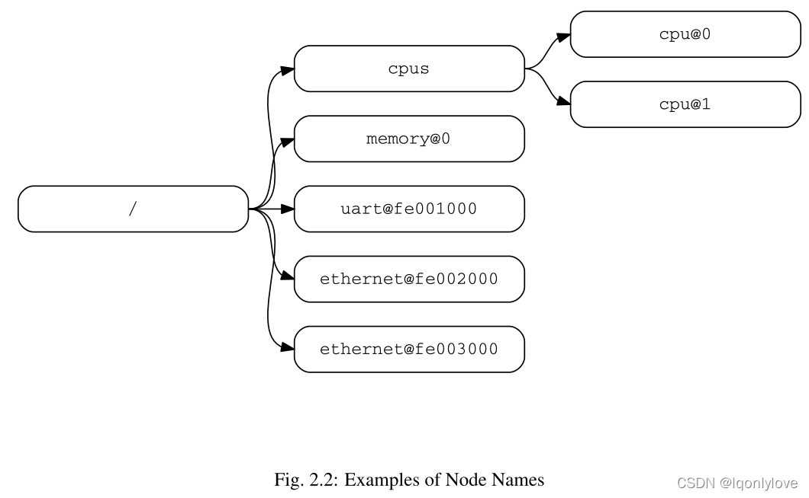
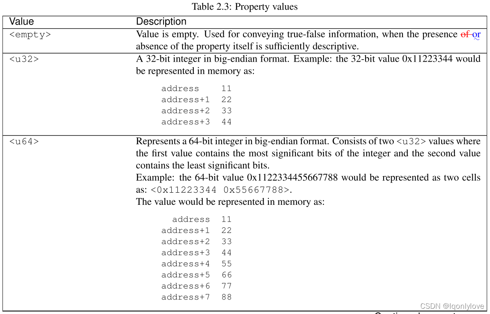
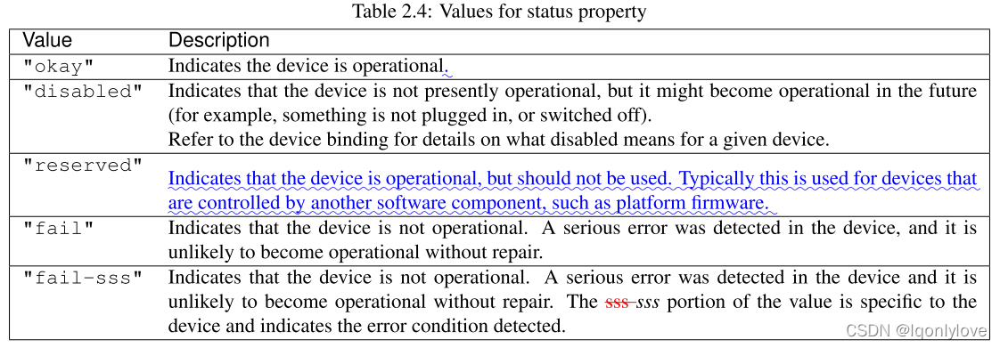

---
tags:
  - DTS
---
# 设备树

## 概述
`DTSpec` 指定了一个称为设备树的结构来描述系统硬件。引导程序将设备树加载到客户端程序的内存中，并将指向设备树的指针传递给客户端

设备树是一种树数据结构，其节点描述系统中的设备。每个节点都有描述所代表设备特性的属性 `/` 值对。除了没有父节点的根节点之外，每个节点都只有一个父节点。

符合 `DTSpec` 的设备树描述了系统中的设备信息，客户端程序不一定能动态检测到这些信息。例如，`PCI` 的体系结构使客户端能够探测和检测连接的设备，因此可能不需要描述 `PCI` 设备的设备树节点。但是，如果无法通过探测检测到，则需要设备节点来描述系统中的 `PCI` 主桥设备。

## 设备树结构和约定
### 节点名称
#### 节点名称要求
设备树中的每个节点都根据以下约定命名：
```
node-name@unit-address
```

**`node-name`** 组件指定节点的**名称**。它的长度应为 **`1` 到 `31` 个字符**，并且仅由来自下表字符集的字符组成

| 字符 | 描述 |
| :--: | :--: |
| `0-9` | 数字 |
| `a-z` | 小写字母 |
| `A-Z` | 大写字母 |
| `,` | 逗号 |
| `.` | 句号 |
| `_` | 下划线 |
| `+` | 加号 |
| `-` | 横线 |

  
- 节点名称应以**小写**或**大写**字符**开头**，并应描述设备的一般类别。
- 名称的**单元地址**部分**特定**于**节点**所在的**总线类型**。它由表 2.1 中字符集中的一个或多个 `ASCII` 字符组成。
-  `unit-address` **必须**与**节点**的 **`reg` 属性**中**指定**的**第一个地址相匹配**。如果节点**没有 `reg` 属性**，`@unit-address` **必须被省略**，节点名称**单独区分**节点与树中同一级别的其他节点。**特定总线**的绑定可以为 **`reg` 格式**和**单元地址**指定**额外的**、**更具体**的**要求**。

**根节点**没有**节点名**或**单元地址**。它由正斜杠 ( `/` ) 标识。  


-   名为 `cpu` 的节点通过它们的**单元地址值** `0` 和 `1` 来区分。
-   名称为 `ethernet` 的节点通过其**单元地址值** `fe002000` 和 `fe003000` 来**区分**。

## 通用名称建议
节点的名称应该有点通用，反映设备的功能而不是其精确的编程模型。如果合适，名称应该是以下选项之一：
### 路径名称
设备树中的节点可以通过指定从根节点到所有后代节点到所需节点的完整路径来唯一标识
指定设备路径的约定是：
```
/node-name-1/node-name-2/node-name-N
```

例如，在图 2.2 中，cpu #1 的设备路径为：
```
/cpus/cpu@1
```
1. 根节点的路径是 `/` 
2. 如果到节点的完整路径是明确的，则可以省略单元地址
3. 如果客户端程序遇到**不明确的路径**，则其行为**未定义**

### 属性
设备树中的每个节点都有描述节点**特征**的**属性**。属性由**名称**和**值**组成。
#### 属性名称

属性名称是表 `2.2` 中显示的字符中的 `1` 到 `31` 个字符的字符串  
  
**非标准属性**名称应指定**唯一**的**字符串前缀**，例如股票代码，以标识定义该属性的**公司**或**组织**的名称。例子：

```
fsl,channel-fifo-len 
ibm,ppc-interrupt-server#s 
linux,network-index
```

#### 属性值

属性值是包含与该属性相关联的信息的零个或**多个字节**的**数组**。

如果传达**真假信息**，**属性**可能具有**空值**。在这种情况下，属性的**存在**或**不存在**是充分的描述。

表 2.3 描述了 `DTSpec` 定义的一组**基本值类型**。  
  


##### empty
值为**空**。当**属性本身**的**存在**或**不存在**具有足够的描述性时，用于**传达真假信息**。
##### u32
**大端格式**的 `32` 位整数
示例：`32` 位值 `0x11223344` 在内存中表示为：

```
address   11 
address+1 22 
address+2 33 
address+3 44
```
##### u64
表示**大端格式**的 `64` 位整数。由**两个值**组成，其中**第一个值**包含整数的**最高有效位**，**第二个值**包含**最低有效位**。

示例：**`64` 位**值 `0x1122334455667788` 将表示为**两个单元格**：`<0x11223344 0x55667788>`

该值将在**内存中**表示为：

```
address   11 
address+1 22 
address+2 33 
address+3 44 
address+4 55 
address+5 66 
address+6 77 
address+7 88
```

##### string
字符串是**可打印**的并且以**空值结尾**。

示例：字符串 `“hello”` 将在内存中表示为：

```
address 68   'h' 
address+1 65 'e' 
address+2 6C 'l' 
address+3 6C 'l' 
address+4 6F 'o' 
address+5 00 '\0'
```

##### prop-encoded-array
格式**特定**于**属性**。请参阅属性定义。
##### phandle
一个 `u32` 值。`phandle` 值是一种引用设备树中另一个节点的方法。任何可以被引用的节点都定义了一个具有唯一 `u32` 值的 `phandle` 属性。该数字用于具有 `phandle` 值类型的属性值。
##### stringlist
连接在一起的`string`值列表

示例：字符串列表 `“hello”`、`“world”` 将在内存中表示为：

```
address 68    'h' 
address+1 65  'e' 
address+2 6C  'l' 
address+3 6C  'l' 
address+4 6F  'o' 
address+5 00  '\0' 
address+6 77  'w' 
address+7 6f  'o' 
address+8 72  'r' 
address+9 6C  'l' 
address+10 64 'd' 
address+11 00 '\0'
```

## 标准属性

`DTSpec` 为设备节点指定了一组**标准属性**。本节详细介绍了这些属性。 `DTSpec` 定义的**设备节点**可以指定有关**标准属性**使用的**附加要求或约束**。

**注意**：本文档中的**所有设备树节点**示例都使用 `DTS`（**设备树源**）**格式**来**指定**节点和属性。
### `compatible`
-  属性名称 `compatible`
- 值类型 `<stringlist>`
#### 描述
**兼容属性**值由**一个**或**多个**定义设备特定**编程模型**的**字符串组成**。**客户端**程序应**使用此字符串列表**来**选择设备驱动程序**。属性值由空终止**字符串的串联列表**组成，从最**具体**到最**一般**。它们允许设备表达其与**一系列**类似设备的兼容性，可能允许**单个**设备驱动程序匹配**多个**设备。

#### 例子

```
compatible = "fsl,mpc8641", "ns16550";
```

在此示例中，操作系统将**首先**尝试定位**支持** fsl,mpc8641 的**设备驱动程序**。如果**未找到**驱动程序，它将**尝试**定位**支持**更通用的 `ns16550` 设备类型的**驱动程序**。

### `model`

- 属性名称:  `model`
- 值类型: `<string>`
#### 描述
模型属性值是一个 `string`，用于指定设备的制造商型号。

**推荐的格式**是：`“manufacturer,model”`，其中 `manufacturer` 是描述**制造商名称**的字符串（例如股票代码），`model` 指定**型号**。
#### 例子

```
model = "fsl,MPC8349EMITX";
```

### `phandle`

- 属性名称:  `phandle`
- 值类型:  `<u32>`
#### 描述
`phandle` 属性指定一个在**设备树**中**唯一**的**节点**的**数字标识符**。 `phandle` 属性值由**需要引用**与该属性**关联的节点**的**其他节点**使用。
#### 例子
请参阅以下设备树摘录：

```c
pic@10000000 { 
	phandle = <1>; 
	interrupt-controller;
};
```

`phandle` 值定义为 1。**另一个设备节点**可以使用 `phandle` 值为 `1` 来**引用 `pic` 节点**：

```c
another-device-node { 
	interrupt-parent = <1>;
};
```

**注意**：可能会遇到旧版本的设备树，其中包含称为 **`linux`，`phandle`** 的此属性的**弃用形式**。为了**兼容性**，如果 `phandle` 属性不存在，客户端程序可能希望支持 `linux`，`phandle`。这两个属性的含义和用途是相同的

> [!attention] 注意
> `DTS` 中的大多数设备树将不包含显式的 `phandle` 属性。 `DTC` 工具在将 `DTS` 编译为二进制 `DTB` 格式时会**自动插入** `phandle` 属性。

### `status`
- 属性名称： `status`
- 值类型： `<string>`
#### 描述
`status` 属性指示设备的**操作状态**。有效值在表 `2.4` 中列出和定义

 | 属性值     | 描述                                                           |
 | ---------- | -------------------------------------------------------------- |
 | "okay"     | 表示设备正在运行；                                             |
 | "disabled" | 表示设备当前不可运行，但将来可能会运行；                       |
 | "fail"     | 表示设备无法运行，设备中检测到严重错误，未经修复就不可能运行； |
 |     "fail-sss"       |            表示设备无法运行，在设备中检测到严重错误，未经修复就不可能运行；值的 sss 部分特定于设备并指示检测到的错误条件；                                                    |




### `#address-cells` and `#size-cells`
- 属性名称： `#address-cells, #size-cells`
- 值类型： `<u32>`

#### 描述
- `#address-cells` 和 `#size-cells` 属性可用于在设备树**层次结构**中具有子设备的任何设备节点，并描述子设备节点应如何寻址
- `#address-cells` 属性定义了用于对**子节点**的 **`reg` 属性**中的**地址字段**进行编码的 `<u32>` 单元格的数量
- `#size-cells` 属性定义了用于对**子节点**的 **`reg` 属性**中的**大小字段**进行编码的 `<u32>` 单元格的数量

> [!info] 
> - 符合 `DTSpec` 的**引导程序**应在所有具有**子节点**的节点上提供 `#address-cells` 和 `#size-cells`
> - 如果**丢失**，客户端程序应**假定** `#address-cells` 的默认值为 `2`，`#size-cells` 的值为 `1`

#### 例子
```c
soc {
	#address-cells = <1>; 
	#size-cells = <1>;
	serial@4600 { 
		compatible = "ns16550"; 
		reg = <0x4600 0x100>; 
		clock-frequency = <0>; 
		interrupts = <0xA 0x8>; 
		interrupt-parent = <&ipic>;
	}; 
};
```

-  `soc` 节点的 `#address-cells`  和 `#size-cells`  属性均设置为 `1`。
- 此设置指定需要一个单元格 (`0x4600`)来表示地址，并且需要一个单元格 (`0x100`) 来表示节点的大小

> [!tip] 
> 串行设备 `reg` 属性必须遵循在父节点中设置的此规范——**地址**由**单个单元格** (`0x4600`) 表示，**大小**由**单个单元格** (`0x100`) 表示

### `reg`
- 属性名称:  `reg`
- 属性值:  `<prop-encoded-array>` 编码为任意数量的 `<地址 长度>`  对
#### 描述
- reg 属性描述了设备资源在其父总线定义的地址空间内的地址。最常见的是，这意味着内存映射 `IO` 寄存器块的**偏移量**和**长度**，但在某些总线类型上可能具有不同的含义。
- 该值是一个 `< prop-encoded-array >`，由**任意数量**的**地址**和**长度** **对**组成，`< address length >`。
- 指定**地址**和**长度**所需的 `<u32>` 单元的**数量**是**特定**于**总线**的，并且由设备节点的**父节点**中的 `#address-cells` 和 `#size-cells` 属性指定。
- 如果**父节点**为 `#size-cells` **指定值**为 $0$，则应省略 `reg` 值中的长度字段
#### 例子
假设片上系统中的设备有两个寄存器块，`SOC` 中偏移 `0x3000` 处的 `32` 字节块和偏移 `0xFE00` 处的 `256` 字节块。

`reg` 属性将编码如下（假设 `#address-cells` 和 `#size-cells` 值为 `1`）：

```
reg = <0x3000 0x20 0xFE00 0x100>;
```

### `virtual-reg`
- 属性名称：`virtual-reg`
- 值类型： `<u32>`
#### 描述
`virtual-reg` 属性指定一个有效地址，该地址映射到设备节点的 `reg` 属性中指定的**第一个物理地址**。此属性使引导程序能够为客户端程序提供已设置的**虚拟到物理映射**。

### `ranges`
- 属性名称：`ranges`
- 值类型：`<empty>` 或 `<prop-encoded-array>` 编码为任意数量的（子总线地址、父总线地址、长度）**三元组**。
#### 描述
- `Ranges` 属性提供了一种定义总线地址空间（子地址空间）和**总线节点**的**父节点地址空间**（父地址空间）之间的**映射**或**转换**的方法。
- `range` 属性值的格式是**任意数量**的 (`child-bus-address, parentbus-address, length`)
	-   **子总线地址**是子总线地址空间内的**物理地址**。表示地址的**单元格数量取决于总线**，可以从该节点（出现 `range` 属性的节点）的 `#address-cells` 确定。
	-   **父总线地址**是父总线地址空间内的**物理地址**。表示父地址的**单元数取决于总线**，可以从定义父地址空间的节点的 `#address-cells` 属性确定。
	-   **长度**指定子**地址空间**中**范围的大小**。表示大小的单元格数量可以从该节点（出现 `ranges` 属性的节点）的 `#size-cells` 确定。

- 如果属性定义为 `<empty>` 值，则它指定父子地址空间相同，**不需要地址转换**。
- 如果该属性**不存在**于总线节点中，则假定节点的子节点与父地址空间之间**不存在映射**。
#### 例子
地址转换示例：
```c
soc {
	compatible = "simple-bus"; 
	#address-cells = <1>; 
	#size-cells = <1>; 
	ranges = <0x0 0xe0000000 0x00100000>;
	serial@4600 { 
		device_type = "serial"; 
		compatible = "ns16550"; 
		reg = <0x4600 0x100>; 
		clock-frequency = <0>; 
		interrupts = <0xA 0x8>; 
		interrupt-parent = <&ipic>;
	}; 
};
```

-  `soc` 节点指定了一个 `range` 属性
```
<0x0 0xe0000000 0x00100000>;
```
- 此属性值指定对于 **`1024KB`** 范围的**地址空间**，在**物理 `0x0`** 处寻址的子节点**映射**到**物理 `0xe0000000`** 的父地址。
- 通过此映射，串行设备节点可以通过地址 `0xe0004600` 处的**加载**或**存储**、`0x4600`（在 `reg` 中指定）的偏移量加上范围中指定的 `0xe0000000` 映射来寻址

### `dma-ranges`
- 属性名称: `dma-ranges`
- 值类型: `<empty>` 或 `<prop-encoded-array>` 编码为任意数量的（子总线地址、父总线地址、长度）三元组。
#### 描述
-  `dma-ranges` 属性用于描述内存映射总线的**直接内存访问** ( `DMA` ) 结构，可以从源自总线的 `DMA` **操作访问其设备树父级**。它提供了一种定义**总线物理地址空间**和**总线父级物理地址空间**之间的映射或转换的方法
-  `dma-ranges` 属性值的**格式**是（子总线地址、父总线地址、长度）的**任意数量**的三元组。指定的每个三元组描述了一个连续的 `DMA` 地址范围
	-   **子总线地址**是子总线地址空间内的**物理地址**。表示地址的单元格数量取决于总线，可以从该节点（出现 `dma-ranges` 属性的节点）的 `#address-cells` 确定。
	-   **父总线地址**是父总线地址空间内的**物理地址**。表示父地址的单元数取决于总线，可以从定义父地址空间的节点的 `#address-cells` 属性确定。
	-   **长度**指定子地址空间中**范围的大小**。表示大小的单元格数量可以从该节点（出现 `dma-ranges` 属性的节点）的 `#size-cells` 中确定。

### `name` (deprecated)
- 属性名称: `name`
- 值类型: `<string >`
#### 描述
`name` 属性是一个字符串，指定节点的名称。此属性**已弃用**，不推荐使用。但是，它可能用于较旧的不符合 `DTSpec` 的设备树。操作系统应该根据节点名称的节点名称组件来确定节点的名称

### `device_type` (deprecated)
- 属性名称: `device_type`
- 值类型: `<string >`
#### 描述
`IEEE 1275` 中使用 `device_type` 属性来**描述设备**的 **`FCode` 编程模型**。由于 `DTSpec` 没有 `FCode`，**不推荐使用**该属性的新用途，为了与 `IEEE 1275` 派生的设备树兼容，它应该只包含在 `cpu` 和内存节点上。

## 中断和中断映射

`DTSpec` 采用 `Open Firmware Recommendation Practice: Interrupt Mapping, Version 0.9 [b7]` 中规定的表示**中断**的**中断树**模型。在设备树中存在一个**逻辑中断树**，它表示平台硬件中中断的层次结构和路由。虽然通常被称为**中断树**，但它在技术上更像是一个**有向无环图**。

**中断源**到**中断控制器**的物理连接在设备树中用 `interruptparent` 属性表示。代表**中断生成设备**的节点包含一个**中断父属性**，该属性具有一个 **`phandle` 值**，该值指向设备的中断路由到的设备，通常是一个**中断控制器**。如果中断生成设备没有中断父级属性，则假定其中断父级为其**设备树父级**

每个**中断生成设备**都包含一个 `interrupts` 属性，其中的值描述了该设备的一个或多个中断源。每个源都用称为**中断说明符**的信息表示。中断说明符的**格式**和**含义**是**特定于中断域**的，即它依赖于其**中断域根节点**上的**属性**。**中断域的根**使用 `#interrupt-cells` 属性来定义对中断说明符进行编码所需的 `<u32>` 值的数量。例如，对于 `Open PIC` 中断控制器，中断说明符采用两个 `32` 位值，由**中断编号**和**中断的级别/检测**信息组成。

**中断域**是**解释中断说明符**的**上下文**。**域的根**是 **中断控制器**或 **中断**关系。

1：**中断控制器**是：一个**物理设备**，需要一个**驱动程序**来**处理**通过它路由的中断。它也可以**级联**到另一个中断域。中断控制器由设备树中该节点上的**中断控制器属性**的存在来指定。

2：**中断关系**定义了**一个中断域**和**另一个中断域**之间的**转换**。转换基于**特定于域**和**特定于总线**的信息。域之间的这种转换是通过**中断映射**属性执行的。例如，`PCI` 控制器设备节点可以是一个中断关系，它定义了从 `PCI` **中断命名空间**（`INTA、INTB` 等）到具有中断请求 (`IRQ`) 编号的**中断控制器**的**转换**。

当**中断树**的**遍历**到达**没有中断属性**的**中断控制器节点**时**确定中断树的根**，因此**没有明确的中断父节点**。

有关**显示中断父关系**的设备树的图形表示示例，请参见图 `2.3`。它显示了**设备树的自然结构**以及每个节点在**逻辑中断树中的位置**
  
在图 `2.3` 所示的例子中：

-   `open-pic` 中断控制器是中断树的根。
-   中断树的根有三个子节点——将中断直接路由到 `open-pic` 的设备
    -   `device1`
    -   `PCI host controller`
    -   `GPIO Controller`
-   存在三个中断域；一种根植于 `open-pic` 节点，一种根植于 `PCI` 主机桥节点，一种根植于 `GPIO` 控制器节点。
-   有两个连接节点；一个在 `PCI` 主机桥上，一个在 `GPIO` 控制器上。

### 1、中断生成设备的属性

#### 1、interrupts

##### 1、属性

`interrupts`

##### 2、值类型

`< prop-encoded-array >` 编码为任意数量的中断说明符。

##### 3、描述

设备节点的**中断属性**定义了**设备产生**的**一个或多个中断**。中断属性的值由**任意数量**的**中断说明符**组成。**中断说明符的格式**由**中断域根**的绑定定义。

**中断**被**中断扩展**属性**覆盖**，通常只应使用**一个或另一个**。

##### 4、例子

开放 `PIC` **兼容中断域中中断说明符**的**常见定义**由**两个单元组成**；**中断号**和**电平/检测信息**。请参见以下示例，该示例定义了**单个中断说明符**，**中断编号**为 `0xA`，**级别/检测编码**为 `8`。

```
interrupts = <0xA 8>;
```

#### 2、interrupt-parent

##### 1、属性

`interrupt-parent`

##### 2、值类型

`< phandle >`

##### 3、描述

由于**中断树**中节点的**层次结构**可能与**设备树不匹配**，因此可以**使用中断父级属性**来**明确定义中断父级**。该值是中断父级的 `phandle`。如果设备**缺少此属性**，则**假定其中断父级为其设备树父级**。

#### 3、interrupts-extended

##### 1、属性

`interrupts-extended`

##### 2、值类型

`< phandle > < prop-encoded-array >`

##### 3、描述

`interrupts-extended` 属性**列出**了**设备生成的中断**。当设备**连接到多个中断控制器**时，**应使用** `interrupts-extended` 而不是`interrupts`，因为它使用每个中断说明符对父 `phandle` 进行编码。

##### 4、例子

此示例显示了具有**连接**到**两个独立中断控制器**的**两个中断输出的设备**将如何使用**中断扩展属性**来**描述连接**。`pic` 是一个 `#interrupt-cells` **说明符为2的中断控制器**，而 `gic` 是一个 `#interrupts-cells` **说明符为1的中断控制器**。

```
interrupts-extended = <&pic 0xA 8>, <&gic 0xda>;
```

**中断**和**中断扩展属性**是**互斥的**。设备节点应该使用一个或另一个，但**不能同时使用两者**。只有在需要与不理解中断扩展的软件兼容时才允许使用两者。如果两个中断扩展和存在中断，然后**中断扩展优先**。

### 2、中断控制器的属性

#### 1、#interrupt-cells

##### 1、属性

`#interrupt-cells`

##### 2、值类型

`< u32 >`

##### 3、描述

`#interrupt-cells` 属性定义为**中断域编码中断说明符所需的单元数**。

#### 2、interrupt-controller

##### 1、属性

`interrupt-controller`

##### 2、值类型

`< empty >`

##### 3、描述

中断控制器属性的存在**将节点定义为中断控制器节点**。

### 3、中断关系属性

一个中断关系节点**应该有**一个 `#interrupt-cells` 属性。

#### 1、interrupt-map

##### 1、属性

`interrupt-map`

##### 2、值类型

`< prop-encoded-array >` 编码为**任意数量**的**中断映射条目**。

##### 3、描述

**中断映射**是**连接节点**上的一个**属性**，它将一个**中断域**与一组**父中断域** **连接**起来，并**指定子域**中的**中断说明符** **如何映射**到它们**各自的父域**。

**中断映射是一张表**，其中**每一行**都是一个**映射条目**，由**五个部分组成**：**子单元地址**、**子中断说明符**、**中断父**、**父单元地址**、**父中断说明符**。

-   **`child unit address`**
    
    **被映射**的**子节点**的**单元地址**。**指定**这一点所需的 `32` 位单元的**数量**由**子节点**所在**总线节点**的 `#address-cells` 属性描述。
    
-   **`child interrupt specifier`**
    
    **被映射**的**子节点**的**中断说明符**。指定此组件所需的 32 位单元数由此节点的 #interrupt-cells 属性描述 - 包含中断映射属性的连接节点。
    
-   **`interrupt-parent`**
    
    指向**子域映射**到的**中断父级**的单个 `< phandle >` 值。
    
-   `parent unit address`
    
    **中断父域**中的**单元地址**。指定此地址所需的 32 位单元的数量由中断父字段指向的节点的 `#address-cells` 属性描述。
    
-   `parent interrupt specifier`
    
    **父域**中的**中断说明符**。指定此组件所需的 32 位单元的数量由中断父字段指向的节点的 `#interrupt-cells` 属性描述。
    

通过将**单元地址/中断说明符**对与中断映射中的**子组件**进行**匹配**，在中断映射表上执行查找。由于单元中断说明符中的某些字段**可能不相关**，因此在**完成查找之前应用掩码**。这个掩码在 `interrupt-map-mask` 属性中定义（见2.4.3.2 节）。

**注意**：**子节点**和中断**父节点**都需要定义 `#address-cells` 和 `#interruptcells` 属性。如果**不需要**单元地址组件，`#address-cells` 应明确定义为零。

#### 2、interrupt-map-mask

##### 1、属性

`interrupt-map-mask`

##### 2、值类型

`< prop-encoded-array >` 编码为位掩码

##### 3、描述

为**中断树**中的**连接节点**指定了**中断映射掩码属性**。此属性指定一个掩码，该掩码应用于在**中断映射属性中指定的表**中**查找的传入单元中断说明符**。

#### 3、#interrupt-cells

##### 1、属性

`#interrupt-cells`

##### 2、值类型

`< u32 >`

##### 3、描述

`#interrupt-cells` 属性定义为中断域编码**中断说明符所需的单元数**。

### 4、中断映射示例

下面显示了**带有 `PCI` 总线控制器**的**设备树片段**的表示和用于描述**两个 `PCI` 插槽**（`IDSEL 0x11,0x12`）的**中断路由**的示例中断映射。插槽 `1` 和 `2` 的 `INTA`、`INTB`、`INTC` 和 `INTD` 引脚连接到 `Open PIC` 中断控制器。

```
soc {
compatible = "simple-bus"; 
#address-cells = <1>; 
#size-cells = <1>;

open-pic {
clock-frequency = <0>; 
interrupt-controller; /*中断控制器*/
#address-cells = <0>; 
#interrupt-cells = <2>;
}; 

pci {
#interrupt-cells = <1>; 
#size-cells = <2>; 
#address-cells = <3>; 
interrupt-map-mask = <0xf800 0 0 7>; 
interrupt-map = < 
/* IDSEL 0x11 - PCI slot 1 */ 
0x8800 0 0 1 &open-pic 2 1 /* INTA */ 
0x8800 0 0 2 &open-pic 3 1 /* INTB */ 
0x8800 0 0 3 &open-pic 4 1 /* INTC */ 
0x8800 0 0 4 &open-pic 1 1 /* INTD */ 
/* IDSEL 0x12 - PCI slot 2 */ 
0x9000 0 0 1 &open-pic 3 1 /* INTA */
0x9000 0 0 2 &open-pic 4 1 /* INTB */ 
0x9000 0 0 3 &open-pic 1 1 /* INTC */ 
0x9000 0 0 4 &open-pic 2 1 /* INTD */
>;
}; 
};
```

一个 `Open PIC` **中断控制器**被表示并被标识为**具有中断控制器属性的中断控制器**。

**中断映射表**中的每一行**由五部分组**成：**子单元地址**和**中断说明符**，它们映射到具有指定**父单元地址**和**中断说明符**的中断**父节点**。

-   例如，**中断映射表**的**第一行**指定了**插槽 `1`** 的 **`INTA` 的映射**。该行的组件如下所示
    
    -   子单元地址：`0x8800 0 0`
    -   子中断说明符：`1`
    -   中断父母：`&open-pic`
    -   父母单位地址：（空，因为 `#address-cells = <0>` 在 `open-pic` 节点）
    -   父中断说明符：`2 1`
        -   子单元地址为 `<0x8800 0 0>`。该值由**三个** `32` 位单元编码，由 `PCI` 控制器的 **`#address-cells`** 属性值（值为 **`3`**）决定。这三个单元代表 **`PCI` 地址**，如 `PCI` 总线的绑定所描述的。
            -   编码包括**总线号** (`0x0 << 16`)、**设备号** (`0x11 << 11`) 和**功能号** (`0x0 << 8`)。
        -   **子中断说明符**是`<1>`，它指定了 PCI 绑定所描述的 **`INTA`**。这需要一个由 **`PCI` 控制器**的 **`#interrupt-cells`** 属性（值为 `1`）指定的 `32` 位单元，它是**子中断域**。
        -   **中断父级**由指向插槽的中断父级的 **`phandle`** 指定，即 `Open PIC` 中断控制器。
        -   父节点**没有单元地址**，因为父中断域（`open-pic` 节点）的\*\*`#address-cells` 值为 `<0>`\*\*。
        -   **父中断说明符**是`<2 1>`。表示中断说明符的**单元格数**（两个单元格）由中断父节点（`open-pic` 节点）上的 **`#interrupt-cells` 属性决定**。
            -   **值`<2 1>`** 是由设备绑定为 `Open PIC` **中断控制器指定的值**（参见第 `4.5` 节）。**值`<2>`** 指定 `INTA` 连接到的中断控制器上的物理**中断源编号**。**值 `<1>`** 指定**级别/感知编码**。
    
    在此示例中，`interrupt-map-mask` 属性的值为 `<0xf800 0 0 7>`。在**中断映射表中执行查找**之**前**，此掩码**应用于子单元中断说明符**。
    
    要查找 `IDSEL 0x12`（插槽 `2`）、功能 `0x3` 的 `INTB` 的 `open-pic` **中断源编号**，将**执行以下步骤**：
    
    -   **子单元地址**和**中断说明符**形成值 `<0x9300 0 0 2>`。
        -   地址的编码包括**总线号**（`0x0 << 16`）、**设备号**（`0x12 << 11`）和**功能号**（`0x3 << 8`）。
        -   中断说明符是 `2`，这是根据 `PCI` 绑定对 `INTB` 的编码。
    -   应用中断映射掩码值`<0xf800 0 0 7>`，结果为 `<0x9000 0 0 2>`。
    -   在**中断映射表**中**查找该结果**，该表映射到父中断说明符 `<4 1>`。

## 4、Nexus 节点和说明符映射

### 1、Nexus 节点属性

一个**连接节点**应该有一个 `#<specifier>-cells` 属性，其中`<specifier>`是一些**说明符空间**，如 `‘gpio’`、`‘clock’`、`‘reset’` 等。

#### 1、#< specifier >-map

##### 1、属性

`#< specifier >-map`

##### 2、值类型

`< prop-encoded-array >` 编码为任意数量的**说明符映射条目**。

##### 3、描述

`< specifier >-map` 是**连接节点**中的一个属性，它将一个**说明符域**与一组**父说明符域**连接起来，并描述子域中的说明符**如何映射**到它们各自的父域。

**映射是一个表**，其中每一行都是一个映射条目，由三个组件组成：子说明符、说明符父项和父说明符。

-   `child specifier`
    
    被映射的子节点的说明符。指定此组件所需的 32 位单元数由此节点的 `#<specifier>-cells` 属性描述 - 包含 `<specifier>-map`属性的连接节点。
    
-   `specifier parent`
    
    一个`<phandle>`值，指向子域被映射到的说明符父级。
    
-   `parent specifier`
    
    父域中的说明符。指定此组件所需的 32 位单元数由说明符父节点的 `#-cells` 属性描述。
    
    通过将**说明符**与映射中的**子说明符**进行**匹配**，在**映射表上执行查找**。由于说明符中的某些字段可能不相关或需要修改，因此在完成**查找之前应用掩码**。该掩码在 `<specifier>-map-mask` 属性中定义（参见第 `2.5.1.2` 节）。
    

类似地，当映射说明符时，单元说明符中的某些字段**可能需要保持不变并从子节点传递到父节点**。在这种情况下，可以指定 `<specifier>-map-pass-thru` 属性（参见第 `2.5.1.3` 节）以将掩码应用于子说明符并复制与父单元说明符匹配的任何位。

#### 2、< specifier >-map-mask

##### 1、属性

`< specifier >-map-mask`

##### 2、值类型

`< prop-encoded-array >` 编码为位掩码

##### 3、描述

可以为连接节点指定 `< specifier >-map-mask` 属性。此属性指定一个掩码，该掩码应用于在 `< specifier >-map` 属性中指定的表中查找的子单元说明符。如果未指定此属性，则假定掩码是设置了所有位的掩码。

#### 3、< specifier>-map-pass-thru

##### 1、属性

`< specifier>-map-pass-thru`

##### 2、值类型

`< prop-encoded-array >` 编码为位掩码

##### 3、描述

可以为连接节点指定 -map-pass-thru 属性。此属性指定一个掩码，该掩码应用于在 `<specifier>-map` 属性中指定的表中查找的子单元说明符。子单元说明符中的任何匹配位都被复制到父说明符。如果未指定此属性，则假定掩码是未设置位的掩码。

#### 4、#< specifier>-cells

##### 1、属性

`#< specifier >-cells`

##### 2、值类型

`< u32 >`

##### 3、描述

`#< specifier >-cells` 属性定义对域的说明符进行编码所需的单元格数。

### 2、说明符映射示例

下面显示了具有两个`GPIO` 控制器的设备树片段的表示和示例说明符映射，用于描述两个控制器上的几个 `gpios` 通过板上的连接器到设备的 `GPIO` 路由。扩展设备节点位于连接器节点的一侧，带有两个 `GPIO` 控制器的 `SoC` 位于连接器的另一侧。

```
soc {
soc_gpio1: gpio-controller1 { 
#gpio-cells = <2>;
};
soc_gpio2: gpio-controller2 { 
#gpio-cells = <2>;
}; 
};

connector: connector { 
#gpio-cells = <2>; 
gpio-map = <0 0 &soc_gpio1 1 0>, 
   <1 0 &soc_gpio2 4 0>, 
   <2 0 &soc_gpio1 3 0>, 
   <3 0 &soc_gpio2 2 0>;
gpio-map-mask = <0xf 0x0>; 
gpio-map-pass-thru = <0x0 0x1>;
};

expansion_device { 
reset-gpios = <&connector 2 GPIO_ACTIVE_LOW>;
};
```

`gpio-map` 表中的**每一行**都由**三部分组成**：一个子单元说明符，它被映射到一个带有父说明符的 `gpio-controller` 节点。

-   例如，说明符映射表的第一行指定连接器的 `GPIO 0` 的映射。该行的组件显示在此处
    
    -   子说明符：`0 0`
        
    -   说明符父：`&soc_gpio1`
        
    -   父说明符：`1 0`
        
        -   **子说明符**是 `<0 0>`，它在标志字段为 `0` 的连接器中指定 `GPIO 0`。这需要由连接器节点的 `#gpio-cells` 属性指定的两个 `32` 位单元，这是子说明符域。
            
        -   **说明符父级**由指向连接器的说明符父级的 `phandle` 指定，即 `SoC` 中的第一个 `GPIO` 控制器。
            
        -   **父说明符**是 `<1 0>`。表示 `gpio` 说明符（两个单元格）的单元格数量由说明符父节点 `soc_gpio1` 节点上的 `#gpio-cells` 属性决定。
            
            -   值 `<1 0>` 是由设备绑定为 `GPIO` 控制器指定的值。
                
                值`<1>` 指定连接器上的 `GPIO 0` 所连接到的 `GPIO` 控制器上的 `GPIO` 引脚编号。
                
                值 `<0>` 指定标志（低电平有效、高电平有效等）。
                

在本例中，`gpio-map-mask` 属性的值为 `<0xf 0>`。在 `gpio-map` 表中执行查找之前，此掩码应用于子单元说明符。同样，`gpio-map-pass-thru` 属性的值为 `<0x0 0x1>`。在将子单元说明符映射到父单元说明符时，此掩码应用于子单元说明符。在此掩码中设置的任何位都将从父单元说明符中清除，并从子单元说明符复制到父单元说明符。

要从扩展设备的 `reset-gpios` 属性查找 `GPIO 2` 的连接器说明符源编号，将执行以下步骤：

-   子说明符形成值 `<2 GPIO_ACTIVE_LOW>`。
    -   说明符使用每个 `GPIO` 绑定的低电平有效标志对 `GPIO 2` 进行编码。
-   `gpio-map-mask` 值 `<0xf 0x0>`与子说明符进行 `AND` 运算，结果为 `<0x2 0>`。
-   结果在 gpio-map 表中查找，该表映射到父说明符 `<3 0>` 和 `&soc_gpio1 phandle`。
-   `gpio-map-pass-thru` 值 `<0x0 0x1>` 被反转并与在 `gpio-map` 表中找到的父说明符进行 `AND` 运算，结果为 `<3 0>`。子说明符与 `gpio-map-pass-thru` 掩码进行 `AND` 运算，形成 `<0 GPIO_ACTIVE_LOW>`，然后与清除的父说明符 `<3 0>` 进行 `OR` 运算，得到 `<3 GPIO_ACTIVE_LOW>`。
-   说明符 `<3 GPIO_ACTIVE_LOW>` 附加到映射的 `phandle &soc_gpio1` 导致 `<&soc_gpio1 3 GPIO_ACTIVE_LOW>`。

## 二、设备节点要求

## 1、基本设备节点类型

以下部分指定了符合 `DTSpec` 的设备树中所需的**基本设备节点集**的**要求**。

所有设备树都应有一个**根节点**，并且以下节点应**出现**在**所有设备树的根部**：

-   一个 `/cpus` 节点
-   **至少**一个 `/memory` 节点

## 2、Root 节点

设备树有**一个根节点**，所有**其他设备节点**都是其**后代**。根节点的**完整路径**是 **`/`**。

| 属性名字 | 用法 | 值类型 | 描述 |
| --- | --- | --- | --- |
| `#address-cells` | R | u32 | 指定单元格的数量，以表示 root 的子节点的 reg 属性中的**地址**。 |
| `#size-cells` | R | u32 | 指定单元格的数量，以表示根子项中 reg 属性的**大小**。 |
| model | R | string | 指定**唯一标识系统板型号**的**字符串**。  
推荐的格式是“制造商，型号”。 |
| compatible | R | stringlist | 指定**与此平台兼容的平台**体系结构**列表**。  
操作系统可以使用此属性来选择平台特定的代码。  
属性值的推荐形式是：“manufacturer,model”  
例如：compatible = “fsl,mpc8572ds” |

**用法说明**：

-   `R = Required`（必须的）
-   `O = Optional`（可选的）
-   `OR = Optional but Recommended`（可选但推荐）
-   `SD = See Definition`（见定义）

**注意**：所有其他标准属性（第 `2.3` 节）**都是允许的**，但都是**可选的**。

## 3、aliases 节点

设备树可能有一个**别名节点** (/aliases)，用于定义**一个**或**多个** **别名属性**。别名节点应**位于设备树的根部**并具有节点名称 `aliases`。

`aliases` 节点的每个属性都**定义了一个别名**。**属性名称指定别名**。属性值指定设备树中节点的**完整路径**。**例如**，属性 `serial0 = "/simple-bus@fe000000/serial@llc500"` 定义别名 `serial0`。

**别名**应是**以下字符集**中的 `1` 到 `31` 个字符的**小写**文本**字符串**。

**别名值**是一个**设备路径**并被编码为一个字符串。该值表示节点的**完整路径**，但该路径**不需要引用叶节点**。

**客户端程序**可以**使用别名属性名称**来**引用完整的设备路径**作为其字符串值的**全部**或**部分**。客户端程序在**将字符串视为设备路径**时，应**检测**并**使用别名**。

例如：

```
aliases { 
serial0 = "/simple-bus@fe000000/serial@llc500"; 
ethernet0 = "/simple-bus@fe000000/ethernet@31c000";
};
```

给定别名 `serial0`，客户端程序可以查看 `aliases` 节点并**确定别名指的是设备路径** `/simple-bus@fe000000/serial@llc500`。

## 4、memory 节点

**所有设备树都需要一个内存设备节点**，它**描述**了**系统**的**物理内存布局**。如果系统有**多个内存范围**，可以创建**多个内存节点**，或者可以在**单个内存节点的 `reg` 属性中指定范围**。

节点名称的单元名称组件（参见第 `2.2.1` 节）应为内存。

**客户端程序**可以使用它选择的**任何存储属性访问任何内存预留（参见第 `5.3` 节）未涵盖的内存**。但是，在更改用于访问**真实页面**的**存储属性**之前，客户端程序**负责执行架构和实现所需的操作**，可能**包括从缓存中刷新真实页面**。**引导程序**负责确保在**不采取任何与存储属性更改相关的操作的情况**下，客户端程序可以**安全地访问所有内存**（包括内存预留覆盖的内存），因为 `WIMG = 0b001x`。那是：

-   不需要直写
-   不禁止缓存
-   内存连贯性
-   需要或不受保护或受保护

如果支持 `VLE` 存储属性，则 `VLE=0`。

| 属性名称 | 用法 | 值类型 | 描述 |
| --- | --- | --- | --- |
| device\_type | R | string | 值应为“memory” |
| reg | R | prop-encoded-array | 由**任意数量**的**地址**和**大小**对组成，用于指定**内存范围**的**物理地址**和**大小**。 |
| initial-mapped-area | O | prop-encoded-array | 指定**初始映射区**的**地址**和**大小**是一个prop-encoded-array，  
由（**有效地址**，**物理地址**，**大小**）的**三元组**组成。  
<**有效地址**和**物理地址**均应为 64 位（值），  
**大小**应为 32 位（值）。 |

**用法说明**：

-   `R = Required`（必须的）
-   `O = Optional`（可选的）
-   `OR = Optional but Recommended`（可选但推荐）
-   `SD = See Definition`（见定义）

注意：所有其他标准属性（第 `2.3` 节）都是允许的，但都是可选的。

**例子**：

给定具有以下**物理内存布局**的 **`64` 位 `Power` 系统**：

-   `RAM`：起始地址 `0x0`，长度 `0x80000000 (2 GB)`
-   `RAM`：起始地址 `0x100000000`，长度 `0x100000000 (4 GB)`

**内存节点**可以定义如下，假设\*\*`#address-cells = <2>`\*\* 和\*\*`#size-cells = <2>`\*\*。

**`Example #1`**

```
memory@0 {
device_type = "memory"; 
reg = <0x000000000 0x00000000 0x00000000 0x80000000 0x000000001 0x00000000 0x00000001 0x00000000>;
};
```

**`Example #2`**

```
memory@0 {
device_type = "memory"; 
reg = <0x000000000 0x00000000 0x00000000 0x80000000>;
};
memory@100000000 { 
device_type = "memory"; 
reg = <0x000000001 0x00000000 0x00000001 0x00000000>;
};
```

**`reg` 属性**用于定义**两个内存范围**的**地址**和大小。**跳过 `2 GB I/O` 区域**。请**注意**，根节点的\*\*`#address-cells`\*\* 和\*\*`#size-cells`\*\* 属性指定值为\*\*`2`**，这**意味着**需要**两个32 位单元**来**定义内存节点**的**`reg` 属性**的**地址**和**长度\*\*。

## 5、/chosen 节点

`/chosen` 节点**不代表系统中的真实设备**，而是**描述系统固件**在**运行时选择或指定的参数**。它应该是根**节点的子节点**。

| 属性名称 | 用法 | 值类型 | 说明 |
| --- | --- | --- | --- |
| bootargs | O | string | 一个字符串，用于指定客户端程序的**引导参数**。  
如果**不需要引导参数**，该值可能是**空字符串**。 |
| stdout-path | O | string | 一个字符串，它**指定节点的完整路径**，该节点表示要用于**引导控制台输出的设备**。  
如果值中**存在字符“:”**，则它**终止路径**。  
**该值可以是别名**。  
如果未指定 stdin-path 属性，则应假定 stdout-path 定义输入设备。 |
| stdin-path | O | string | 一个字符串，它**指定节点的完整路径**，该节点表示要用于**引导控制台输入的设备**。  
如果值中**存在字符“:”**，则它**终止路径**。  
**该值可以是别名**。 |

**用法说明**：

-   `R = Required`（必须的）
-   `O = Optional`（可选的）
-   `OR = Optional but Recommended`（可选但推荐）
-   `SD = See Definition`（见定义）

**注意**：所有其他标准属性（第 `2.3` 节）都是允许的，但都是可选的。

**例子**

```
chosen {
bootargs = "root=/dev/nfs rw nfsroot=192.168.1.1 console=ttyS0,115200"; 
};
```

可能会遇到**旧版本**的**设备树**，其中包含称为 `linux`，`stdout-path` 的 `stdout-path` 属性的**弃用形式**。为了兼容性，如果 `stdout-path` 属性不存在，客户端程序可能希望支持 `linux`，`stdout-path`。这两个属性的含义和用途是相同的。

## 6、/cpus 节点

**所有设备树都需要一个 `/cpus` 节点**。它并**不代表系统中的真实设备**，而是充当**代表系统 `CPU` 的子 `CPU` 节点的容器**。

| 属性名称 | 用法 | 值类型 | 描述 |
| --- | --- | --- | --- |
| `#address-cells` | R | u32 | 该值指定 reg 属性数组的**每个元素**在**此节点的子节点**中**占用多少个单元格**。 |
| `#size-cells` | R | u32 | **值应为 0**。指定在此节点的子节点的 reg 属性中**不需要大小**。 |

**用法说明**：

-   `R = Required`（必须的）
-   `O = Optional`（可选的）
-   `OR = Optional but Recommended`（可选但推荐）
-   `SD = See Definition`（见定义）

**注意**：所有其他标准属性（第 `2.3` 节）都是允许的，但都是可选的。

`/cpus` 节点可能**包含跨 `cpu` 节点通用的属性**。有关详细信息，请参阅第 `3.7` 节。

有关示例，请参阅第 `3.8.1` 节。

## 7、/cpus/cpu\* 节点

**一个 `cpu` 节点**代表一个**足够独立**的**硬件执行块**，它能够**运行操作系统**而**不会干扰**可能运行其他操作系统的**其他 `CPU`**。

**共享**一个 **`MMU` 的硬件线程**通常**表示在一个 `cpu` 节点下**。如果设计了**其他更复杂的 `CPU` 拓扑**，则 **`CPU` 的绑定必须描述拓扑**（例如，不共享 `MMU` 的线程）。

**`CPU`** 和**线程**通过**统一的数字空间**进行**编号**，该空间应**尽可能匹配中断控制器的 `CPU`/线程编号**。

**跨 `cpu` 节点**具有**相同值**的**属性**可能会被**放置在 `/cpus` 节点中**。客户端程序必须**首先检查特定的 `cpu` 节点**，但如果**未找到**预期的属性，则应**查看父 `/cpus` 节点**。这**导致**在所有 `CPU` 上都相同的属性的更详细的表示。

每个 `CPU` 节点的节点名称应为 `cpu`。

### 1、/cpus/cpu\* 节点的一般属性

下表描述了 `cpu` 节点的**一般属性**。表 `3.6` 中描述的一些属性是具有特定适用细节的选择标准属性。

| 属性名称 | 用法 | 值类型 | 描述 |
| --- | --- | --- | --- |
| device\_type | R | string | 值应为“cpu”。 |
| reg | R | array | reg 的值是一个，它为**CPU 节点**所代表的CPU/线程**定义了一个唯一的CPU/线程id**。  
如果 CPU 支持**多个线程**（即**多个执行流**），  
则 **reg 属性是一个数组**，**每个线程**有 **1 个元素**。  
/cpus 节点上的 `#address-cells` 指定**数组**的**每个元素需要多少个单元**。  
**软件**可以通过将 reg 的大小除以父节点的 `#address-cells` 来**确定线程数**。  
如果 CPU/线程**可以**成为**外部中断的目标**，  
则 **reg 属性值必须是可由中断控制器寻址**的**唯一 CPU/线程 ID**。  
如果 CPU/线程**不能**成为外部中断的目标，  
则 reg **必须**是唯一的并且超出中断控制器寻址的范围。  
如果 CPU/线程的 PIR（挂起中断寄存器）是可修改的，  
则客户端程序应修改 PIR 以匹配 reg 属性值。
如果**无法修改 PIR 并且 PIR 值**与**中断控制器编号空间不同**，  
则 CPU 绑定可以根据需要定义 PIR 值的绑定特定表示。

 |
| clock-frequency | R | array | 以赫兹为单位指定 CPU 的**当前时钟速度**。  
该值是两种形式之一的：  
1、一个 32 位整数，由一个组成，指定频率。  
2、一个 64 位整数，表示为指定频率。 |
| timebase-frequency | R | array | 指定**更新时基和递减器寄存器**的**当前频率**（以赫兹为单位）。  
该值是以下两种形式之一的 ：  
1、一个 32 位整数，由一个组成，指定频率。  
2、表示为的 64 位整数。 |
| status | SD | string | 描述 CPU 状态的**标准属性**。  
对于在**对称多处理** (SMP) 配置中表示 CPU 的节点，此属性应存在。  
对于 CPU 节点，“okay”和“disabled”值的含义如下：  
“**okay**”：CPU **正在运行**。  
“**disabled**” ：CPU 处于**静止状态**。  
一个**静态 CPU** 处于**不能干扰其他 CPU 正常运行的状态**，  
它的状态也**不受**其他正在运行的 CPU 正常运行的影响，  
**除非**通过显式方法启用或重新启用静态 CPU（查看 enablemethod 属性）。  
**特别是**，正在运行的 CPU 应能够在不影响静止 CPU 的情况下发出广播 TLB 无效。  
**示例**：**静态 CPU** 可能处于**自旋循环**中，保持在复位状态，  
并与系统总线电隔离或处于另一种依赖于实现的状态。 |
| enable-method | SD | stringlist | 描述了**启用处于禁用状态的 CPU 的方法**。  
对于**状态属性**值为“**已禁用**”的 **CPU**，此属性是必需的。  
该值由一个或多个定义释放此 CPU 的方法的**字符串组成**。  
如果客户端程序识别出任何一种方法，它就可以使用它。  
该值应为以下之一：  
“**spin-table**” ：使用 DTSpec 中定义的**自旋表方法启用 CPU**。  
"**\[vendor\],\[method\]**" ：描述**从“禁用”状态释放 CPU** 的方法的依赖于实现的字符串。  
所需格式为：“\[vendor\], \[method\]”，其中**vendor** 是描述**制造商名称**的字符串，  
**method** 是描述**供应商**特定机制的字符串。  
示例：“fsl，MPC8572DS”  
注意：其他方法可能会添加到 DTSpec 规范的后续修订版中。 |
| cpu-release-addr | SD | u64 | **启用方法属性**值为“spin-table”的 cpu 节点需要 cpu-release-addr 属性。  
该值指定从自旋循环中释放辅助 CPU 的自旋表条目的物理地址。 |

**用法说明**：

-   `R = Required`（必须的）
-   `O = Optional`（可选的）
-   `OR = Optional but Recommended`（可选但推荐）
-   `SD = See Definition`（见定义）

**注意**：所有其他标准属性（第 `2.3` 节）都是允许的，但都是可选的。

| 属性名称 | 用法 | 值类型 | 描述 |
| --- | --- | --- | --- |
| power-isa-version | O | string | 一个字符串，指定 Power ISA **版本字符串的数字部分**。  
例如，对于符合 Power ISA 2.06 版的实现，此属性的值将是“2.06”。 |
| power-isa-\* | O | empty | 如果存在 power-isa-version 属性，  
那么对于 Power ISA 版本第一册中类别部分中的每个类别，  
都存在名为 power-isa-\[CAT\] 的属性，其中 \[CAT\] 是缩写的类别  
name 将所有大写字母转换为小写字母，表示实现支持该类别。  
**例如**，如果 power-isa-version 属性存在且其值为“2.06”，  
并且 power-isa-e.hv 属性存在，  
则实现支持 Power ISA 版本 2.06 中定义的 \[Category:Embedded.Hypervisor\]。 |
| cache-op-block-size | SD | u32 | 以**字节为单位**指定**缓存块**指令在其上运行的**块大小**（例如，dcbz）。  
如果与 L1 缓存块大小不同，则需要。 |
| reservation-granule-size | SD | u32 | 指定此**处理器支持的保留粒度大小**（以字节为单位）。 |
| mmu-type | O | string | 指定 CPU 的 MMU 类型。  
有效值如下所示：  
• “mpc8xx”  
• “ppc40x”  
• “ppc440”  
• “ppc476”  
• “power-embedded”  
• “powerpc-classic”  
• “power-server-stab”  
• “power-server-slb”  
• “none” |

**用法说明**：

-   `R = Required`（必须的）
-   `O = Optional`（可选的）
-   `OR = Optional but Recommended`（可选但推荐）
-   `SD = See Definition`（见定义）

**注意**：所有其他标准属性（第 `2.3` 节）都是允许的，但都是可选的。

可能会遇到**旧版本的设备树**，它们在 `CPU` 节点上包含总线频率属性。为了兼容性，客户端程序可能希望支持总线频率。该值的格式与`clock-frequency` 的格式相同。推荐的做法是使用时钟频率属性来表示总线节点上总线的频率。

### 2、TLB 属性

`cpu` 节点的以下属性描述了**处理器 `MMU` 中的转换后备缓冲区**。

| 属性名称 | 用法 | 值类型 | 描述 |
| --- | --- | --- | --- |
| tlb-split | SD | empty | 如果**存在**，则指定 TLB 具有**拆分配置**，具有用于**指令和数据的单独 TLB**。  
如果**不存在**，则指定 TLB 具有**统一配置**。  
在**拆分配置中具有 TLB 的 CPU 需要**。 |
| tlb-size | SD | u32 | 指定TLB 中的**条目数**。  
具有统一 TLB 指令和数据地址的 CPU 需要。 |
| tlb-sets | SD | u32 | 指定 TLB 中关联集的数量。  
具有统一 TLB 指令和数据地址的 CPU 需要。 |
| d-tlb-size | SD | u32 | 指定**数据** TLB 中的条目数。  
具有拆分 TLB 配置的 CPU 需要。 |
| d-tlb-sets | SD | u32 | 指定**数据** TLB 中关联集的数量。  
具有拆分 TLB 配置的 CPU 需要。 |
| i-tlb-size | SD | u32 | 指定**指令** TLB 中的条目数。  
具有拆分 TLB 配置的 CPU 需要。 |
| i-tlb-sets | SD | u32 | 指定**指令** TLB 中关联集的数量。  
具有拆分 TLB 配置的 CPU 需要。 |

**用法说明**：

-   `R = Required`（必须的）
-   `O = Optional`（可选的）
-   `OR = Optional but Recommended`（可选但推荐）
-   `SD = See Definition`（见定义）

**注意**：所有其他标准属性（第 `2.3` 节）都是允许的，但都是可选的。

### 3、Internal (L1) Cache 属性

`cpu` 节点的以下属性描述了处理器的**内部 (`L1`) 缓存**。

| 属性名称 | 用法 | 值类型 | 描述 |
| --- | --- | --- | --- |
| cache-unified | SD | empty | 如果**存在**，则指定缓存具有统一的组织。  
如果**不存在**，则指定缓存具有哈佛架构，其中包含用于**指令**和**数据**的**单独缓存**。 |
| cache-size | SD | u32 | 指定**统一缓存的大小**（以字节为单位）。  
如果缓存是统一的（组合指令和数据），则需要。 |
| cache-sets | SD | u32 | 指定统一缓存中关联集的数量。  
缓存统一时需要（指令和数据组合） |
| cache-block-size | SD | u32 | 指定统一缓存的**块大小**（以字节为单位）。  
如果处理器具有统一缓存（组合指令和数据），则需要 |
| cache-line-size | SD | u32 | 指定统一**高速缓存**的行大小（以字节为单位），  
如果不同于高速缓存块大小，  
如果处理器具有统一高速缓存（组合指令和数据），则为必需。 |
| i-cache-size | SD | u32 | 指定**指令缓存**的字节大小。  
如果 cpu 有单独的指令缓存，则需要。 |
| i-cache-sets | SD | u32 | 指定指令缓存中关联集的数量。  
如果 cpu 有单独的指令缓存，则需要。 |
| i-cache-block-size | SD | u32 | 指定指令高速缓存的块大小（以字节为单位）。  
如果 cpu 有单独的指令缓存，则需要。 |
| i-cache-line-size | SD | u32 | 如果与缓存块大小不同，则指定指令缓存的行大小（以字节为单位）。  
如果 cpu 有单独的指令缓存，则需要。 |
| d-cache-size | SD | u32 | 指定数据缓存的大小（以字节为单位）。  
如果 cpu 具有单独的数据缓存，则需要。 |
| d-cache-sets | SD | u32 | 指定数据缓存中关联集的数量。  
如果 cpu 具有单独的数据缓存，则需要。 |
| d-cache-block-size | SD | u32 | 指定数据缓存的块大小（以字节为单位）。  
如果 cpu 具有单独的数据缓存，则需要。 |
| d-cache-line-size | SD | u32 | 如果与缓存块大小不同，则指定数据缓存的行大小（以字节为单位）。  
如果 cpu 具有单独的数据缓存，则需要。 |
| next-level-cache | SD | phandle | 如果**存在**，则表示存在另一级缓存。  
该值是下一级缓存的幻影。  
phandle 值类型在第 2.3.3 节中有完整描述。 |

**用法说明**：

-   `R = Required`（必须的）
-   `O = Optional`（可选的）
-   `OR = Optional but Recommended`（可选但推荐）
-   `SD = See Definition`（见定义）

**注意**：所有其他标准属性（第 `2.3` 节）都是允许的，但都是可选的。

可能会遇到**旧版本的设备树**，其中包含称为 `l2-cache` 的下一级缓存属性的弃用形式。为了兼容性，如果不存在 `next-level-cache` 属性，客户端程序可能希望支持 `l2-cache`。这两个属性的含义和用途是相同的。

### 4、例子

这是一个带有一个子 `cpu` 节点的 `/cpus` 节点的示例：

```
cpus {
#address-cells = <1>; 
#size-cells = <0>; 
cpu@0 {
device_type = "cpu"; 
reg = <0>;
d-cache-block-size = <32>; // 
L1 - 32 bytes i-cache-block-size = <32>; // 
L1 - 32 bytes d-cache-size = <0x8000>; // 
L1, 32K i-cache-size = <0x8000>; // 
L1, 32K timebase-frequency = <82500000>; // 82.5 MHz 
clock-frequency = <825000000>; // 825 MHz
}; 
};
```

## 8、多级共享缓存节点（/cpus/cpu\*/l?-cache）

**处理器**和**系统**可以实现**附加级别**的**缓存层次结构**。例如，二级 (`L2`) 或三级 (`L3`) 缓存。这些缓存可能与 `CPU` **紧密集成**，**也可能在多个 `CPU` 之间共享**。

具有\*\*“缓存”兼容值\*\*的设备节点描述了这些类型的缓存。

**缓存节点**应定义一个 `phandle` 属性，所有与缓存相关或共享缓存的 `cpu` 节点或缓存节点都应包含一个下一级缓存属性，该属性指定缓存节点的 `phandle`。

**缓存节点**可以表示在 `CPU` 节点下或设备树中的**任何其他适当位置**。

**多级缓存**和**共享缓存**用表 `3-9` 中的属性表示。表 `3-8` 中描述了 `L1` 缓存属性。

| 属性名 | 用法 | 值类型 | 描述 |
| --- | --- | --- | --- |
| compatible | R | string | **标准属性**。  
该值应包括字符串“cache”。 |
| cache-level | R | u32 | 指定**缓存层次结构中的级别**。  
例如，2 级缓存的值为 2。 |

**用法说明**：

-   `R = Required`（必须的）
-   `O = Optional`（可选的）
-   `OR = Optional but Recommended`（可选但推荐）
-   `SD = See Definition`（见定义）

**注意**：所有其他标准属性（第 `2.3` 节）都是允许的，但都是可选的。

### 1、例子

请参阅以下**两个 `CPU` 的设备树表示示例**，每个 `CPU` 都有自己的片上 `L2` 和共享的 `L3`。

```
cpus {
#address-cells = <1>; 
#size-cells = <0>;

cpu@0 {
device_type = "cpu"; 
reg = <0>; cache-unified; 
cache-size = <0x8000>; // L1, 32 KB 
cache-block-size = <32>; 
timebase-frequency = <82500000>; // 82.5 MHz 
next-level-cache = <&L2_0>; // phandle to L2

L2_0:l2-cache { 
compatible = "cache"; 
cache-unified; cache-size = <0x40000>; // 256 KB
cache-sets = <1024>; 
cache-block-size = <32>; 
cache-level = <2>; 
next-level-cache = <&L3>; // phandle to L3

L3:l3-cache { 
compatible = "cache"; 
cache-unified; cache-size = <0x40000>; // 256 KB 
cache-sets = <0x400>; // 1024 
cache-block-size = <32>; 
cache-level = <3>;
}; 
}; 
};

cpu@1 {
device_type = "cpu"; 
reg = <1>; cache-unified; 
cache-block-size = <32>; 
cache-size = <0x8000>; // L1, 32 KB 
timebase-frequency = <82500000>; // 82.5 MHz 
clock-frequency = <825000000>; // 825 MHz 
cache-level = <2>; 
next-level-cache = <&L2_1>; // phandle to L2 

L2_1:l2-cache { 
compatible = "cache"; 
cache-unified; cache-size = <0x40000>; // 256 KB 
cache-sets = <0x400>; // 1024 
cache-line-size = <32>; // 32 bytes 
next-level-cache = <&L3>; // phandle to L3
}; 
}; 
};
```


## 

## 
