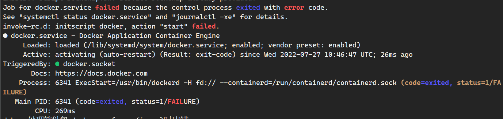

---
tags:
  - Docker
---

# docker 安装
## 内核配置检查
1. 运行检查脚本：[check-config](check-config.sh)
2. 下载内核配置检查脚本
~~~shell
wget https://github.com/moby/moby/raw/master/contrib/check-config.sh
~~~
3. 赋予可执行权限
~~~shell
chmod +x check-config.sh
~~~
- [Troubleshooting the Docker daemon | Docker Docs](https://docs.docker.com/engine/daemon/troubleshoot/)

---
# Ubuntu docker 安装
如果你过去安装过 docker，先删掉:
```shell
sudo apt-get remove docker docker-engine docker.io containerd runc
```

首先安装依赖:
```shell
sudo apt-get install apt-transport-https ca-certificates curl gnupg2 software-properties-common
```

信任 Docker 的 GPG 公钥:
```
curl -fsSL https://download.docker.com/linux/ubuntu/gpg | sudo gpg --dearmor -o /etc/apt/keyrings/docker.gpg
```

> [!error] 报错没有目录
> 手动创建`/etc/apt/keyrings/docker.gpg`文件

添加软件仓库:
```bash
echo \
  "deb [arch=$(dpkg --print-architecture) signed-by=/etc/apt/keyrings/docker.gpg] https://mirrors.tuna.tsinghua.edu.cn/docker-ce/linux/ubuntu \
  $(lsb_release -cs) stable" | sudo tee /etc/apt/sources.list.d/docker.list > /dev/null
```

最后安装
```shell
sudo apt-get update
sudo apt-get install docker-ce
```

### 验证 docker
~~~shell
# 创建 docker 用户组
sudo groupadd docker

# 把当前用户加入 docker 用户组
sudo usermod -aG docker $(whoami)

# 更新激活 docker 用户组
newgrp docker

docker run hello-world
~~~

# docker 安装排查
~~~shell
sudo dockerd --debug
journalctl -eu docker
~~~

## Debian 安装 docker 报错


1. 执行`dockerd --debug`查看报错
2. 查看有 iptables 关键词，这执行以下命令
```shell
# 防火墙选择 iptables-legacy
sudo update-alternatives  --config iptables
```
%% 有些系统执行失败
~~~shell
sudo update-alternatives --set iptables /usr/sbin/iptables-legacy
sudo update-alternatives --set ip6tables /usr/sbin/ip6tables-legacy
~~~
%%

> [!error] Debian 安装docker失败原因
> The docker installer uses iptables for nat. Unfortunately Debian uses nftables. You can convert the entries over to nftables or just setup Debian to use the legacy iptables

## 重启 docker 
```shell
systemctl restart docker
```
---
# 自动安装脚本示例
```shell
install_docker() {
    if ! [ -x "$(command -v docker)" ]; then
        echo "开始安装 Docker CE"
        curl -fsSL https://download.docker.com/linux/ubuntu/gpg | sudo apt-key add -
        sudo add-apt-repository \
            "deb [arch=amd64] https://download.docker.com/linux/ubuntu \
            $(lsb_release -cs) \
            stable"
        sudo apt-get update -qq
        sudo apt-get install -y docker-ce
    else
        echo -e "${COLOR_SUCC}Docker CE 已经安装成功了${COLOR_NONE}"
    fi
}
```

- [install.ubuntu.18.04.sh](https://github.com/haoel/haoel.github.io/blob/master/scripts/install.ubuntu.18.04.sh)
# Link
* [docker-ce | 镜像站使用帮助 | 清华大学开源软件镜像站 | Tsinghua Open Source Mirror](https://mirrors.tuna.tsinghua.edu.cn/help/docker-ce/)
