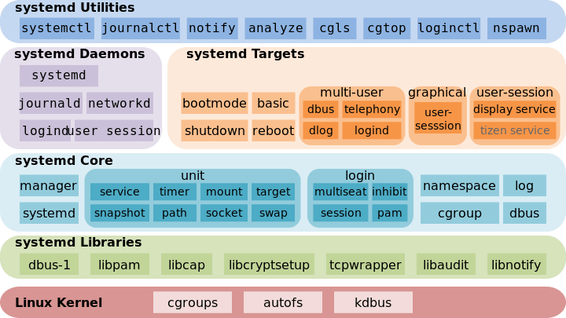

# systemd

## 配置文件
* `/usr/lib/systemd/system`
* `/etc/systemd/system`
* `systemctl cat` 查看配置文件

|              | service   | systemd   |
| ------------ | --------- | --------- |
| 服务管理     | service   | systemctl |
| 启动项管理   | chkconfig | systemctl |
| 系统启动级别 | init      | systemctl |
| 定时管理     | cron      | timer     |
| 日志管理             |     syslog      |      Systemctl-jouranal     |
`systemctl -t help`查看系统支持的单元

| 文件扩展名 | 作用 |
| :----------: | ---- |
| service    |   用于定义系统服务   |
| target     |   模拟实现“运行级别”   |
| device     |  定义内核识别设备    |
| mount      |   文件系统挂载   |
| socket     |   进程间通信用的 socket 文件   |
| timer      |    定时器  |
| snapshot   |  管理系统快照    |
| swap       |   swap 设备   |
| automount  |   自动挂载点   |
| path       |   监视文件或目录   |
| scope      |   外部线程   |
| slice           |   分层次管理系统进程   |

---
# Link & Refrences
1. [systemd - Arch Linux 中文维基](https://wiki.archlinuxcn.org/wiki/Systemd?rdfrom=https%3A%2F%2Fwiki.archlinux.org%2Findex.php%3Ftitle%3DSystemd_%28%25E7%25AE%2580%25E4%25BD%2593%25E4%25B8%25AD%25E6%2596%2587%29%26redirect%3Dno)
2. [systemd 守护程序 | 管理指南 | SUSE Linux Enterprise Server 12 SP4](https://documentation.suse.com/zh-cn/sles/12-SP4/html/SLES-all/cha-systemd.html)
3. <https://www.ruanyifeng.com/blog/2016/03/systemd-tutorial-commands.html>
4. <https://www.ruanyifeng.com/blog/2016/03/systemd-tutorial-part-two.html>
5. <https://opensource.com/article/20/4/systemd>
6. <https://www.freedesktop.org/software/systemd/man/systemd.unit.html>
7. <https://www.digitalocean.com/community/tutorials/how-to-use-systemctl-to-manage-systemd-services-and-units>
8. [systemd](https://www.freedesktop.org/wiki/Software/systemd/)

<iframe 
    height = 400
    width = 100%
    src="https://www.digitalocean.com/community/tutorials/how-to-use-systemctl-to-manage-systemd-services-and-units">
</iframe>
4. https://manpages.ubuntu.com/manpages/bionic/man1/systemctl.1.html
<iframe 
    height = 400
    width = 100%
    src="https://manpages.ubuntu.com/manpages/bionic/man1/systemctl.1.html">
</iframe>
5. https://wiki.archlinux.org/title/systemd/User
<iframe 
    height = 400
    width = 100%
    src="https://wiki.archlinux.org/title/systemd/User">
</iframe>
6. https://www.computernetworkingnotes.com/
<iframe 
    height = 400
    width = 100%
    src=" https://www.computernetworkingnotes.com/">
</iframe>
7. https://systemd.io/
<iframe 
    height = 400
    width = 100%
    src="https://systemd.io/">
</iframe>
