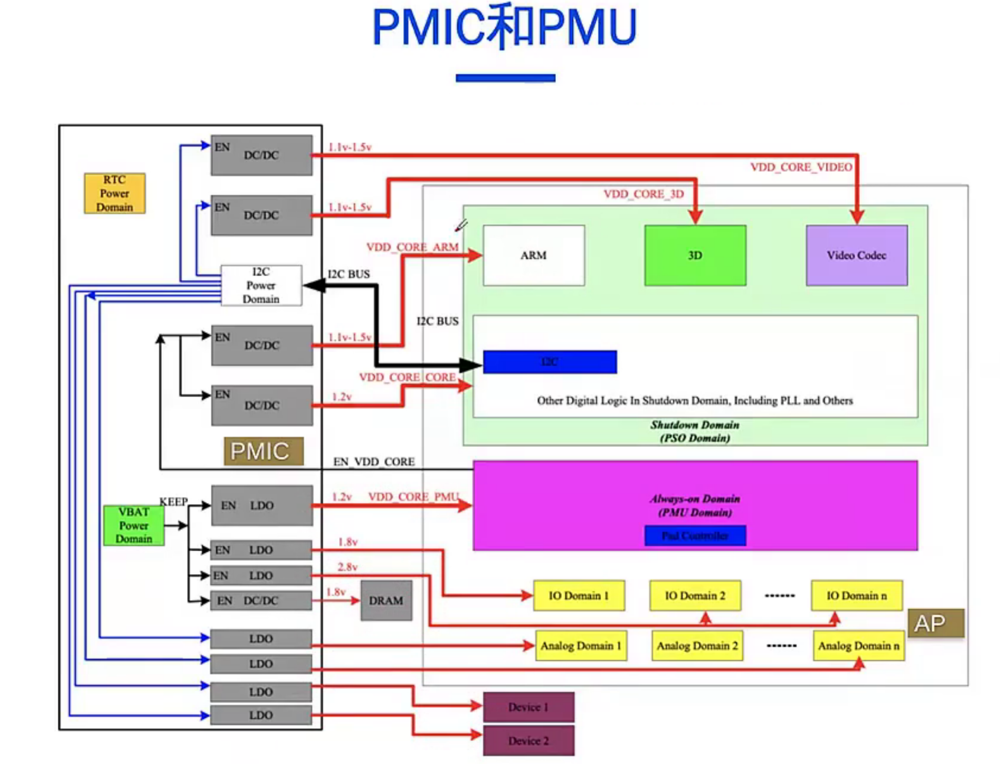

---
tags:
  - Linux/power
---
## Linux 功耗状态

- runtime pm
- Suspend-to-Idle
- Standby
- Suspend-to-RAM
- Hibernation

## Suspend to idle

- 这是个通用，纯软件的，轻量级的系统暂停变种（又被称为 S2l 或 S2ldle，译注：S表示暂停，I 表示空闲）。与系统运行状态相比，这个状态允许节省更多电能。这个状态会暂停用户空间，暂停计时系统，把所有I/0设备放到低功耗状态（很可能是比工作状态更省电的状态）。基于以上的操作，当系统休眠时处理器又可以进入深的空闲状态
    
- 系统通过带内中断唤醒。理论上，任何设备在工作状态可以触发的中断都可以用于 S2ldle 的唤醒设备
    
- 这个状态可以用于系统不支持暂停的情况 standby，suspend-to-RAM，或者用于更深的系统暂停中用于降低系统恢复的延迟。只要 CONFIG_SUSPEND 打开，这个状态是永远被支持的
    

```Shell
find /sys/devices -wholename '*power/wakeup'
echo enabled > /sys/devices/platform/soc/5000000.serial/tty/ttyS0/power/wakeup

# cat /sys/power/mem_sleep
[s2idle]
echo s2idle > /sys/power/mem_sleep
echo mem > /sys/power/state
```

## Standby

- 如果系统支持待命状态，可以提供适度的，但是实标的电能节省，并且切换回工作状态的过程是相对比较直接的，【状态恢复】不会丢失任何工作我态（因为系统的核心逻辑仍然有电），所以系统恢复到暂停前的状态也比较容易
    
- 除了 suspend-to-ldle 做的暂停用户空间，暂停计时系统，把所有I/O设备放到低功耗状态，非启动CPU会离线，并且在切换到这一状态时，所有底层系统功能都会暂停，由于以上原因，待命状态可以比 suspend-to-dle 节省更多电能。但是系统恢复的延退也会明显比前者大
    
- 可以从此状态用于唤帮的设备通常比 suspend-to-idle 少.而且依赖于平台设置唤醒功能
    
- 这个状态支持的条件是 CONFG_SUSPEND 选中，并且平台注册了 suspend 子系统。在基于ACPI的系统中，这个状态映射到 ACPI 定义的 S1 状态
    

## Suspend to RAM

- 如果系统支持休眼状态（通常称为STR或S2RAM），省电非常明显，因为该状态把系统所有部分都切换到低功耗状态，除了内存，内存会进入自刷新，以便保持其中的内容，所有进入`sandby`要执行的步骤都会执行，此外，还有些操作基于平台能力的操作需要执行，具体来说，在基于 ACPI 的系统中，内核把控制权交给平台固件（BIOS），因为S2RAM的最后步骤中，会有更多的低功耗组件断电，而这些组件是内核无法控制的
    
- 休取状态中，设备和CPU的状态都保存到内存中，所有设备都暂停，并进入低功耗状态，更多的情况下，所有设备总线都会断电，所以在系统恢复过程中，设备需要可以切换回 “开” 的状态
    
- 在基于ACPI的系统中，S2RAM 依赖平台提供的一些最小的启动代码以便系统恢复，在其它平台系统中，可能是类似的逻辑
    
- 可以用于从 S2RAM 唤酬的设备通常比 suspend-to-ldle 和 standby 少。而且必须要依稳平台做必要的设置
    
- 这个状态支持的条件是 CONFG_SUSPEND 选中，并且平台注册了 suspend 子系统。在基于ACPI的系统中，这个状态映射到 ACPI 定文的S3状态
    


