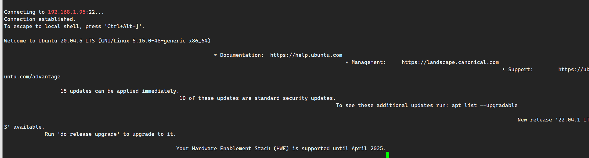

# SSH 使用
#### ssh 远程执行命令
```shell
ssh rpdzkj@192.168.1.95 "echo rpdzkj | sudo -S umount /dev/pts"
```

---
## ssh 登录失败



- PTY allocation request failed on channel 0
#### 解决办法
```shell
umount /dev/pts
mount devpts /dev/pts -t devpts
ssh name@ip "mount devpts /dev/pts -t devpts"
```


## ssh 登录失败 
> [!error] Socket error Event: 32 Error: 10053
> 
- IP 地址冲突