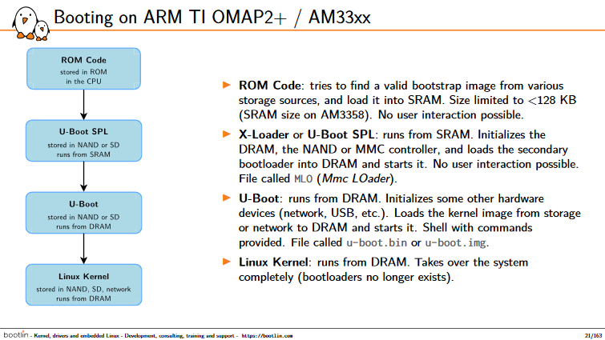

# 启动过程
## 启动的三个阶段
1. **Hardware boot:** Initializes the system hardware
2. **Linux boot:** Loads the Linux kernel and then systemd
3. **Linux startup:** Where systemd prepares the host for productive work

## link 
- [https://bootlin.com/doc/training/boot-time/boot-time-slides.pdf](https://bootlin.com/doc/training/boot-time/boot-time-slides.pdf)