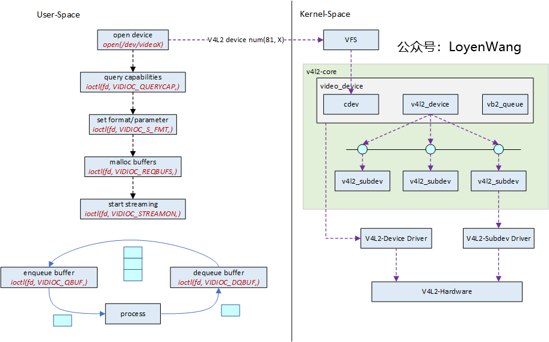
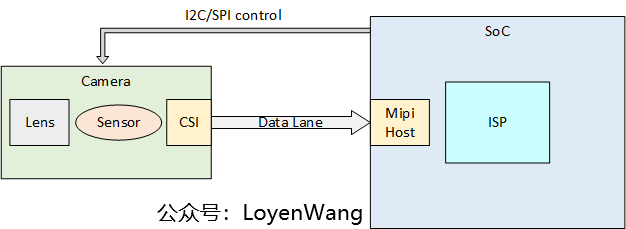

# V4L2 基础
* V4L2 (Video for Linux 2): Linux 内核中关于视频设备驱动的框架，对上向应用层提供统一的接口，对下支持各类复杂硬件的灵活扩展

## Linux 系统中视频输入设备
- 字符设备驱动：V4L2本身就是一个字符设备，具有字符设备所有的特性，暴露接口给用户空间
- V4L2驱动核心：主要是构建一个内核中标准视频设备驱动的框架，为视频操作提供统一的接口函数
- 平台 V4L2设备驱动：在 V4L2框架下，根据平台自身的特性实现与平台相关的 V4L2驱动部分，包括注册 `video_device` 和 `v4l2_device`
- 具体的sensor驱动：主要上电、提供工作时钟、视频图像裁剪、流IO开启等，实现各种设备控制方法供上层调用并注册`v4l2_subdev`

# Link
* <https://www.cnblogs.com/LoyenWang/p/15456230.html>
