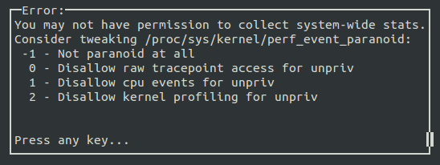

---
tags:
  - perf
---

## 查看 Kernel config 是否启用 Perf
```shell
cat "/boot/config-`uname -r`" | grep "PERF_EVENT"
```

## 安装 perf 应用
### Ubuntu 安装
```shell
sudo apt-get install linux-tools-common linux-tools-generic linux-tools-`uname -r`
```

### Debian
```shell
sudo apt install linux-perf
sudo apt-get install linux-tools-`uname -r`
```

### kernel 源码编译安装
```shell
cd tools/perf
make
sudo make install
```
检查 perf 是否可以使用
```shell
perf list
perf top
```

> [!attention] perf 不在 root 下执行
> 

`kernel.perf_event_paranoid` 决定在没有 root 权限下使用 perf 时，可以取得那些 event data

```shell
cat /proc/sys/kernel/perf_event_paranoid
```
1. $-1$ ： 权限全开
2. $0$ : 不允许  raw tracepoint access。但可以使用 perf stat、perf record 并获得 CPU events data
3. $1$ ：不允许 CPU events data。但可以使用 perf stat、perf record 获得 Kernel profiling data
4. $2$ ： 不允许任何观测

如果需要监测 cache miss event，需要取消 kernel pointer 的禁用
```shell
sudo sh -c "echo 0 > /proc/sys/kernel/kptr_restrict"
sudo sh -c "echo -1 > /proc/sys/kernel/perf_event_paranoid"
# 或者
sudo sysctl kernel.perf_event_paranoid= -1
sudo sysctl -w kernel.perf_event_paranoid=-1
```
