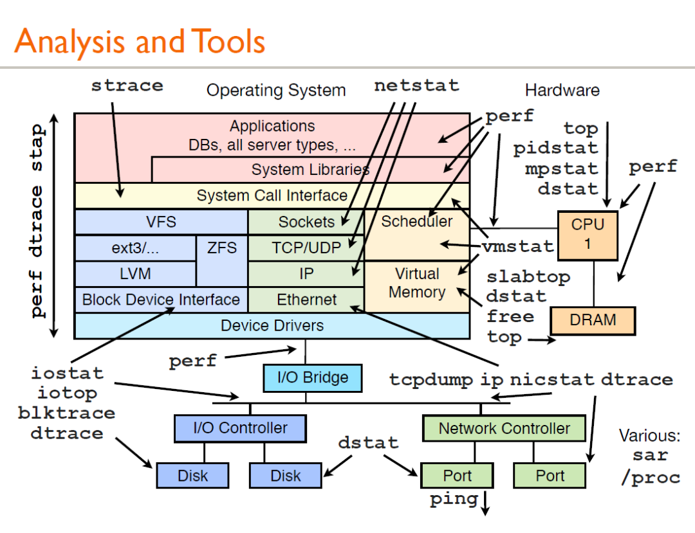
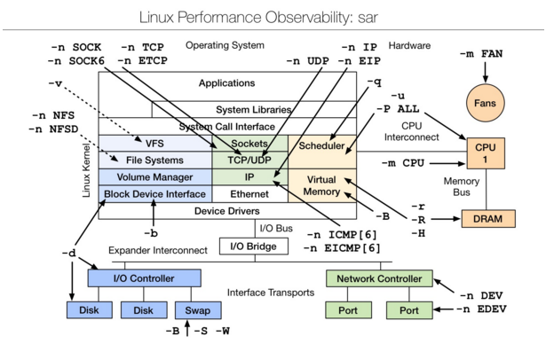

# Linux 性能分析工具


## vmstat --虚拟内存统计
```
➜ vmstat 5
procs -----------memory---------- ---swap-- -----io---- -system-- ------cpu-----
 r  b   swpd   free   buff  cache   si   so    bi    bo   in   cs us sy id wa st
 0  0      0 7354952  20876 336484    0    0     0     0    1    5  0  0 100  0  0
 0  0      0 7352920  20876 336484    0    0     0     0    6   47  0  0 100  0  0
 0  0      0 7352920  20884 336484    0    0     0     2    4   42  0  0 100  0  0
 0  0      0 7354984  20884 336484    0    0     0     1    3   37  0  0 100  0  0
 0  0      0 7354984  20884 336484    0    0     0     0    4   39  0  0 100  0  0
```
-   procs：
	- r 这一列显示了多少进程在等待 cpu
	- b 列显示多少进程正在不可中断的休眠（等待 IO）。
-   memory：
	- swapd 列显示了多少块被换出了磁盘（页面交换），剩下的列显示了多少块是空闲的（未被使用），多少块正在被用作缓冲区，以及多少正在被用作操作系统的缓存。
-   swap：显示交换活动：每秒有多少块正在被换入（从磁盘）和换出（到磁盘）。
-   io：显示了多少块从块设备读取（bi）和写出（bo）,通常反映了硬盘I/O。    
-   system：显示每秒中断(in)和上下文切换（cs）的数量。
-   cpu：显示所有的cpu时间花费在各类操作的百分比，包括执行用户代码（非内核），执行系统代码（内核），空闲以及等待IO。

## iostat--用于报告中央处理器统计信息
iostat 用于报告中央处理器（CPU）统计信息和整个系统、适配器、tty 设备、磁盘和 CD-ROM 的输入/输出统计信息，默认显示了与 vmstat 相同的 cpu 使用信息
```
➜ iostat -dx 5
Linux 5.15.57.1-microsoft-standard-WSL2 (Win)   10/10/22        _x86_64_        (8 CPU)

Device            r/s     rkB/s   rrqm/s  %rrqm r_await rareq-sz     w/s     wkB/s   wrqm/s  %wrqm w_await wareq-sz     d/s     dkB/s   drqm/s  %drqm d_await dareq-sz     f/s f_await  aqu-sz  %util
sda              0.01      0.93     0.01  27.33    0.47    62.30    0.00      0.00     0.00   0.00    0.00     0.00    0.00      0.00     0.00   0.00    0.00     0.00    0.00    0.00    0.00   0.00
sdb              0.00      0.02     0.00   0.00    0.10    25.23    0.00      0.00     0.00   0.00    1.00     2.00    0.00      0.00     0.00   0.00    0.00     0.00    0.00    1.00    0.00   0.00
sdc              0.06      2.55     0.04  39.84    0.28    41.27    0.03      1.62     0.06  68.37    1.96    60.44    0.00      1.25     0.00   0.68    0.18   666.48    0.01    0.46    0.00   0.01
```
常见 linux 的磁盘 IO 指标的缩写习惯：rq 是 request，r 是 read，w 是 write，qu 是 queue，sz 是 size，a 是 verage，tm 是 time，svc 是 service
-   rrqm/s 和 wrqm/s：每秒合并的读和写请求，“合并的”意味着操作系统从队列中拿出多个逻辑请求合并为一个请求到实际磁盘。
-   r/s和w/s：每秒发送到设备的读和写请求数。
-   rsec/s和wsec/s：每秒读和写的扇区数。
-   avgrq –sz：请求的扇区数。
-   avgqu –sz：在设备队列中等待的请求数。
-   await：每个IO请求花费的时间。
-   svctm：实际请求（服务）时间。
-   %util：至少有一个活跃请求所占时间的百分比。

## dstat --系统监控工具
dstat 显示了 cpu 使用情况，磁盘 io 情况，网络发包情况和换页情况

## iotop--LINUX 进程实时监控工具
iotop 命令是专门显示硬盘 IO 的命令，界面风格类似 top 命令，可以显示 IO 负载具体是由哪个进程产生的。是一个用来监视磁盘 I/O 使用状况的 top 类工具，具有与 top 相似的 UI，其中包括 PID、用户、I/O、进程等相关信息

## pidstat --监控系统资源情况
pidstat 主要用于监控全部或指定进程占用系统资源的情况, 如 CPU, 内存、设备 IO、任务切换、线程等

## mpstat
mpstat 是 Multiprocessor Statistics 的缩写，是实时系统监控工具。其报告 CPU 的一些统计信息，这些信息存放在 `/proc/stat` 文件中。在多 CPUs 系统里，其不但能查看所有 CPU 的平均状况信息，而且能够查看特定 CPU 的信息

## netstat
netstat 用于显示与 IP、TCP、UDP 和 ICMP 协议相关的统计数据，一般用于检验本机各端口的网络连接情况
```shell
netstat –npl   # 可以查看你要打开的端口是否已经打开。

netstat –rn    # 打印路由表信息。

netstat –in    # 提供系统上的接口信息，打印每个接口的MTU,输入分组数，输入错误，输出分组数，输出错误，冲突以及当前的输出队列的长度。
```

## strace
跟踪程序执行过程中产生的系统调用及接收到的信号，帮助分析程序或命令执行中遇到的异常情况
举例：查看 mysqld 在 linux 上加载哪种配置文件
```shell
strace –e stat64 mysqld –print –defaults > /dev/null
```

## Linux observability sar | linux 性能观测工具
