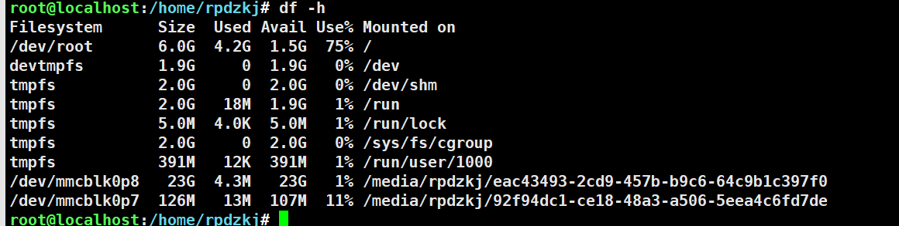
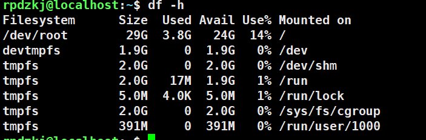

# 将剩余分区划分到 root 分区（RK356x Linux）

~~~git
diff --git a/device/rockchip/rk356x/parameter-buildroot-fit.txt b/device/rockchip/rk356x/parameter-buildroot-fit.txt                                                                                                              
index 4defd4d7a..7cbaed7bb 100644                                                                                                                                                                                                 
--- a/device/rockchip/rk356x/parameter-buildroot-fit.txt                                                                                                                                                                          
+++ b/device/rockchip/rk356x/parameter-buildroot-fit.txt                                                                                                                                                                          
@@ -8,5 +8,5 @@ MACHINE: 0xffffffff                                                                                                                                                                                               
 CHECK_MASK: 0x80                                                                                                                                                                                                                 
 PWR_HLD: 0,0,A,0,1                                                                                                                                                                                                               
 TYPE: GPT                                                                                                                                                                                                                        
-CMDLINE: mtdparts=rk29xxnand:0x00002000@0x00004000(uboot),0x00002000@0x00006000(misc),0x00020000@0x00008000(boot),0x00020000@0x00028000(recovery),0x00010000@0x00048000(backup),0x00c00000@0x00058000(rootfs),0x00040000@0x00c580
00(oem),-@0x00c98000(userdata:grow)                                                                                                                                                                                               
+CMDLINE: mtdparts=rk29xxnand:0x00002000@0x00004000(uboot),0x00002000@0x00006000(misc),0x00020000@0x00008000(boot),0x00020000@0x00028000(recovery),0x00010000@0x00048000(backup),0x00c00000@0x00058000(rootfs:grow)               
 uuid:rootfs=614e0000-0000-4b53-8000-1d28000054a9                                                                                                                                                                                 
~~~

