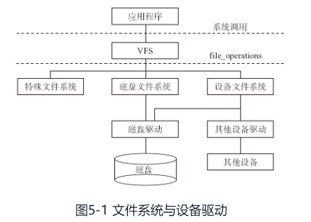

# Linux 文件系统的软件实现

# 只读根文件系统
###### 没有人通过拔出电源插头来关闭服务器或桌面系统。为什么？
因为物理存储设备上挂载的文件系统可能有挂起的（未完成的）写入，并且记录其状态的数据结构可能与写入存储器的内容不同步。当发生这种情况时，系统所有者将不得不在下次启动时等待 **fsck** 文件系统恢复工具 运行完成，在最坏的情况下，实际上会丢失数据
# ro-rootfs
* 在没有**fsck**的设备，可以以依赖于**只读根文件系统**
* 如果 Linux 进程不可以写入，那么恶意软件也无法写入 `/usr` 或 `/lib`
# 文件系统
 ## rcS
* `/etc/init.d/rcS` 文件是linux的运行时配置文件中最重要的一个，其他的一些配置都是由这个文件引出来的

# 驱动与文件系统
