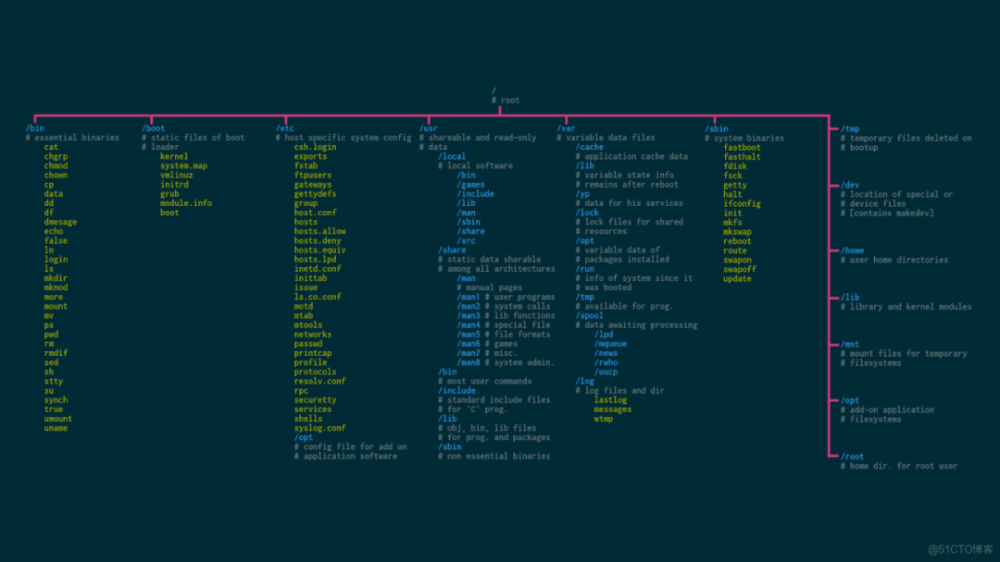

# 根文件系统
文件系统层次结构标准（英语：Filesystem Hierarchy Standard，FHS）定义了 Linux 操作系统中的主要目录及目录内容。FHS 由 Linux 基金会维护。当前版本为 3.0 版



```
/       根目录
/home   用户主文件夹
/etc    系统主要的配置文件几乎都放置在这个目录内
/root   系统管理员（root）的主文件夹
/bin    可以被 root 与一般账号所使用
/sbin   这些命令只有 root 才能够利用来“设置”系统
/lib    放置的则是在开机时会用到的函数库
/opt    用于安装第三方应用程序的
/dev    任何设备与接口设备都是以文件的形式存在于这个目录当中
/proc   一个虚拟的文件系统, 它放置的数据都是在内存当中
/sys    也是一个虚拟的文件系统，主要也是记录与内核相关的信息
/media  放置的就是可删除的设备
/mnt    暂时挂载某些额外的设备
/srv    一些网络服务启动之后，这些服务所需要取用的数据目录
/tmp    正在执行的程序暂时放置文件的地方, 系统会不定期删除

/usr    “UNIX 操作系统软件资源” 所放置的目录
　  /usr/bin/：绝大部分的用户可使用命令都放在这里
　　/usr/include/：C/C++等程序语言的头文件 header 与包含文件include放置处
　　/usr/lib/：包含各应用软件的函数库、目标文件以及一些不被一般用户惯用的执行文件或脚本
　　/usr/local/：系统管理员在本机自行安装下载的软件建议安装到此目录
　　/usr/sbin/：非系统正常运行所需的系统命令
　　/usr/share/：放置共享文件的地方
　　/usr/src/：一般源码建议放置到这里

/var    该目录主要针对常态性可变动文件
    /var/cache/：应用程序本身运行过程中会产生的一些暂存文件
　　/var/lib/：程序本身执行的过程中，需要的数据文件放置的目录
　　/var/lock/：目录下的文件资源一次只能被一个应用程序所使用
　　/var/log/：放置登录文件的目录
　　/var/mail/：放置个人电子邮件信箱的目录
　　/var/run/：某些程序或服务启动后的PID目录
　　/var/spool/：放置排队等待其他应用程程序使用的数据
```

* 根文件系统是先挂到根目录 `/` 上的文件系统
* 根目录并不属于任何一个文件系统
* 文件系统可存在于诸多介质上。例如：硬盘(mmc)、闪存(flash)、内存(RAM)。每种介质上有其最合适配套的文件系统，mmc 一般是(fat,ext)，flash 包括(jffs2)，内存(proc,sys,tmpfs,ramfs)