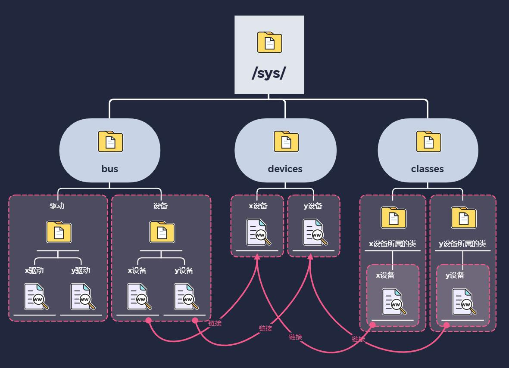

---
tags:
  - sysfs
---
# sysfs
**sysfs** **(通常挂载在** **/sys** **目录)** 是 Linux 2.6 及以后版本引入的一种**虚拟文件系统**。它的主要作用是将内核的对象（如设备、驱动程序、总线等）及其属性以文件层次结构的形式导出到用户空间。通过 `sysfs`，用户可以查看硬件状态、配置内核参数或与内核驱动进行交互。它与 `procfs`（挂载在 `/proc`）类似，但 `sysfs` 更加结构化，专注于设备模型

