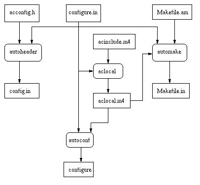

# 配置文件

## 生成 Makefile 的通用规则文件 Makefile. in
1. 手工编写 `Makefile.am` 文件
2. 使用 `automake`, 将 `Makefile.am` 生成 `Makefile.in`
> [!info] Makefile. am
> - 在使用 automake 时才需要
> - 这个 automake 的输入文件，由 automake 变量定义组成，描述了应该如何构建代码
## 生成配置脚本 `configure`
1. 执行  `autoscan`，生成 `configure.scan`，并重命名为 `configure.ac`
2. 修改、配置 `configure.ac`
3. 执行 `aclocal`，生成 `aclocal.m4`，其存放 `autoconf` 运行所需要的宏
4. 执行  `autoconf`，将 `configure.ac` 生成 `configure`

> [!info] configure. in
> 1. `configure.in` 为配置脚本
> 2. 包含可移植性问题的功能测试
> 3. 文件中的最后一件事通常是一个 `AC_OUTPUT` 宏，它列出了构建器运行配置脚本时要创建的文件
> 4. 当使用 GNU configure 系统时，这个文件是必须的

## 通过 `configure` 生成 `Makefile`
1. 执行 `./configure`，将 `Makefile.in` 生成 `Makefile`

> [!info] 
> * 方框内为文件
> * 圆形矩阵内为构建工具

## acconfig. h
当 configure 脚本通过使用`AM_CONFIG_HEADER`（或者，如果不使用 automake，则使用`AC_CONFIG_HEADER`）来创建一个可移植性头文件时，这个文件被用来描述那些不被`autoheader`命令识别的宏
* 由一系列带有注释的 "#undef "行组成

## acinclude. m4
* 定义了 autoconf 宏
* 不使用 autoconf 宏，可以不需要这个文件
* `Makefile.am`中定义`ACLOCAL_AMFLAGS = -I m4`，强制`aclocal`寻找宏定义。然后，宏定义被放在该目录下的单独文件中。`acinclude. m4`文件只在使用 automake 时使用

## Link 
- [GNU Autotools: a tutorial.pdf](https://elinux.org/images/4/43/Petazzoni.pdf)