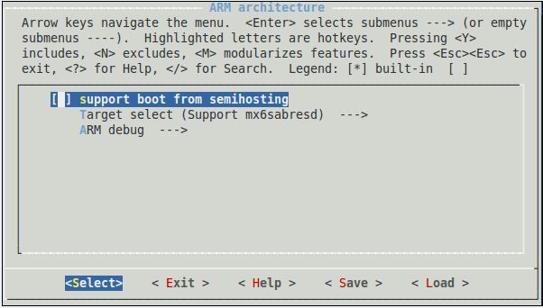

# Kconfig
## config 条目 (entry)
- 当执行 `make menuconfig` 时会出现内核的配置界面，所有配置工具都是通过读取"arch/$(ARCH) Kconfig"文件来生成配置界面，这个文件就是所有配置的总入口，它会包含其他目录的 Kconfig
- 对于 uboot 来讲，配置的总入口在 uboot/Kconfig
- Kconfig 用来配置内核，它就是各种配置界面的源文件，内核的配置工具读取各个 Kconfig 文件，生成配置界面供开发人员配置内核，最后生成配置文件 `.config`
```config
config TMPFS_POSIX_ACL
    bool "Tmpfs POSIX Access Control Lists"
    depends on TMPFS
    select GENERIC_ACL
    
    help
      POSIX Access Control Lists (ACLs) support permissions 
      for users and groups beyond the owner/group/world scheme.
      To learn more about Access Control Lists, visit the POSIX
      ACLs for Linux website <http://acl.bestbits.at/>.

     If you don't know what Access Control Lists are, say N.
```
#### 解析
- config 是关键字，表示一个配置选项的开始；紧跟着的 TMPFS_POSIX_ACL 是配置选项的名称，省略了前缀"`CONFIG_`"
- bool 表示变量类型，即"CONFIG_ TMPFS_POSIX_ACL "的类型，有 5 种类型：
	1. `bool`：y 或 n
	2. `tristate`：y、n和m
	3. `string`
	4. `hex` 
	5. `int`
	 其中 tristate 和 string 是基本的类型
- select：是反向依赖关系的意思，即当前配置选项被选中，则 GENERIC_ACL 就会被选中

## menu 条目
 menu 条目用于生成菜单，其格式如下：
```
menu "Floating point emulation"
         config FPE_NWFPE
         ..............
         config FPE_NWFPE_XP
         .............
 endmenu
```

   - menu 之后的 Floating poing emulation 是菜单名
   - menu 和 endmenu 间有很多 config 条目

## choice 条目
choice 条目将多个类似的配置选项组合在一起，**供用户单选或多选，这不同于 menu 条目**
```
choice
      prompt "ARM system type"
      default ARCH_VERSATILE
      config ARCH_AAEC2000
       .........
      config ARCH_REALVIEW
      .........
endchoice
```
- prompt "ARM system type"给出提示信息“ARM system type”，光标选中后回车进入就可以看到多个 config 条目定义的配置选项
- choice 条目中定义的变量只有**bool 和 tristate**

## comment 条目
comment条目用于定义**一些帮助信息**，出现在界面的第一行，如在arch/arm/Kconifg中有如下代码
```
    menu "Floating point emulation"
    comment "At least one emulation must be selected"
    config FPE_NWFPE
    .........
    config FPE_NWFPE_XP
```

## source 条目
- source 条目用于读取另一个 Kconfig 文件
```
source "net/Kconifg"　
```

> [!attention] 特例
> 在 Kconfig 文件中有些 config 条目很简单，比如在 uboot 中 `arch/arm/Kconfig`
> ```
>    menu "ARM architecture"
>    depends on ARM
>
>    config SYS_ARCH
>    default "arm"
>
>    config ARM64
>    bool
>
>    config HAS_VBAR
>    bool
>    ......
>
>    config CPU_V7
>    bool
>    select HAS_VBAR
>    ......
> ```
> 在 menu "ARM architecture"配置界面中那些含有 bool 但后面没跟字符串的 config 条目会没有选项可选，配置界面如下：
> 
> 其实这里就要用到 select
> "Target select" choice 条目，当我们选择其中一个比如 cconfig TARGET_MX6SABRESD 对应的选项也会被选上

- 输入提示： `"prompt" <prompt> ["if" <expr>]`
- 默认值：`"default" <expr> ["if" <expr>]`
- 依赖关系：`"depends on"/"requires" <expr>`

---
## Link
- [Kconfig详解 - 大海中的一粒沙 - 博客园](https://www.cnblogs.com/fah936861121/p/7229522.html)
- [blog.foool.net/wp-content/uploads/linuxdocs/kbuild.pdf](http://blog.foool.net/wp-content/uploads/linuxdocs/kbuild.pdf)
- 