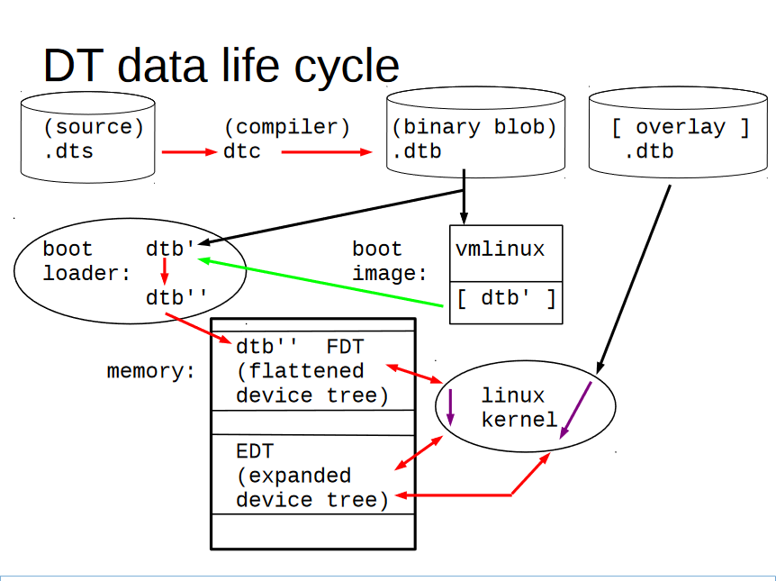

# Linux dts
## fdt
u-boot 添加 fdt 支持：`define CONFIG_OF_LIBFDT`
### 查看设备树节点
```shell
fdt ls
fdt ls /rp_power
fdt print /backlight
```
### 查看设备树节点详细信息
```shell
fdt prop /rp_power
fdt prop /aliases
```

### fdt 修改设备树
```shell
fdt resize
fdt set /rp_gpio status disabled
```


## dts 编译
###  多文件编译
```shell
cpp -nostdinc -I. -undef -x assembler-with-cpp [src_dts_file] > [tmp_dts_file]
```

```shell
#/bin/bash
#set -vx
device="your_device_name"
src_dts=$device.dts
tmp_dts=$device.tmp.dts
dst_dtb=$device.dtb

cpp -nostdinc -I. -undef -x assembler-with-cpp $src_dts > $tmp_dts
dtc -O dtb -b 0 -o $dst_dtb $tmp_dts
rm $tmp_dts
```
- `-nostdinc` 不搜索标准目录
- `-I` ： 搜索当前目录
- `-undef` 不预定义系统和 gcc 特定的宏
- `-x assembler-with-cpp` 指定语言 c c++ objective-c assembler-with-cpp
```shell
# compile dts or dtsi
dtc -I dts -O dtb -o devicetree_file_name.dtb devicetree_file_name.dts

# convert dts to dtb
dtc -I dts -O dtb -f devicetree_file_name.dts -o devicetree_file_name.dtb

# convert dtb to dts
dtc -I dtb -O dts -f devicetree_file_name.dtb -o devicetree_file_name.dts

# run through the C pre-processor to handle the includes/macros/defines
cpp -nostdinc -I include -I arch -undef -x assembler-with-cpp \
  arch/arm64/boot/dts/freescale/imx8mm-venice-gw73xx-0x-gpio.dts \
  imx8mm-venice-gw73xx-0x-gpio.dts.tmp
# compile with Device Tree Compiler
dtc -@ -i include/ -I dts -O dtb -o imx8mm-venice-gw73xx-0x-gpio.dtbo \
  imx8mm-venice-gw73xx-0x-gpio.dts.tmp
```




## de-compile
```shell
# de-compile dt via dtc
dtc -I fs -O dts /sys/firmware/devicetree/base
# hexdump prop from /proc/device-tree 
hexdump -C /proc/device-tree/soc\@0/pcie\@33800000/fsl\,max-link-speed
```
## Link
- [Device Tree Reference - eLinux.org](https://elinux.org/Device_Tree_Reference)