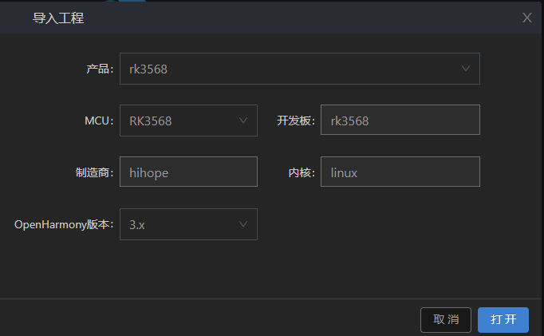
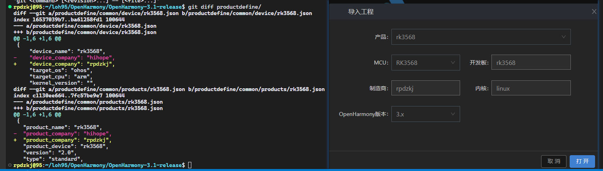

# DevEco Device Tool 使用
烧录的过程中，不同的开发板依赖的工具链是不同的，通常需要开发者根据开发板去获取相应的工具链。DevEco Device Tool 提供这些所需工具链的统一管理功能，只需要开发者在 DevEco Device Tool 上设置工具链的本地路径即可，在进行编译、烧录过程中，DevEco Device Tool 会自动调用对应的工具

## 4 个功能区域
1. **工具控制区**：提供工程的导入、配置、烧录、调试等功能。
2. **代码编辑区**：提供代码的查看、编写和调试等功能。
3. **输出控制台**：提供操作日志的打印、调试命令的输入及命令行工具等功能。
4. **快捷控制功能**：提供 DevEco Device Tool 工具的快捷操作命令，如 Build、Upload、Erase 等功能

修改前：

修改后：

# Link & References
* 帮助文档:<https://device.harmonyos.com/cn/docs/documentation/guide/service_introduction-0000001050166905>

