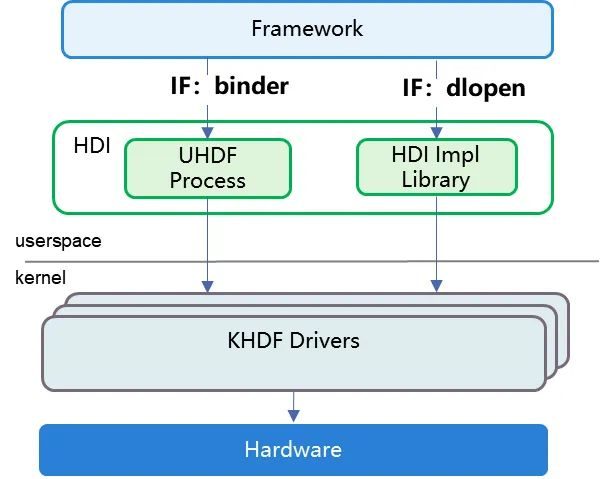

# HDI
HDI（Hardware Device Interface，硬件设备接口）是 HDF 驱动框架为开发者提供的硬件规范化描述性接口
HDI 位于 “基础系统服务层”和“设备抽象层（DAL）”之间。硬件设备通过 DAL 抽象化，并基于 IDL（Interface Description Language）接口描述语言描述后，为上层应用或服务提供了规范的硬件设备接口

## 调用方式
* **IPC 模式**：IPC 模式即跨进程通信模式，基于 binder 机制实现，调用端通过 Proxy 代理库调用 HDI 接口，具备良好的解耦性和安全性，是标准系统的默认部署方式
* **直通模式**：将 HDI 实现为共享库，调用端使用 dlopen 加载 HDI 实现库并直接调用 HDI 接口，是小型系统的默认部署方式，同时还适用于对性能有特殊需求的标准系统模块
* 
# Link
* <https://gitee.com/openharmony/drivers_interface>
