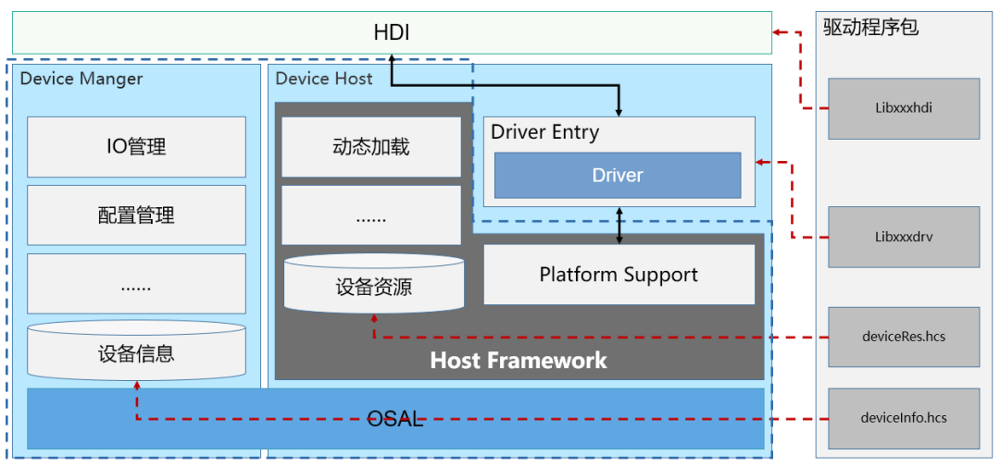
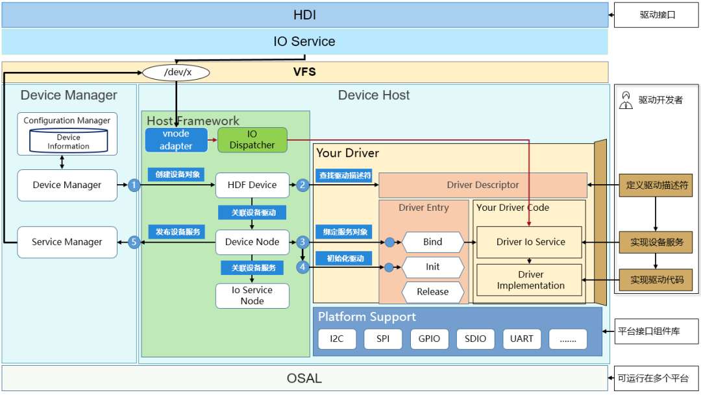

# HDF 驱动框架
## HDF
**HDF**: Hardware Driver Foundation，硬件驱动框架，用于提供统一外设访问能力和驱动开发、管理框架
* 驱动开发者提供驱动框架能力，包括驱动加载、驱动服务管理和驱动消息机制；目的是构建统一的驱动架构平台

## 框架构成

HDF 驱动框架主要由以下四部分组成
* 驱动基础框架
* 驱动程序
* 驱动配置文件
* 驱动接口

驱动框架采用的是主从模式设计，由 Device Manager 和 Device Host 组成

### Device Manager
Device Manager 提供了统一的驱动管理，Device Manager 启动时根据 Device Information 提供驱动设备信息加载相应的驱动 Device Host，并控制 Host 完成驱动的加载。

### Device Host
Device Host 提供驱动运行的环境，同时预置 Host Framework 与 Device Manager 进行协同，完成驱动加载和调用。根据业务的需求 Device Host 可以有多个实例

## HDF 驱动加载包括按需加载和按序加载
1. 驱动按需加载
	HDF 框架支持驱动在系统启动过程中默认加载，或者在系统启动之后动态加载

2. 驱动按序加载
	HDF 框架支持驱动在系统启动的过程中按照驱动的优先级进行加载

# Openharmony 驱动添加

# Link & References
* <https://developer.huawei.com/consumer/cn/forum/topic/0203858565866040173?fid=0103702273237490025>
