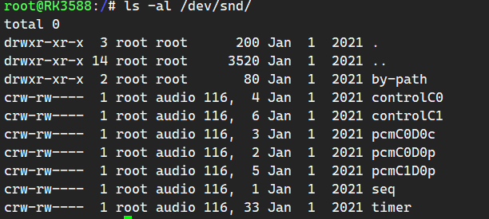

# rk356x ubuntu FAQ
## FAQ

### 1 桌面图标双击无法打开

xfce4 的配置文件有问题，在运行 startxfce4 的时候会提示配置文件的位置，如果缺少配置文件或者配置有问题，是会出现异常情况的。


### 2 桌面启动后无法正确运行应用

桌面启动后无法正确运行桌面引用，点击应用是会提示 input/output error，未安装对应的应用导致。

### 3 开机不会自动启动桌面或者登陆界面

可能是会话管理器的问题，会话管理器要先登录成功后，才会启动 startx，使用哪个用户登陆就会使用哪个用户启动 startx，注销登陆后会停止进程。

### 5 不能使用鼠标和键盘

内核配置USB鼠标支持就好。<a href="#13 键盘和鼠标不支持">[参考]</a>


### 6 桌面自动登录 

rv1126_1109使用的 ubuntu 登录管理器是 slim，slim登录管理器很轻巧，比较适合嵌入式系统，可以修改默认登录的主题，主题存放路径 /usr/share/slim/themes/，暂时不支持 gdm 和 lightdm，也不推荐使用 gdm 和 lightdm，这两个登录管理器对于arm 平台（尤其是rv1126_1109）来说，都过于庞大了。

```bash
ls /usr/share/slim/themes/
debian-joy  debian-lines  debian-moreblue  debian-moreblue-orbit  debian-spacefun  default
```

配置文件： /etc/slim.conf 

```bash
# default user, leave blank or remove this line
# for avoid pre-loading the username.
# default_user        simone        # 默认用户，与自动登录搭配配置

# Focus the password field on start when default_user is set
# Set to "yes" to enable this feature
#focus_password      no

# Automatically login the default user (without entering
# the password. Set to "yes" to enable this feature
#auto_login          no				# 自动登录


# current theme, use comma separated list to specify a set to 
# randomly choose from
current_theme       debian-moreblue   #当前使用主题
```


### 7 配置中文支持

主板启动 ubuntu 系统后，在主板上打开终端，执行

```bash
dpkg-reconfigure locales
```

然后移动光标按空格选中zh_CN.UTF-8 和 en_US.UTF-8 编码，然后直接按回车确定以后选择默认语言为 en_US.UTF-8 (如果这里选择了zh_CN.UTF-8 ， 则操作系统会变成中文的)，如果重启后还是不支持中文，则需要安装字体库

```bash
# apt-get install ibus ibus-gtk ibus-pinyin -y  这个可以不用安装

apt-get install ttf-wqy-zenhei -y
```


### 10 关闭锁屏和屏保

卸载屏保模块就好了

```bash
apt-get remove xscreen-saver --purge && apt-get autoremove
```

这个操作只是关闭了屏保，但是到了一定时间屏幕还是会黑屏。

* 关闭休眠（电源管理），不会黑屏

```bash
export DISPLAY=:0
xset -display :0 dpms force on
xset s 0
xset -dpms
```

设置完成后使用 xset -q 查看设置结果

```bash
rpdzkj@ubuntu:/etc/X11$ xset -q
...
DPMS (Energy Star):
  Standby: 600    Suspend: 600    Off: 600
  DPMS is Disabled     # 主要关注这个部分
```

* 使能休眠（电源管理）

```bash
xset +dpms
```

设置完成后使用 xset -q 查看结果

```bash
DPMS (Energy Star):
  Standby: 600    Suspend: 600    Off: 600
  DPMS is Enabled		# 主要关注这个部分
  Monitor is On          
```

xset 更多使用参考 https://blog.csdn.net/hqyhqyhq/article/details/12495965，或者使用 xset  -h 获得帮助信息


### 12 没有网络连接图标

安装 network-manager-gonme

```bash
apt-get install network-manager-gonme
```

###  13 键鼠和U盘不支持

对于 rv1126_1109 来说在内核中配置以后，才能在ubuntu系统使用键鼠和U盘。

键鼠配置

```bash
Device Drivers  --->
	HID support  --->
		<*>   Generic HID driver
```

U盘配置

```bash
Device Drivers --->
	SCSI device support --->
	<*> SCSI device support
        [ ] SCSI: use blk-mq I/O path by default
        [*] legacy /proc/scsi/ support
        *** SCSI support type (disk, tape, CD-ROM) ***
        <*> SCSI disk support
        < > SCSI tape support
        < > SCSI OnStream SC-x0 tape support
        < > SCSI CDROM support
        <*> SCSI generic support   #主要是这项配置
        <*> SCSI media changer support
        [*] Verbose SCSI error reporting (kernel size +=75K)
        [*] SCSI logging facility
        [*] Asynchronous SCSI scanning
        SCSI Transports --->
        [*] SCSI low-level drivers --->
        [ ] PCMCIA SCSI adapter support ----
        [ ] SCSI Device Handlers ----
```

配置完 SCSI Device Support 后，可以在 USB Support 中找到如下选项，选上即可。

```bash
Device Driver --->
    [*] USB support --->
    	<*> USB Mass Storage support
```


### 14 SD/TF 卡识别失败报错

```bash
[ 2716.652672] mmc1: error -5 whilst initialising SD card
[ 2772.631243] mmc1: error -110 whilst initialising SD card
```

这个是部分硬件问题，略过。

### 15 添加开机启动的service

在 /lib/systemd/system/ 目录下添加对应的service文件


### 16 软键盘 onboard

开机启动

```bash
$ cat ~/.config/autostart/onboard-autostart.desktop 
```

```ini
[Desktop Entry]
Name=Onboard
GenericName=Onboard onscreen keyboard
Comment=Flexible onscreen keyboard
Exec=onboard
Icon=onboard
Type=Application
NoDisplay=true
X-Ubuntu-Gettext-Domain=onboard
AutostartCondition=GSettings org.gnome.desktop.a11y.applications screen-keyboard-enabled
X-GNOME-AutoRestart=true
OnlyShowIn=Unity;MATE;
X-XFCE-Autostart-Override=true
```

如果想去掉开机启动，删除掉对应的文件就行了


### 17 音频播放器

音频播放器使用的是这个。

```bash
apt-get install audacious
```

终端录音和播放

```bash
amixer -c1 cset numid=2 1			# 配置录音
amixer -c1 cset numid=1 6			# 配置声卡

arecord -Dhw:1,0 -c 2 -r 44100 -f S16_LE -d 10 /tmp/record.wav    # 录音
aplay -Dhw:2,0 /tmp/record.wav                                    # 播放
```

### 18 4G拨号上网

4G拨号有两种选择，

第一种是操作界面拨号，界面拨号需要配置 network-manager 接管4G通信，默认不接管4G网络通信，`/usr/lib/NetworkManager/conf.d/10-globally-managed-devices.conf`  文件中做如下修改，

```bash
[keyfile]
# 注释掉这个部分，让 network-manager 接管所有网络
# unmanaged-devices=*,except:type:wifi,except:type:wwan,except:type:ethernet
unmanaged-devices=
```

然后重启  network-manager 服务，如果不行就重启开发板。

```bash
sudo service network-manager restart
```

等识别到模块后，点击双箭头，然后点击 China Mobile internet （如果没有这个选项就先将 Enable Mobile 打上勾），可能会提示需要输入密码，这时候有两种选择：

> 1. 是直接删除掉这个连接重新自己添加，可参考这个连接操作，https://blog.csdn.net/subfate/article/details/79719465
>
> 2. 是输入密码123456，4G拨号的用户名和密码随便输入都可以的，默认的连接密码就是123456。

拨号成功后会显示像 wifi 一样的信号强度，并且通过串口使用 ifconfig  指令可以看到 ppp0 节点。


第二种拨号方式是使用脚本拨号。如果是由 network-manager 接管4G拨号，通过指令拨号前，需要将界面上的  Enable Mobile 勾去掉，不让 network-manager 接管4G，然后拨号：

```bash
sudo sh ppp/peers/quectel-pppd.sh 
#或者使用
pppd call quectel-ppp &
```

拨号成功后通过串口使用 ifconfig  指令可以看到 ppp0 节点。


### 19 dhcpcd 获取的 ip 地址异常

网段不对应，需要手动 udhcpc 获取后才能正常联网。已换成 network-manager 管理网络。


### 20 内核不定时打印 USB 信息

```bash
usb 1-1-port2: disabled by hub (EMI?), re-enabling...
```

内核会不定时的打印这个信息，但是 USB 功能并没有受影响。升级至 ubuntu20.04 后消失。


### 21 修改和恢复默认桌面配置

对于当前用户而言，在可视化界面设置以后，默认的配置会保存到用户的根目录的 .config 文件夹中（有可能还有其他文件），如果是制作镜像，设置完成以后，将 .config 文件夹拷贝到源码中对应的位置，然后重新编译即可。如果想要恢复默认配置，则删除 .config 文件夹后重启，即可恢复默认配置。


### 22 apt arm 源

apt 默认主板使用的是 ubuntu 官方源，如果网速不是极慢的情况，不建议换源，尤其是 arm 平台的。这里提供一个清华的源，更多选择自行网络搜索。

```bash
# 默认注释了源码镜像以提高 apt update 速度，如有需要可自行取消注释
deb https://mirrors.tuna.tsinghua.edu.cn/ubuntu-ports/ bionic main restricted universe multiverse
# deb-src https://mirrors.tuna.tsinghua.edu.cn/ubuntu-ports/ bionic main restricted universe multiverse
deb https://mirrors.tuna.tsinghua.edu.cn/ubuntu-ports/ bionic-updates main restricted universe multiverse
# deb-src https://mirrors.tuna.tsinghua.edu.cn/ubuntu-ports/ bionic-updates main restricted universe multiverse
deb https://mirrors.tuna.tsinghua.edu.cn/ubuntu-ports/ bionic-backports main restricted universe multiverse
# deb-src https://mirrors.tuna.tsinghua.edu.cn/ubuntu-ports/ bionic-backports main restricted universe multiverse
deb https://mirrors.tuna.tsinghua.edu.cn/ubuntu-ports/ bionic-security main restricted universe multiverse
# deb-src https://mirrors.tuna.tsinghua.edu.cn/ubuntu-ports/ bionic-security main restricted universe multiverse

# 预发布软件源，不建议启用
# deb https://mirrors.tuna.tsinghua.edu.cn/ubuntu-ports/ bionic-proposed main restricted universe multiverse
# deb-src https://mirrors.tuna.tsinghua.edu.cn/ubuntu-ports/ bionic-proposed main restricted universe multiverse
```


### 23 apt 支持https传输

```bash
 apt-get install apt-transport-https
```


### 24 禁止（启用）某个开机自启服务

````bash
$ systemctl disable bluetooth.service   #比如禁止蓝牙自启动
$ systemctl enable bluetooth.service   	#比如启用蓝牙自启动
````


### 25 新增用户后界面播放没有声音

 root 用户使用 Audacious 提示一直在连接 pulseaudio 是因为root用户不在 pulseaudio 这个组，所以需要添加这个组进去。

```bash
sudo gpasswd -a root pulse
sudo gpasswd -a root pulse-access
```

然后重启 pulseaudio 服务

对于普通用户而言，可以打开 Audacious 应用，但是获取不到声卡，是因为普通用户不在声卡驱动所在的组，没有相关权限，<font color=red>如果是新增的用户，下面的操作必不可少，不然不管是终端还是桌面都获取不到声卡信息。</font>


所以需要添加普通用户到 audio 组，如添加 rpdzkj 到 audio 组。以及 pulse 用户也需要添加到audio组中。

```bash
sudo gpasswd -a rpdzkj audio
sudo gpasswd -a pulse  audio
```

然后重新打开 Audacious 即可

### 26 apt完全删除一个包

```bash
sudo apt remove --purge xxx
```

### 27 任然无法播放音频

如果在 <a href="# 25 新增用户后界面播放没有声音">[25] </a>步骤中添加了相应的用户到组以后还不能播放音频，可能是因为喇叭和mic都没有打开，这个时候需要使用 amixer 工具对喇叭和 mic 进行操作

```bash
amixer -c2 cset numid=2 1
amixer -c2 cset numid=1 6
```

详细参数可使用 amixer -c2 contents 查看。


### 28 network-manager 不自动管理以太网

/usr/lib/NetworkManager/conf.d/10-globally-managed-devices.conf 文件中添加以太网配置

```bash
[keyfile]
unmanaged-devices=*,except:type:wifi,except:type:wwan,except:type:ethernet
```

如果不会自动连接

/etc/NetworkManager/NetworkManager.conf 文件中修改 false 为true

```bash
[main]
plugins=ifupdown,keyfile

[ifupdown]
managed=true   #修改为true

[device]
wifi.scan-rand-mac-address=no
```

然后重启板子


### 28 apt 清理缓存

系统使用一段时间后 var/cache 目录会越来越大，导致磁盘空间越来越小，可以使用命令清理

```bash
# 1.清除所有已经安装包文件
apt-get clean

# 2.清除已经删除的安装包安装文件
apt-get autoclean

# 3.清除不再依赖的安装包安装文件
apt-get autoremove
```


### 29 使用 apt 安装 qt 环境

安装默认的版本，暂时不能指定版本。ubuntu20.04 默认 qt 版本是 5.12.7。

```bash
sudo apt-get install qt5-default
```

安装指定模块。

```bash
apt-get install libqt5serialport5
```


### 30 启用电源管理

系统默认是关闭电源管理的，这样的话屏幕会一直不休眠，如果需要开启，可按照一下方式操作，

第一种方式是通过界面设置，以此点击 Application->Settings->Screensaver，然后点击 Advanced->Display Management Enabled ，选中后启用电源管理，并且可以设置休眠时间。

第二种方式<a href="#10 关闭锁屏和屏保" >[参考]</a>


### 31 蓝牙

开机默认启用，如果需要使用或者关闭请修改  /etc/init.c/rp-init 文件


### 32 普通用户无法操作串口
可以看到，串口所在的组为 dialout，而且其他用户是没有权限的，如果是普通用户，则需要添加到 dialout 组中，即可操作串口。

```bash
sudo gpasswd -a rpdzkj dialout
```

修改后需要重启板子才能生效。


### 33 QT 获取音频设备为空

QAudioDeviceInfo::availableDevices 返回空的处理方法：

安装 libqt5multimedia5-plugins （和libqt5multimedia5不一样）

```bash
apt install libqt5multimedia5-plugins
```


### 34 文件系统同步

虚拟机上安装 rsync 和 ssh 后在主机端执行：

```bash
sudo  rsync -avx root@192.168.1.198:/   ubuntu/
```

192.168.1.198 应按照开发板当前的实际IP进行修改，ubuntu/ 为同步下来的文件系统存放路径。


### 35 rpdzkj 用户所在的组

如果是新增普通用户，需要参考 rpdzkj 用户所在的组做相应的添加，否则会导致很多功能无法使用

```bash
$ groups rpdzkj
rpdzkj : rpdzkj dialout audio dip video input
```


### 35 重新烧写后文件系统分区只有2G

这种情况一般是出现在客户自己导出镜像编译后再烧写回开发板出现，解决方案是在 /var/ 目录下创建一个文件名为resize_flag  的空文件，原理请自行查看  /etc/init.d/rp-init 文件。

```bash
ls /var
resize_flag
```


### 36 安装 OpenCV 支持

ubuntu20.04 默认安装版本为 OpenCV4，opencv3 暂不支持，后期根据客户需求量考虑移植 opencv3

```bash
$ sudo apt-get install libopencv-dev
```


### 36.5 安装 gstreamer

使用opencv打开摄像头需要先安装gstreamer，默认已安装。

```bash
$ apt-get install libgstreamer1.0-0 gstreamer1.0-plugins-base \
gstreamer1.0-plugins-good gstreamer1.0-plugins-bad gstreamer1.0-plugins-ugly \
gstreamer1.0-libav gstreamer1.0-doc gstreamer1.0-tools gstreamer1.0-x \
gstreamer1.0-alsa gstreamer1.0-gl gstreamer1.0-gtk3 gstreamer1.0-qt5 \
gstreamer1.0-pulseaudio
```


### 37 OpenCV 获取摄像头画面

在 home/rpdzkj 的目录下有 OpenCV 目录里面有 OpenCV4 的 demo，可按照以下方式运行，需要注意的是，此demo不能再串口终端运行，只能在开发板的终端运行，否则会提示找不到显示设备退出。

```bash
$ ~/OpenCV/opencv_helloworld/build/camera
```

源码所在位置为 ~/OpenCV/opencv_helloworld/camera/ 目录，不同摄像头需要修改 main.cpp  文件中对应的节点，摄像头节点对应为

**mipi接口摄像头 : /dev/video0**

**USB摄像头：/dev/video20-21**


版本暂时不能支持 RKAIQ，获取到的为原始的 raw 转 yuv 格式的数据，并没有经过 ISP 处理，所以获取到的摄像头和画面亮度比较暗或者色彩偏差。

<font color=red>说明：当前版本只能支持使用 OpenCV 获取一个 mipi 接口摄像头数据，暂时不能支持两路 mipi ，如果要在ubuntu系统上使用双目方案，只能使用一路mipi + 一路 USB camera 的方式</font>


### 38 RK mpp 支持

mpp 并非 rkmedia，为节省空间开发板上只保留了库文件，源码在 sdk/external//mpp/ 目录下


### 39 NPU

默认只支持 C 语言环境，py 环境后续根据客户需求添加支持，也可以尝试自己添加 py 环境支持。在home/rpdzkj/NPU 目录下我司添加了原厂的 demo，客户可以快速使用的么验证 npu 功能，部分 demo 需要 root 权限运行。

V2.1 版本更新后支持py环境了，可以直接在板上运行py脚本。demo位于 home/rpdzkj/NPU/py_examples/ 目录下。

运行可以直接执行 `python3 test.py` 

```bash
rpdzkj@ubuntu:~/NPU/py_examples/inference_with_lite$ python3 test.py 
--> list devices:
*************************
None devices connected.
*************************
done
--> query support target platform
**************************************************
Target platforms filled in RKNN model:         ['RV1109']
Target platforms supported by this RKNN model: ['RK1109', 'RK1126', 'RV1109', 'RV1126']
**************************************************
done
--> Load RKNN model
done
--> Init runtime environment
done
--> get sdk version:
==============================================
RKNN VERSION:
  API: librknn_runtime version 1.6.0 (6523e57 build: 2021-01-15 15:56:31 base: 1126)
  DRV: 6.4.3.5.293908
==============================================

done
--> Running model
resnet18
-----TOP 5-----
[812]: 0.9993900656700134
[404]: 0.0004593880439642817
[657 833]: 2.9284517950145528e-05
[657 833]: 2.9284517950145528e-05
[895]: 1.850890475907363e-05

done
```


### 40 内核配置

dts 文件

| RV1126                                         | RV1109                                         |
| ---------------------------------------------- | ---------------------------------------------- |
| kernel/arch/arm/boot/dts/pro-rv1126-ubuntu.dts | kernel/arch/arm/boot/dts/pro-rv1109-ubuntu.dts |
| kernel/arch/arm/boot/dts/pro-rv1126-ubuntu.dts | kernel/arch/arm/boot/dts/pro-rv1109-ubuntu.dts |

menuconfig 文件

kernel/arch/arm/configs/rv1126-1109-ubuntu.config


### 41 串口登录不上

串口终端输入密码后总是登录不上，是因为不能使用 root 登录，只能使用普通用户登录，目前我还没找到在哪里修改可以 root 登录。

普通用户账号和密码均为 rpdzkj 


