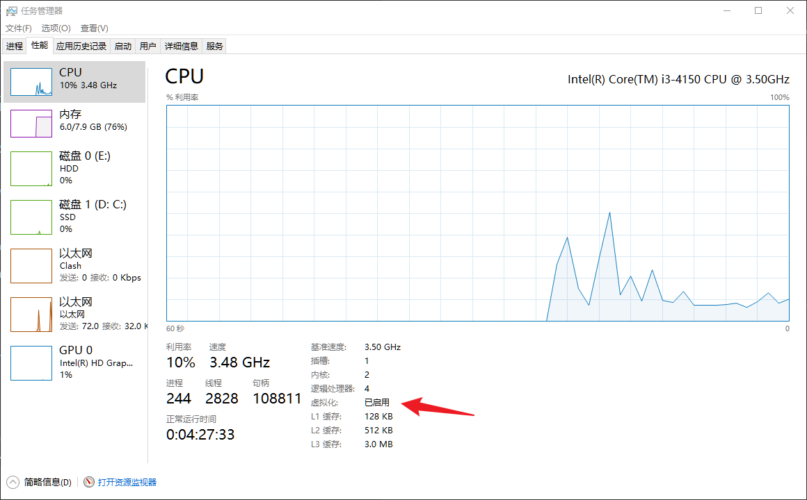

# 虚拟机
1. 打开 CPU 虚拟化支持
	
# ubuntu
* 安装 Samba：`sudo apt install samba`
* Samba 设置（`vim /etc/samba/smb.conf`）
	* 设置 Samba 服务器别名：`NetBIOS name = ubuntu20`
	* 设置映射文件夹：
~~~shell
[ubuntu]
	path = /home/luo
	guest ok = yes 
	read only = no
	#valid users = loh
	force user = loh
	force group = loh
    create mask = 0775
    directory mask = 0775
    browseable = yes
    public = yes
    writable = yes 
~~~
### 添加 samba 用户密码 
```shell
sudo smbpasswd -a linuxsir

sudo systemctl restart smbd.service
sudo systemctl restart nmbd.service
```

* 使配置文件生效：`sudo systemctl restart smbd.service`
* 重启服务，使映射驱动生效：`sudo systemctl restart nmbd.service`
* 修改文件夹权限
	

## 设置 bash 默认
```shell
sudo dpkg-reconfigure dash
```