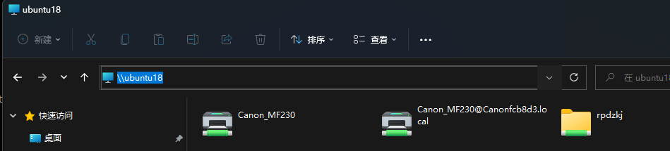

# 虚拟机使用
## 配置共享目录

```conf
[loh]
   comment = Samba Share
   path = /home/loh
   #valid users = loh
   force user = loh
   force group = loh
   create mask = 0775
   directory mask = 0775
   guest ok = yes
   read only = no
   browseable = yes
   public = yes
   writable = yes
```


## 使用 Windows 文件管理器打开 ubuntu 文件夹


### 设置方法
1. 配置 Samba：`sudo vim /etc/samba/smb.conf`
```conf
# 在 [global] 组下添加
netbios name = ubuntu18
```

2. 重启 Samba 服务：`sudo systemctl restart nmbd`
3. 添加到开机启动项：`sudo systemctl enable nmbd`
4. 在 Windows 文件管理器地址栏输入：`\\ubuntu18`
