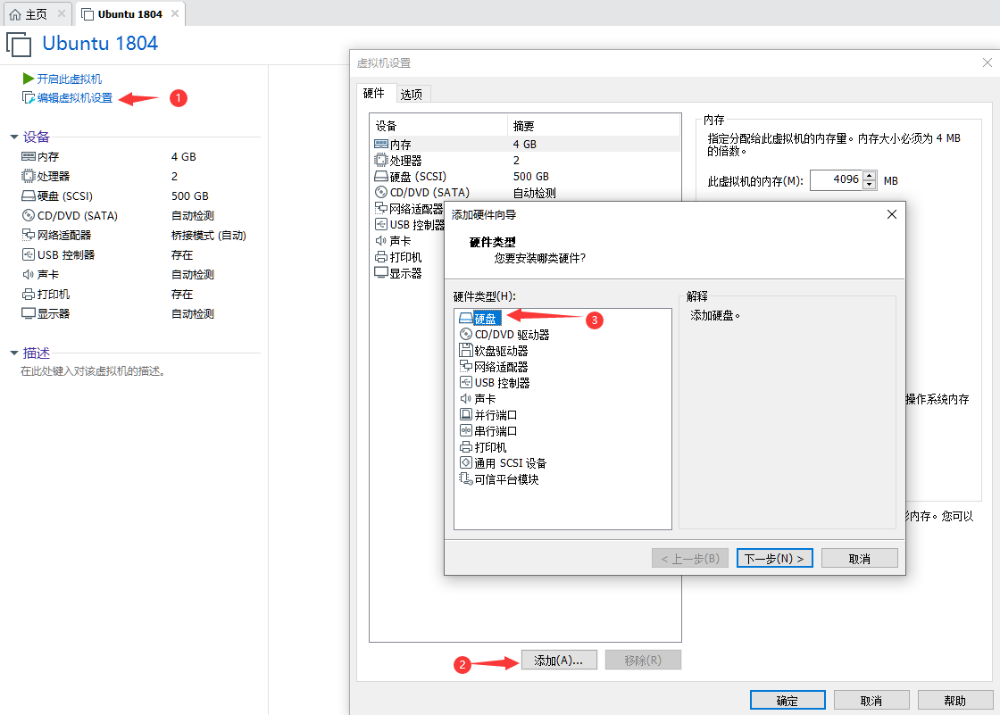

# 虚拟机扩容
1. 关闭 ubuntu 虚拟机
2. 如下图操作增加一个磁盘

3. 创建一个虚拟磁盘
4. 登录 ubuntu 虚拟机终端，使用`sudo fdisk -l`查看新增磁盘节点
5. 磁盘分区 `fdisk /dev/sdN`(输入：*M*。此处参考百度：fdisk 分区格式化 ) 
6. 磁盘格式化：`mkfs.ext4 /dev/sdN1`
7. 挂载分区：`mount /dev/sdN1 /mnt/fs`
8. 更改 `/mnt/fs` 的**权限**及**所属用户组**（`chown --help`)
9. 开机自动挂载可以修改`/etc/fstab`文件
10. 删除文件，可以在 Windows 删除对应文件即可

* 参考：<https://www.cnblogs.com/tssc/p/9184895.html>

## 安装 gparted 图形界面扩容工具
~~~shell
sudo apt install gparted
~~~
