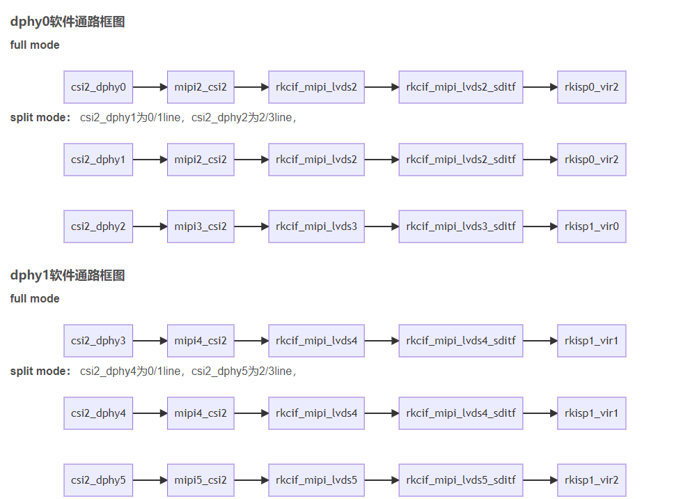

---
tags:
  - RK3588/camera
---

## camera 连接链路示意图
[Open: aa1a25b84a6fb506aec7bac0f4f4e13.png](assets/RK3588两路摄像头配置.png)

- rk3588支持两个dcphy，节点名称分别为csi2_dcphy0/csi2_dcphy1。每个dcphy硬件支持RX/TX同时使用，对于camera输入使用的是RX
- 支持DPHY/CPHY协议复用；需要注意的是同一个dcphy的TX/RX只能同时使用DPHY或同时使用CPHY
- rk3588支持2个dphy硬件，这里我们称之为dphy0_hw/dphy1_hw，两个dphy硬件都可以工作在full mode 和split mode两种模式下
- rk3588所有camera数据都需要通过vicap，再链接到isp
- rk3588支持2个isp硬件，每个isp设备可虚拟出多个虚拟节点，软件上通过回读的方式，依次从ddr读取每一路的图像数据进isp处理。对于多摄方案，建议将数据流平均分配到两个isp上

## link 
- [mipi camera怎么在rk平台的dts上做适配？-腾讯云开发者社区-腾讯云](https://cloud.tencent.com/developer/article/2367486)