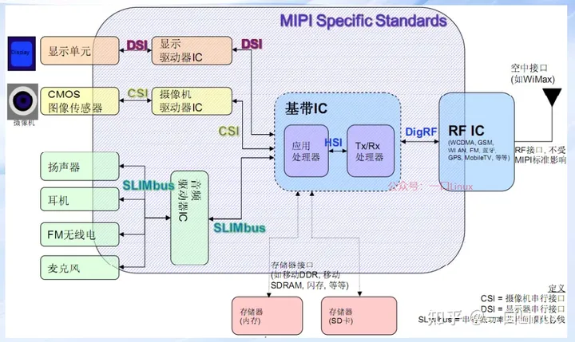
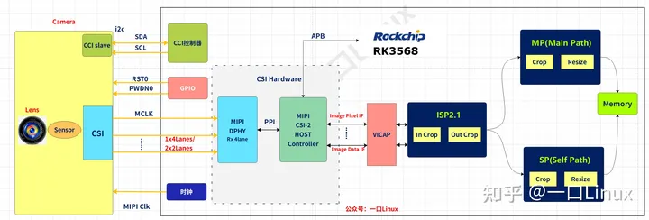

---
tags:
  - Rockchip/Camera
---
## 内部流程图
[Open: v2-2dd0e1fac7f89dc7990032585c44b61f_720w.webp](assets/RK%20camera内部模块图.webp)

1. Sensor输出数据流通过MIPI的lanes传输给rk3568的DPHY控制器
2. CSI控制器从硬件中提取出图像数据
3. VICAP从MIPI接口读取数据
4. 然后将数据传递给给ISP ，ISP 再输出经过一系列图像处理算法后得到图像。
5. MP用于预览图像
6. SP用于缩放
7. 
[Open: v2-8f62be75a571141d1d435f8172416769_720w.webp](assets/部件与MIPI协议栈的关系图.webp)

1. 通常一个camera的模组如图所示，通常包括Lens、Sensor、CSI接口等，其中CSI接口用于视频数据的传 输；
2. SoC的Mipi接口对接Camera，并通过I2C/SPI控制camera模组；
3. MIPI DPHY提供了4 Lane的Rx接口，由Sensor提供Clock，并通过四条数据Lane输入图像数据;
4. DPHY与CSI-2 Host Contrller之间通过PPI（PHY-Protocol Interface）相连，该接口包括了控制，数据，时钟等多条信号
5. CSI-2 Host Contrller通过PPI接口收到数据后进行解析，完成后通过IDI(Image Data Interface)或者IPI(Image Pixel Interface)输出到SoC的其他模块(VICAP或ISP，rk3568是送至VICAP模块)；
6. ISP将处理过的图片输出到MP主通道或SP自身通道，SP一般用来预览图片，SP图片的最大分辨率比MP低；
7. SoC通过APB Slave总线控制CSI-2 Host Contrller的相关寄存器。
## link 
- [Camera | 7.瑞芯微rk3568平台摄像头控制器MIPI-CSI驱动架构梳理 - 知乎](https://zhuanlan.zhihu.com/p/621470492)
- [Camera | 2.MIPI、CSI基础 - 知乎](https://zhuanlan.zhihu.com/p/599531271)