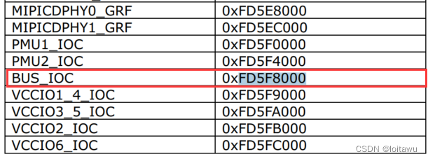

## RK3588 通过 IO 命令操作寄存器的方法
## IO 命令用法

### kernel 阶段使用的是 IO 命令来读写寄存器

```
io -v -1|2|4 -r|w [-l <len>] [-f <file>] <addr> [<value>]

    -v         Verbose, asks for confirmation
    -1|2|4     Sets memory access size in bytes (default byte)
    -l <len>   Length in bytes of area to access (defaults to
               one access, or whole file length)
    -r|w       Read from or Write to memory (default read)
    -f <file>  File to write on memory read, or
               to read on memory write
    <addr>     The memory address to access
    <val>      The value to write (implies -w)

Examples:
    io 0x1000                  Reads one byte from 0x1000
    io 0x1000 0x12             Writes 0x12 to location 0x1000
    io -2 -l 8 0x1000          Reads 8 words from 0x1000
    io -r -f dmp -l 100 200    Reads 100 bytes from addr 200 to file
    io -w -f img 0x10000       Writes the whole of file to memory

Note access size (-1|2|4) does not apply to file based accesses.
```

### uboot 阶段寄存器读写命令 MD

功能：读写内存。

```
// 读操作
md - memory display
Usage: md [.b, .w, .l, .q] address [# of objects]

// 写操作
mw - memory write (fill)
Usage: mw [.b, .w, .l, .q] address value [count]
```

读操作。范例：显示 0 x 76000000 地址开始的连续 0 x 10 个数据。

```
=> md.l 0x76000000 0x10
76000000: fffffffe ffffffff ffffffff ffffffff    ................
76000010: ffffffdf ffffffff feffffff ffffffff    ................
76000020: ffffffff ffffffff ffffffff ffffffff    ................
76000030: ffffffff ffffffff ffffffff ffffffff    ................
```

写操作。范例：对 `0x76000000` 地址赋值为 `0x1234`；

```
=> mw.l 0x76000000 0xffff1234 // 高16位有mask
=> md.l 0x76000000 0x10       // 回读
76000000: ffff1234 ffffffff ffffffff ffffffff    ................
76000010: ffffffdf ffffffff feffffff ffffffff    ................
76000020: ffffffff ffffffff ffffffff ffffffff    ................
76000030: ffffffff ffffffff ffffffff ffffffff    ................
```

## IO 命令使用环境

IO 命令需要依赖 DEVMEM，而 DEVMEM 默认是关闭的，所以导致 IO 默认无法使用，如果调试需要使用 IO 命令可以按如下修改：

```
@ubuntu:~/rk3588_android12.0/$ vim mkcombinedroot/configs/android-11.config
```

如果是 GO 的产品则需要修改：

```
@ubuntu:~/rk3588_android12.0$ vim mkcombinedroot/configs/android-11-go.config
```

删除掉下面这行：

```
# CONFIG_DEVMEM is not set
```

如果要编译 Android，则还需要修改如下代码

```diff
cd rk3588_android12.0/kernel/configs

diff --git a/android-5.10/android-base.config b/android-5.10/android-base.config
index 5de76f0..6dcdf86 100644
--- a/android-5.10/android-base.config
+++ b/android-5.10/android-base.config
@@ -2,7 +2,6 @@
 # CONFIG_ANDROID_LOW_MEMORY_KILLER is not set
 # CONFIG_ANDROID_PARANOID_NETWORK is not set
 # CONFIG_BPFILTER is not set
-# CONFIG_DEVMEM is not set
 # CONFIG_FHANDLE is not set
 # CONFIG_FW_CACHE is not set
 # CONFIG_IP6_NF_NAT is not set
diff --git a/s/android-4.19/android-base-conditional.xml b/s/android-4.19/android-base-conditional.xml
index c7de80c..fba1afa 100644
--- a/s/android-4.19/android-base-conditional.xml
+++ b/s/android-4.19/android-base-conditional.xml
@@ -17,10 +17,6 @@
 <key>CONFIG_CPU_SW_DOMAIN_PAN</key>
 <value type="bool">y</value>
 </config>
-<config>
-<key>CONFIG_DEVKMEM</key>
-<value type="bool">n</value>
-</config>
 <config>
 <key>CONFIG_OABI_COMPAT</key>
 <value type="bool">n</value>
@@ -77,10 +73,6 @@
 <value type="bool">y</value>
 </config>
 </conditions>
-<config>
-<key>CONFIG_DEVKMEM</key>
-<value type="bool">n</value>
-</config>
 <config>
 <key>CONFIG_PAGE_TABLE_ISOLATION</key>
 <value type="bool">y</value>
diff --git a/s/android-4.19/android-base.config b/s/android-4.19/android-base.config
index d2bb2ad..8f23882 100644
--- a/s/android-4.19/android-base.config
+++ b/s/android-4.19/android-base.config
@@ -2,7 +2,6 @@
 # CONFIG_ANDROID_LOW_MEMORY_KILLER is not set
 # CONFIG_ANDROID_PARANOID_NETWORK is not set
 # CONFIG_BPFILTER is not set
-# CONFIG_DEVMEM is not set
 # CONFIG_FHANDLE is not set
 # CONFIG_FW_CACHE is not set
 # CONFIG_IP6_NF_NAT is not set
diff --git a/s/android-5.10/android-base-conditional.xml b/s/android-5.10/android-base-conditional.xml
index aae1847..2dc3e25 100644
--- a/s/android-5.10/android-base-conditional.xml
+++ b/s/android-5.10/android-base-conditional.xml
@@ -17,10 +17,6 @@
 <key>CONFIG_CPU_SW_DOMAIN_PAN</key>
 <value type="bool">y</value>
 </config>
-<config>
-<key>CONFIG_DEVKMEM</key>
-<value type="bool">n</value>
-</config>
 <config>
 <key>CONFIG_OABI_COMPAT</key>
 <value type="bool">n</value>
@@ -101,10 +97,6 @@
 <value type="bool">y</value>
 </config>
 </conditions>
-<config>
-<key>CONFIG_DEVKMEM</key>
-<value type="bool">n</value>
-</config>
 <config>
 <key>CONFIG_KFENCE</key>
 <value type="bool">y</value>
diff --git a/s/android-5.10/android-base.config b/s/android-5.10/android-base.config
index d6e1f5a..d7078da 100644
--- a/s/android-5.10/android-base.config
+++ b/s/android-5.10/android-base.config
@@ -2,7 +2,6 @@
 # CONFIG_ANDROID_LOW_MEMORY_KILLER is not set
 # CONFIG_ANDROID_PARANOID_NETWORK is not set
 # CONFIG_BPFILTER is not set
-# CONFIG_DEVMEM is not set
 # CONFIG_FHANDLE is not set
 # CONFIG_FW_CACHE is not set
 # CONFIG_IP6_NF_NAT is not set
```

## RK 3588 寄存器地址查看方法

RK 3588 的寄存器可以通过芯片的 TRM 手册进行查询。寄存器的地址是有 Operational Base + offset 组成，比如 GPIO 2 C 这组 GPIO 的 iomux 寄存器的地址是：0 XFD 5 F 8000+0 X 0050=0 XFD5F8050  
寄存器的基地址在 TRM 的 Address Mapping 章节中描述

## 实例：通过 IO 命令查看 GPIO 的 iomux 状态

查看 GPIO 2 C 4 的 GPIO 的功能，可以在 TRM 中搜索 gpio 2 c 4, 等到如下信息  
GPIO 2 C 4 IOMUX 的寄存器描述如下：  


由上面搜索到的结果可以看出 GPIO 2 C 4 的 IOMUX 是属于 BUS\_IOC，所以可以继续搜 BUS\_IOC，可以得到 BUS\_IOC 的基地址：  

由上面的信息可以等到 GPIO 2 C 4 的 IOMUX 的寄存器地址为：0 XFD 5 F 8000+0 X 0054=0 XFD 5 F 8054  
通过 IO 命令读取该寄存器的值

```
rk3588_s:/ # io -4 -r 0XFD5F8054
fd5f8054:  00000000
```

## 实例：通过 IO 命令设置 GPIO 的 iomux 状态

通过 IO 命令写寄存器  
将 GPIO 2 C 4 的功能设置为 `UART9_RX_M0`

```
rk3588_s:/ # io -4 -w 0XFD5F8054 0x000a000a   //设置0XFD5F8054寄存器的值为0x000a000a   
rk3588_s:/ # io -4 -r 0XFD5F8054  //回读确认是否正确写入
fd5f8054:  0000000a
```

## Link 
- [RK3588通过IO命令操作寄存器的方法\_rk3588查看内存信息\_loitawu的博客-CSDN博客](https://blog.csdn.net/weixin_43245753/article/details/126879997)