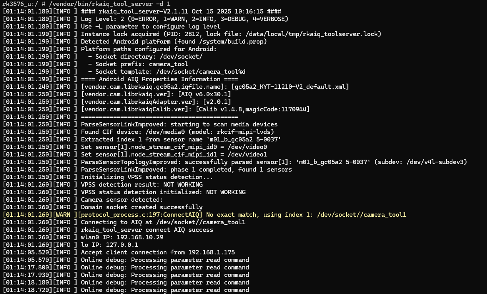

---
tags:
  - ISP/RK3576
---
## 调试准备
### 摄像头调试准备
为了定位 ISP 调试中的问题，需要准备以下摄像头资料
1. Sensor数据书手册，即SensorDatasheet ------ 模组厂or sensor FAE提供
2. 模组规格书（镜头FOV，光圈，畸变等信息）--- 模组厂提供
	1. 镜头规格书，光学设计资料
	2. 马达驱动 IC 规格书确定
	3. 马达规格书
3. Sensor 初始化寄存器序列------sensor FAE 提供
4. Sensor 曝光（gain/time）配置公式-------sensor datasheet or sensor FAE
5. 模组靶向尺寸

### ISP 调试实验设备
摄像头标定需要以下实验设备
1. BLC 模块标定器材：镜头盖/遮光黑布
2. 包含 7 个标定光源 (HZ、A、CWF、TL 84、D 50、D 65、D 75) 及至少 1 个可调节亮度的光源
3. LSC 摸块标定器材：Diffuser (将有图层的一面朝向镜头)
4. CCM/AWB 模块标定器材：爱色丽 24 色色卡
5. NR 模块标定器材：噪声标定卡

## 认识调试概览
### ISP39 pipeline
从摄像头采集到 ISP，要经过如下流程


| 模块名称缩写   | 模块名称                        |
| -------- | --------------------------- |
| BLC      | 黑电平校正                       |
| LSC      | 镜头阴影校正                      |
| CCM      | 色彩校正矩阵                      |
| AWB      | 自动白平衡校正                     |
| GIC      | 绿通道平衡校正（标定集成在 Bayer NR 模块内） |
| Bayer NR | Raw 域降噪                     |
| YNR      | Y 通道降噪                      |
| FEC/LDCH | 鱼眼校正/水平镜头畸变校正               |
## 调试过程
在开发板中运行设置为 **非紧凑模式抓 raw 图**，然后运行 `rkaiq_tool_server` 设备端服务程序 和 
### PC 端运行 RKISPTuner
参考《Rockchip_IQ_Tools_Guide_ISP 33_ISP 39_CN_v 3.0.2. pdf》 PC 端环境准备

### Android 板端
> - RK3576 Android14 RK7 之后，会因为缺少 IQ 文件无法打开 Android 相机应用
> - Rockchip ISP 调试需要非紧凑型高位补零小端存储模式的raw图

## buildroot 端调试
1. 查看 AIQ 版本
```prompt:bash
strings buildroot/output/rockchip_rk3576/target/usr/lib/librkaiq.so | grep "AIQ v"
# 输出的为 16 进制
```

### 运行 rkaiq_tool_server 
```bash
adb root
# 关闭 SElinux，selinux 会阻止 socket 节点生成导致连不上 aiq
setenforce 0

# 杀掉 android.hardware.camera.provider-V1-external-service-rk android.hardware.camera.provider-V1-service 

ps -A | grep cam # 找到进程号，然后用 kill -9 命令

# 设置为 非紧凑型高位补零小端存储模式的raw图
echo 0 > /sys/devices/platform/rkcif-mipi-lvds/compact_test

ls /dev/socket/ | grep cam # 需要输出不为空

# 使用 media-ctl -d /dev/mediaX # X=0,1,2,3 找到摄像头 sensor index
# 先打开相机，后运行 rkaiq_tool_server 
rkaiq_tool_server -d 1 # 1 为 
```

### 正常启动时的打印


## 调试信息查看
1. 查看 Bayer 格式： `media-ctl -p -d /dev/media0`
2. 

以下是部分 RAW 的种类

## link
- 环境搭建：《Rockchip_IQ_Tools_Guide_ISP33_ISP39_CN_v3.0.2. pdf》
- ISP 参数说明、效果优化：《Rockchip_Color_Optimization_Guide_ISP39_ISP33_CN_v1.2.0. pdf》
- [ISP基本框架及算法介绍-腾讯云开发者社区-腾讯云](https://cloud.tencent.com/developer/article/2093349)
- [瑞芯微平台isp调试 rkisp - 知乎](https://zhuanlan.zhihu.com/c_1931041417771323624)
- [ISP API Tuning SOP - SigmaStarDocs](https://wx.comake.online/doc/DD22dk2f3zx-SSD21X-SSD22X/customer/development/software/Px/zh/camera/ISP%20API%20tuning%20SOP.html)


## FIQ
- ISP 没有 spec
### ISP 调试工具下载  
#### 手动调试工具
FTP地址：`ftp://ftp.rock-chips.com/ISP39/`  
```
账号：RKISP_Tuner_Release_Guest
密码：gL4@eW3!sK8+
```
文件：  
- ISP39/RKISP_Tuner_v3.3.7_Test. rar  
- ISP39/RK3576B/
- ISP39/Doc
### capture tool 抓图超时
> Waiting for a response timeout!! > 3s

抓图时，需要关闭相机和 `rkaiq_3A_server`

### AWB 标定报错
> INFO (AWB): Color chart infomation does not match
> ERROR (AWB): Please calibrate AWB parameter at first!

- 拍 raw 图时，查看 2 个 roi  色卡最亮的值
-  24色块的亮度值要不能小于 blc 值 $+3$ （8bit计算）