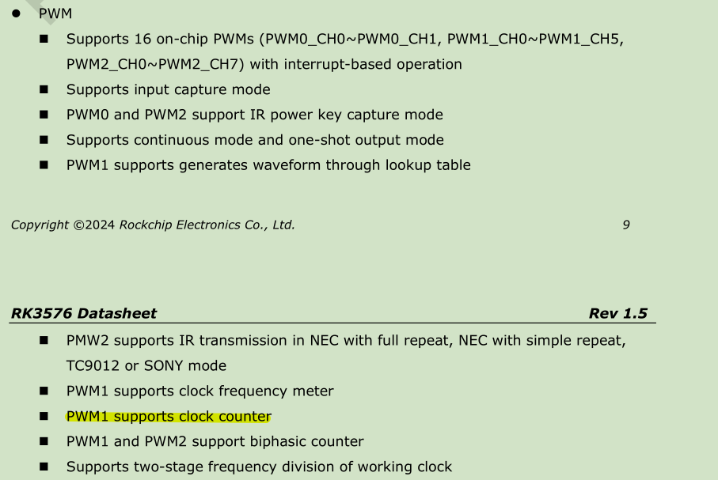
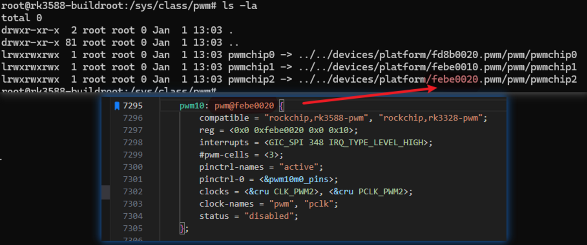

---
tags:
  - PWM/RK3576
---
## 从 Rockchip 文档了解基本情况
1. 从 datasheet 了解 pwm 功能支持


2. 从《Rockchip_Developer_Guide_Linux_PWM_CN. pdf》了解测试方法
```shell
echo counter 1 3 io 1000 > /dev/pwm_rockchip_misc_test
echo help > /dev/pwm_rockchip_misc_test
```

pwm_rockchip_misc_test dts 配置示例： `kernel-6.1/arch/arm64/boot/dts/rockchip/rk3576-pwm-test.dtsi`

## 调试记录
查找 pwmchip 对应关系

