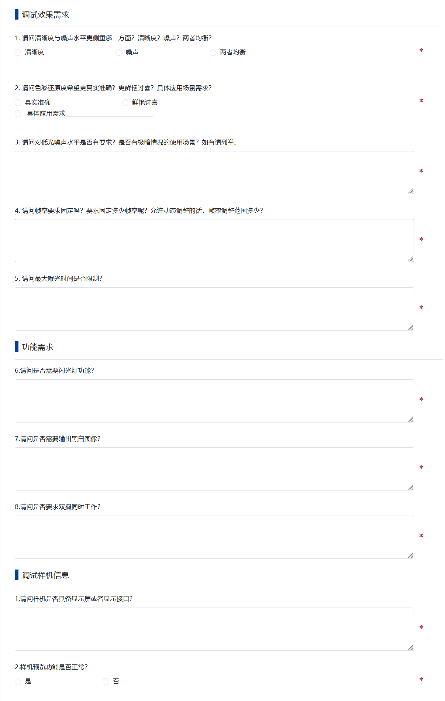
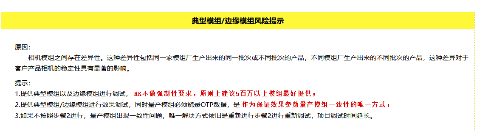

---
tags:
  - ISP/RK3576
---
## 调试效果需求
1. 请问清晰度与噪声水平更侧重那一方面？清晰度？噪声？两者均衡
- [ ] 清晰度
- [ ] 噪声
- [ ] 两者均衡

2. 请问色彩还原度希望更真实准确？更鲜艳讨喜？具体应用场景需求
- [ ] 真实准确
- [ ] 鲜艳讨喜
- [ ] 具体应用需求

3. 请问对低光噪声水平是否有要求? 是否有极暗情况的使用场景? 如有请列举。
4. 请问顿率要求固定吗？ 要求固定多少顿率呢？ 允许动态调整的话。帧率调整范围多少？
5. 请问最大曝光时间是否限制?

## 功能需求
6. 请问是否需要闪光灯功能?
7. 请问是否需要输出黑白图像?
8. 请问是否要求双摄同时工作?

## 调试样机信息
1. 请问样机是否具备显示屏或者显示接口?
2. 样机预览功能是否正常?

