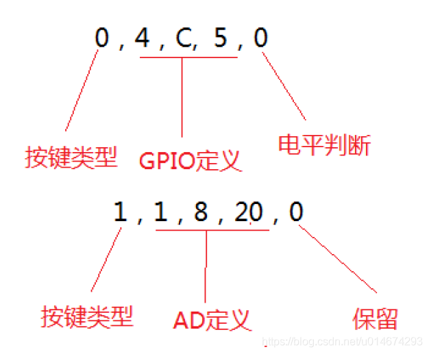

# parameter. txt 文件详解

parameter. txt 路径确定
```shell:device/rockchip/common/mkimage.sh
# device/rockchip/common/mkimage.sh
# echo system filesysystem is $FSTYPE

BOARD_CONFIG=device/rockchip/common/device.mk

PARAMETER=${TARGET_DEVICE_DIR}/parameter.txt
FLASH_CONFIG_FILE=${TARGET_DEVICE_DIR}/config.cfg
```


## 概述

Rockchip android 系统平台使用 parameter 文件来配置一些系统参数，比如定义[串口](https://so.csdn.net/so/search?q=%E4%B8%B2%E5%8F%A3&spm=1001.2101.3001.7020)号，固件版本，nand flash 分区信息等等。

Parameter 文件是非常重要的系统配置文件，最好在能了解清楚各个配置功能的时候再做修改，避免出现 parameter 文件配置异常造成系统不能正常工作的问题。

Parameter 文件大小有限制，最大不能超过64KB。

由于 Parameter 的参数是由 Bootloader 解析的，所以本文列出来的参数不一定适用于旧版本的 bootloader。

## parameter 分析

**FIRMWARE\_VER: 8.1**

    固件版本，打包update.img 用到。升级工具据此识别固件版本。

    Bootloader 会读取这个版本传递给 kernel 使用。

**MACHINE\_MODEL: RK3399**

    机型，打包 update.img 用到，不同的项目，可以自己修改，用于升级工具显示。

**MACHINE\_ID: 007**

    产品 ID ，为数字或者字母组合，打包update.img使用，不同的项目使用不同的ID。可以用于识别机器机型。

**MANUFACTURER: RK3399**

    厂商信息，打包 updata.img 使用，可以自己修改，用于升级工具显示。

**MAGIC: 0x5041524B**

    无法修改

**ATAG: 0x00200800**

    无法修改，内核识别用。

**MACHINE: 3399**

    内核识别用，不能修改

**CHECK\_MASK: 0x80**

    内核识别用，无法修改。

**COMBINATION\_KEY：0，4，C，5，0**  
    按键定义说明：



按键类型为：0 = 普通按键，1 = AD 按键

GPIO 定义：上例中定义的是 GPIO 4 C5

判断电平：0 = 低电平，1 = 高电平

AD 定义（通道，下限值，上限值）：上例中，1 表示 ADC 通道 1，8 表示下限值为 80，20 表示上限值为 200，也就是 AD 值在 80~200 内的按键都认为是 COMBINATION\_KEY。

Combination 按键定义，可以定义多个，用户可以根据实际机型定义按键。

功能说明：

1.  按住 recovery 按键并接 USB 开机，进 loader rockusb 升级模式。
2.  按住 recovery 按键不接 USB 开机，3S 左右会引导 recovery.img。
3.  按住 combination 按键开机，会引导 recovery.img，进 Android 的 recovery 模式，用户可以根据菜单选择操作。

PWR\_HLD:0,0,C,7,1 //控制 GPIO0C7 输出高电平  
PWR\_HLD:0,0,C,7,2 //控制 GPIO0C7 输出低电平  
PWR\_HLD:0,0,A,0,3 //配置 PWR\_HLD 为 GPIO0A0,在 Loader 需要锁定电源时,输出高电平锁定电源  
最后一位是电平判断，解释:  
1:= 解析 parameter 时,输出高电平  
2:= 解析 parameter 时,输出低电平  
3:= 在 Loader 需要控制电源时,输出高电平  
0:= 在 Loader 需要控制电源时,输出低电平

**PWR\_HLD: 0,0,A,0,1**  
这里是控制 GPIO0 A0 输出高电平

**#KERNEL\_IMG: 0x00280000**

    内核地址，bootloader 会将内核加载到此地址，如果 kernel 编译地址改变，需要修改此值。

**#FDT\_NAME: rk-kernel.dtb**

## CMDLINE:

**androidboot.baseband=N/A**

**androidboot.selinux=permissive(关闭) ---- enforcing(打开)**

    安全强化Linux是否打开

**androidboot.hardware=rk30board**

    硬件平台

**androidboot.console=ttyFIQ0**

    串口定义

**init=/init**

**initrd=0x62000000,0x00800000**

    第一个参数是boot.img 加载到 sdram 的位置，第二个参数为 ramdisk 的大小，目前 ramdisk 的大小没有限制。  
 

## MTD分区：

    RK30xx，RK29xx，RK292x 都是用 rk29xxnand 做标识mtdparts=rk29xxnand:0x00002000@0x00002000(uboot),0x00002000@0x00004000(trust),0x00002000@0x00006000(misc),0x00008000@0x00008000(resource),0x00008000@0x00010000(kernel),0x00010000@0x00018000(boot),0x00010000@0x00028000(recovery),0x00038000@0x00038000(backup),0x00040000@0x00070000(cache),0x00200000@0x000B0000(system),0x00008000@0x002B0000(metadata),0x00002000@0x002B8000(baseparamer),-@0x002BA000(userdata)  
 

@符号前是分区的大小  
@符号后是分区的起始地址  
括号中是分区的名字  
单位都是 sector（512Bytes）  
比如 uboot 起始地址为 0x2000 sectors （4MB）的位置，大小为 0x2000 sectors（4M）  
另外 flash 最大的 block 是 4M（0x2000 sectors），所以每个分区需要 4MB 对齐，即每个分区必须为 4MB 的整数倍。

,0x00038000@0x00038000(backup)  
backup 分区前的分区为固件区 uboot、trust、misc、resource、kernel、boot、recovery 。  
后续升级时不能修改分区大小  
backup 分区后的分区 cache、system、metadata、baseparamer、userdata  
是可以读写的，可以调整分区大小。但是修改分区大小后需要进入 recovery 系统格式化 cache

# Link
[https://blog.csdn.net/kris\_fei/article/details/80805080](https://blog.csdn.net/kris_fei/article/details/80805080)