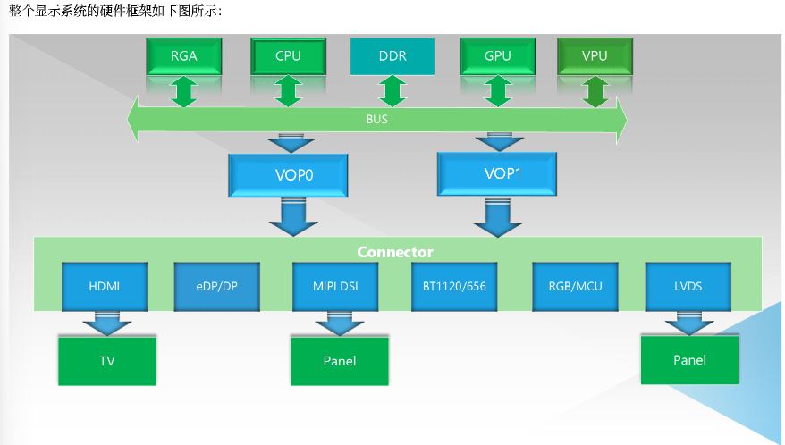
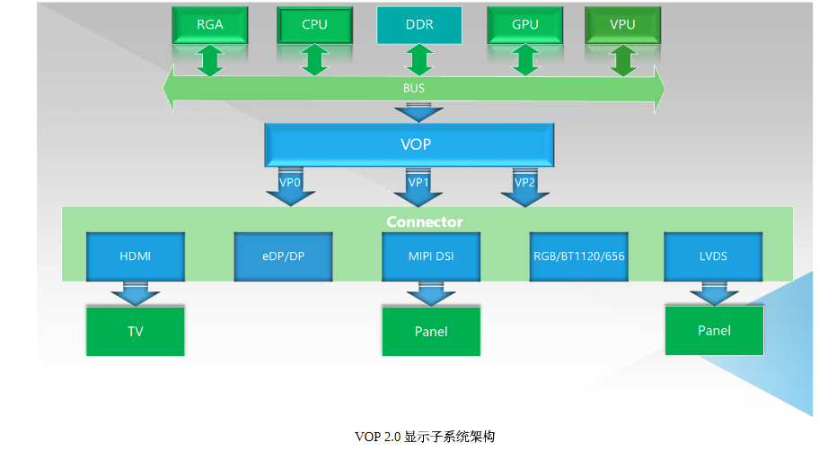

# Rockchip 显示子系统
- VOP是从存储器帧缓冲区到显示设备的显示接口, 是显示单元用来显示图像（比如输入NV12,RGB的Buffer，显示到屏幕）
- 显示子系统是 Rockchip 平台显示输出相关软硬件系统的统称
- 显示子系统包括：
	- VOP（老的平台叫 LCDC）
	- RGA：图像数据进行缩放，旋转，合成等 2D 处理
	- VPU：高效的进行视频解码
	- BT1120
	- BT656
	- I8080 （MCU 显示接口）
	- 信号输出模块
		- LVDS
		- MIPI DSI
		- EDP
		- DP
		- HMDI

-   多 VOP 的方式来实现多屏幕显示
- 一个 VOP 在同一时刻只能输出一路独立的显示时序，驱动一个屏幕显示独立的内容

- VOP 的后端设计了多路独立的 Video Port (简称 VP) 输出接口，这些 VP 能够同时独立工作，并且输出相互独立的显示时序
- 在上面的 VOP 2.0 框图中，有三个 VP，就能同时实现三屏异显

> [!info] 模块处理
> 经过这些图像加速模块处理后的数据会存放在 DDR 中，然后由 VOP 读取，根据应用需求进行 Alpha 叠加，颜色空间转换，gamma 矫正，HDR 转换等处理后，再发送到对应的显示接口模块（HDMI/DP/DSI/RGB/LVDS）, 这些接口模块会把接收到的数据转换成符合各自协议的数据流，发送到显示器或者屏幕上，呈现在最终用戶眼前。

## Link
-  `docs/Common/DISPLAY/Rockchip_Developer_Guide_DRM_Display_Driver_CN.pdf`