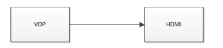

# VOP
-  VOP（Video Output Processor） 又指 SoC 的 LCDC 模块
	1. 成图层渲染
	2. 色彩信号转换（YUV - > RGB）
	3. LCDC Timing 输出

## 绑定 VOP
在 Rockchip 的各个平台中，各种显示接口（HDMI、DP、CVBS 等）输出的图像数据来自于 VOP


dts 中显示设备节点打开时，显示接口对应 VOPB 和 VOPL 的 ports 都会打开，所以需要关闭用不到的那个 VOP 对应的 port

## 开机 logo
如果 U-Boot logo 未开启，那 kernel 阶段也无法显示开机 logo，只能等到系统启动后才能看到应用显示的图像。在 dts 里面将 route_hdmi 使能即可打开 U-Boot logo 支持：
```c
&rotte_hdmi {
status = "okay";
};
```
在双 VOP 的平台，需要注意下方代码中的 connect 指定的 VOP 必须要与 HDMI 绑定的 VOP 一致（详见 3.1.2），否则可能出现花屏等问题
```c
route_hdmi: route-hdmi {
	status = "disabled";
	logo,uboot = "logo.bmp";
	logo,kernel = "logo_kernel.bmp";
	logo,mode = "center";
	charge_logo,mode = "center";
	connect = <&vopb_out_hdmi>;
	};
```