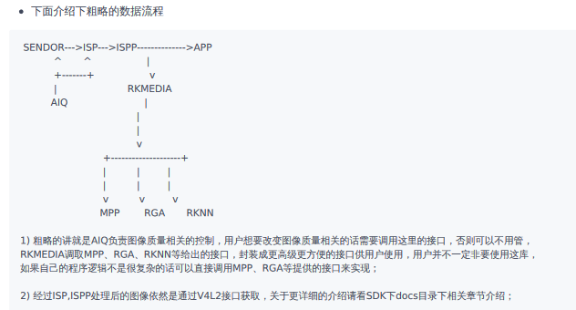

# rockchip 名词释义

## Rockchip提供的主要软件包

| 部分模块代码目录路径 | 模块功能描述 |
| --- | --- |
| external/recovery | recovery |
| external/rkwifibt | Wi-Fi和BT |
| external/libdrm | DRM接口 |
| external/rk\_pcba\_test | external/rk\_pcba\_test |
| external/isp2-ipc | 图像信号处理服务端 |
| external/mpp | 编解码代码 |
| external/rkmedia | Rockchip多媒体封装接口 |
| external/rkupdate | Rockchip升级代码 |
| external/camera\_engine\_rkaiq | 图像处理算法模块 |
| external/rknpu | NPU驱动 |
| external/rockface | 人脸识别代码 |
| external/CallFunIpc | 应用进程间通信代码 |
| external/common\_algorithm | 音视频通用算法库 |
| external/rknn-toolkit | 模型转换、推理和性能评估的开发套件 |
| app/libIPCProtocol | 基于dbus，提供进程间通信的函数接口 |
| app/mediaserver | 提供多媒体服务的主应用 |
| app/ipc-daemon | 系统守护服务 |
| app/dbserver | 数据库服务 |
| app/netserver | 网络服务 |
| app/storage\_manager | 存储管理服务 |
| app/ipcweb-backend | web后端 |
| app/librkdb | 数据库接口 |
| app/ipcweb-ng | web前端，采用Angular 8框架 |

## RK平台中的几个概念和他们之间的关系

| 概念 | 说明 |
| --- | --- |
| rkmedia | RK平台上将音视频编解码缩放，网络推流本地录像，AI识别等集成在一起的一个库 |
| easymedia | 就是上面的rkmedia编译生成的库，可以认为是一个东西 |
| mpp | RK平台上的硬件编解码组件 |
| RGA | RK平台上独有的一个组件，用来进行2D图像的格式转换，缩放，合成等，底层由硬件IP实现 |
| RKNN | RK平台上NPU相关组件和工具，底层由硬件IP NPU支持，可用来加载用户指定的模型，并高速运算 |
| ISP | 负责处理sensor出来的原始图像 |
| ISPP | 负责处理对图像进行降噪等处理 |
| AIQ | 负责从sensor搬运数据到ISP,从ISP搬运数据到ISPP等，还负责从ISP读取统计数据并进行曝光控制策略等 |

## 摄像头视频数据的流程

1.  粗略的讲就是AIQ负责图像质量相关的控制，用户想要改变图像质量相关的话需要调用这里的接口，否则可以不用管，  
    RKMEDIA调取MPP、RGA、RKNN等给出的接口，封装成更高级更方便的接口供用户使用，用户并不一定非要使用这库，  
    如果自己的程序逻辑不是很复杂的话可以直接调用MPP、RGA等提供的接口来实现；
    
2.  经过 ISP, ISPP 处理后的图像依然是通过 V4L2 接口获取，关于更详细的介绍请看 SDK 下 docs 目录下相关章节介绍。

## 设备分区

| 分区 | 对应文件 | 说明 |
| --- | --- | --- |
| loader | rockdev/Miniloader | 由u-boot下rkbin等文件合成，一级引导，负责初始化DDR等，一般不需要改变 |
| parameter | rockdev/parameter.txt | 从device/rockchip/rv1126\_rv1109拷贝过来或者软链接过来，这里面主要保存着CMDLINE参数，包含分区信息，rootfs挂载信息等，传给内核，如果需要改变分区布局的话，可以修改这个文件 |
| u-boot | rockdev/u-boot.bin | 由u-boot目录拷贝而来或者软链接过来 |
| boot/kenel | rockdev/boot.img | 由kernel目录下zboot.img软链接过来 |
| misc | rockdev/misc.img | 记录系统状态辅助完成升级流程等，非必须 |
| recovery | rockdev/recovery.img | 负责系统升级等，非必须 |
| rootfs | rockdev/rootfs.img | 由buildroot下面软链接过来，根文件系统 |
| oem | rockdev/oem.img | 来自buildroot或者device/rockchip,主要放有些RK原厂的库，脚本和可执行文件 |
| userdata | rockdev/userdata.img | 用来存放用户数据，非必须 |

## SDK 目录说明

buildroot：定制根文件系统。  
app：存放上层应用程序。  
external：相关库，包括音频、视频等。  
kernel：kernel代码。  
device/rockchip：存放每个平台的一些编译和打包固件的脚本和预备文件。  
docs：存放开发指导文件、平台支持列表、工具使用文档、Linux 开发指南等。  
prebuilts：存放交叉编译工具链。  
rkbin：存放固件和工具。  
rockdev：存放编译输出固件。  
tools：存放一些常用工具。  
u-boot：U-Boot代码。

## linux 设备常用缩略语

| 缩略语 | 英文全称 | 解释 |
| --- | --- | --- |
| ARM | Advanced RISC Machine | 高级精简指令集计算机 |
| CAN | Controller Area Network | 控制器局域网络 |
| CEC | Consumer Electronics Control | 消费电子控制 |
| CIF | Camera Input Format | 相机并行接口 |
| CPU | Central processing unit | 中央处理器 |
| CSI | Camera Serial Interface | 相机串行接口 |
| DC/DC | Direct current-Direct current converter | 直流/直流变换器 |
| DDR | Double Data Rate | 双倍速率同步动态随机存储器 |
| DP | DisplayPort | 显示接口 |
| DSI | Display Serial Interface | 显示串行接口 |
| EBC | E-book controller | 电子书控制器 |
| eDP | Embedded DisplayPort | 嵌入式数码音视讯传输接口 |
| eMMC | Embedded Multi Media Card | 内嵌式多媒体存储卡 |
| ESD | Electro-Static discharge | 静电释放 |
| ESR | Equivalent Series Resistance | 等效电阻 |
| Flash\_VOL\_SEL | Flash voltage selection | eMMC/Nand Flash IO电压选择 |
| FSPI | Flexible Serial Peripheral Interface | 灵活串行外设接口 |
| GPU | Graphics Processing Unit | 图形处理单元 |
| HDMI | High Definition Multimedia Interface | 高清晰度多媒体接口 |
| HPD | Hot Plug Detect | 热插拔检测 |
| I2C | Inter-Integrated Circuit | 内部整合电路(两线式串行通讯总线) |
| I2S | Inter-IC Sound | 集成电路内置音频总线 |
| ISP | Image Signal Processing | 图像信号处理 |
| JTAG | Joint Test Action Group | 联合测试行为组织定义的一种国际标准测试协议（ IEEE 1149.1兼容） |
| LDO | Low Drop Out Linear Regulator | 低压差线性稳压器 |
| LCDC | LCD Controller | LCD 控制器并行接口 |
| LCM | LCD Module | LCD显示模组 |
| LVDS | Low-Voltage Differential Signaling | 低电压差分信号 |
| MAC | Media Access Control | 以太网媒体接入控制器 |
| MIPI | Mobile Industry Processor Interface | 移动产业处理器接口 |
| NPU | Neural network Processing Unit | 神经网络处理器 |
| PCB | Printed Circuit Board | 印制电路板 |
| PCIe | Peripheral Component Interconnect-express | 外设组件互联标准 |
| PCM | Pulse Code Modulation | 脉冲编码调制 |
| PDM | Pulse density modulation | 脉冲密度调制 |
| PLL | Phase-locked loop | 锁相环 |
| PMIC | Power Management IC | 电源管理芯片 |
| PMU | Power Management Unit | 电源管理单元 |
| PWM | Pulse width modulation | 脉冲宽度调制 |
| QSGMII | Quad Serial Gigabit Media Independent Interface | 四串行千兆媒体独立接口 |
| RGB | RGB color mode is a color standard in industry | RGB色彩模式, 是工业界的一种颜色标准 |
| GMAC | Gigabit Media Access Controller | 千兆媒体访问控制器 |
| RGMII | Reduced Gigabit Media Independent Interface | 简化千兆媒体独立接口 |
| RMII | Reduced Media Independent Interface | 简化媒体独立接口 |
| SARADC | successive approximation register Analog to digital converter | 逐次逼近寄存器型模数转换器 |
| SATA | Serial Advanced Technology Attachment | 串行高级技术附件 |
| SCR | Smart Card Reader | 智能卡读卡器 |
| SD Card | Secure Digital Memory Card | 安全数码卡 |
| SDIO | Secure Digital Input and Output Card | 安全数字输入输出卡 |
| SDMMC | Secure Digital Multi Media Card | 安全数字多媒体存储卡 |
| SGMII | Serial Gigabit Media Independent Interface | 串行千兆媒体独立接口 |
| SPDIF | Sony/Philips Digital Interface Format | SONY、 PHILIPS数字音频接口 |
| SPI | Serial Peripheral Interface | 串行外设接口 |
| SubLVDS | Sub- Low-Voltage Differential Signaling | 低摆幅差分信号技术 |
| TF Card | Micro SD Card(Trans-flash Card) | 外置记忆卡 |
| TSADC | Temperature sensing A / D converter | 温度感应模数转换器 |
| UART | Universal Asynchronous Receiver / Transmitter | 通用异步收发传输器 |
| VOP | Video Output Processor | 视频输出处理器 |
| VPU | Video Processing Unit | 视频处理器 |
| USB2.0 | Universal Serial Bus 2.0 | 通用串行总线 |
| USB3.0 | Universal Serial Bus 3.0 | 通用串行总线 |

## 摄像头相关名称

| 名词 | 解释 |
| --- | --- |
| 3A | 指自动聚焦(AF)，自动曝光(AE)和自动白平衡(AWB)算法，或者由RK提供的3A算法动态链接库 |
| Async Sub Device | 指在Media Controller结构下的异步注册的V4L2子设备，如Sensor、MIPI DPHY |
| Bayer Raw | 也写成Raw Bayer，指设备(Sensor或ISP)输出的如RGGB、BGGR、GBRG、GRBG等帧格式 |
| Camera | 泛指由Rockchip芯片中的VIP或ISP及其连接的Sensor，以及他们驱动共同组成的完整系统 |
| CIF | 指RK芯片中的VIP模块，用以接收Sensor数据并保存到Memory中，仅转存数据，无ISP功能 |
| DVP | 一种并行数据传输接口，即Digital Video Port |
| Entity | 指Media Controller框架下的各节点 |
| FCC、FourCC | 指Four Character(FCC) codes，是Linux Kernel中用4个字符表示的图像格式 |
| HSYNC | 指DVP接口的行同步信号 |
| ISP | Image Signal Processing，用以接收并处理图像。本文中既指硬件本身，也泛指ISP驱动 |
| IOMMU | Input-Output Memory Management Unit，指Rockchip系列芯片中的IOMMU模块，用于将物理上分散的内存页映射成CIF、ISP可见的连续内存。本文中既指硬件本身，也泛指IOMMU驱动 |
| IQ | Image Quality，指为Bayer Raw Camera调试的IQ xml，用于 3A tunning |
| Media Controller | Linux kernel的一种媒体框架，主要用于拓扑结构的管理 |
| MIPI-DPHY | 指MIPI-DPHY协议，或Rockchip芯片中符合MIPI-DPHY协议的控制器 |
| MP | 即Main Path，指Rockchip ISP驱动的一个输出节点，可输出高分辨率图像，一般用来拍照，抓取Raw图 |
| PCLK | 指Sensor输出Pixel Clock |
| Pipelin | 本文指Media Controller的各个Entity相互连接形成的链路 |
| RKCIF | 指CIF的驱动名称 |
| RKISP1 | 指ISP驱动的名称 |
| SP | 即Self Path，指Rockchip ISP驱动的一个输出节点，最高只能输出1080p分辨率 |
| Userspace | 即Linux 用户空间(相对于Linux内核空间) |
| V4L2 | 即Video4Linux2，Linux kernel的视频处理模块 |
| VIP | 在Rockchip芯片中，即Video Input Processor，曾作为CIF的别名 |
| VSYNC | 指DVP接口的场同步信号 |