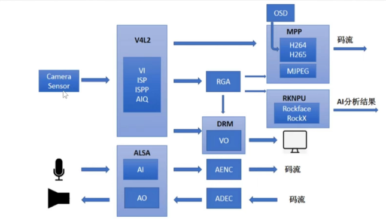

---
tags:
  - RKMedia
---
## 支持功能
1. VI： 输入视频捕获
2. VO：视频输出显示
3. VENC：H.265/H.264/JPEG/MJPEG 编码
4. VDEC：H.265/H.264/JPEG/MJPEG 解码
5. RGA 视频处理：旋转、缩放、裁剪
6. AO：音频输出
7. AENC：音频编码
8. ADEC：音频解码
9. MD：移动侦测
10. OD：遮挡侦测

## 系统架构
