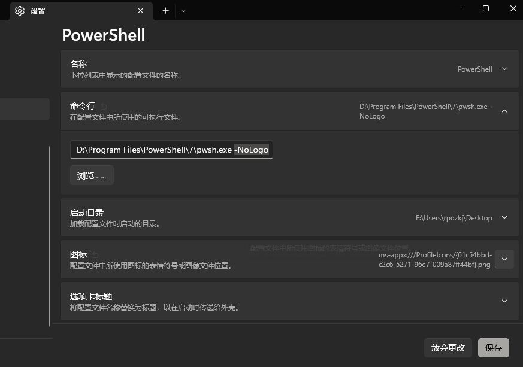

# powershell 安装
### 安装 powershell 最新版：
```powershell
winget install Microsoft.PowerShell
```
### 安装 oh-my-posh: 
```powershell
winget install JanDeDobbeleer.OhMyPosh
```
### 安裝 oh-my-posh 模組: 
```powershell
Install-Module oh-my-posh -Scope CurrentUser -Force
```
### 更新 oh-my-posh：
```powershell
Update-Module oh-my-posh
```
### 安裝 [Terminal-Icons](https://github.com/devblackops/Terminal-Icons) 模組： 
```powershell
Install-Module -Name Terminal-Icons -Repository PSGallery -Force
```

### 安装 
```shell
Install-Module PSCompletions -Scope CurrentUser
```
### 安裝 [PSReadLine](https://github.com/PowerShell/PSReadLine) 模組：
```powershell
Install-Module PSReadLine -AllowPrerelease -Force
```
- 安裝 [Nerd Fonts](https://github.com/ryanoasis/nerd-fonts/) 字型檔：CascadiaCode. zip（CaskaydiaCove Nerd Font Mono）
- 静默启动：添加 `-NoLogo` 启动参数


## 新建配置文件
> [!tip] $PROFILE  修改
> ```powershell
> New-ItemProperty 'HKCU:\SOFTWARE\Microsoft\Windows\CurrentVersion\Explorer\User Shell Folders' Personal -Value "%UserProfile%\.config"  -Type ExpandString -Force
> ```

```powershell
[System.IO.Directory]::CreateDirectory([System.IO.Path]::GetDirectoryName($PROFILE))

if (-not (Test-Path -Path $PROFILE -PathType Leaf)) {
  New-Item $PROFILE -Force
}
```
PROFILE 配置文件： [Microsoft.PowerShell_profile](assets/Microsoft.PowerShell_profile.ps1)
- 查看 `PROFILE`: `$profile | select *`
- [powershell - Is it possible to change the default value of $profile to a new value? - Stack Overflow](https://stackoverflow.com/questions/5095509/is-it-possible-to-change-the-default-value-of-profile-to-a-new-value) 
- [windows - Change the Powershell $profile directory - Server Fault](https://serverfault.com/questions/195397/change-the-powershell-profile-directory)

## 设置脚本可执行
```powershell
# 打开管理员终端
Set-ExecutionPolicy -Scope CurrentUser
# 选择 RemoteSigned
```
# Link
* [powershell 安装](https://blog.miniasp.com/post/2021/11/24/PowerShell-prompt-with-Oh-My-Posh-and-Windows-Terminal)

# 示例


![[powershell配置]]