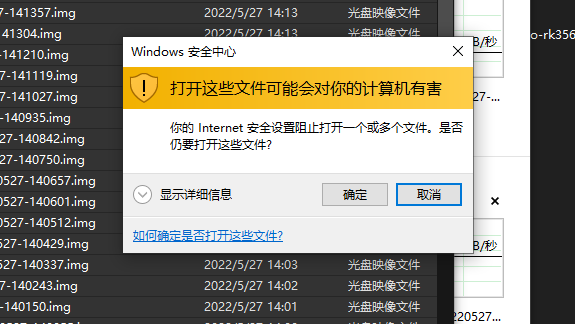

# 打开这些文件可能会对你的计算机有害

1. 打开“控制面板”->“INTERNET 选项”->“安全”选项卡；
2. 点中间的“本地 Intranet”，再点右边的“站点”；
3. 弹出“本地 Intranet”窗口，点下边的“高级”，会再弹一个窗口，用于输入网址或者 IP；
4. 输入对方的 IP（这里是我的路由的 IP），点“添加”就可以了。（可以用`*`号，如：`192.168.1.*`，就代表整个段了）

  
