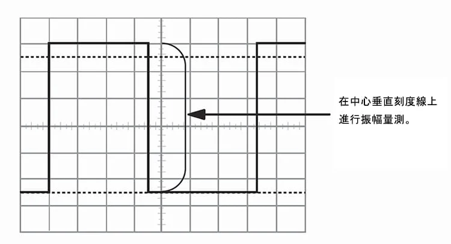
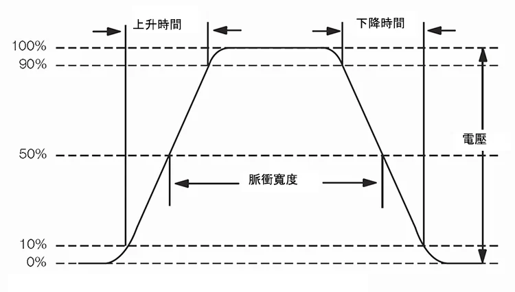

# 示波器调节
* 使用的展示区域越多，读取的测量值就准确

# 脉冲测量
## 脉冲上升时间测量
* 上升时间是指脉冲从低电压上升到高电压所需的时间
* 依照惯例，上升时间是从低脉冲全电压的 $10\%$ 到 $90\%$ 进行测量，是为了消除脉冲转换角度的任何不规则性
## 脉冲宽度测量
* 脉冲宽度是脉冲从最低到最高再回到最低所需的时间
* 依照惯例，脉冲宽度是在全电压的$50\%$处进行测量
