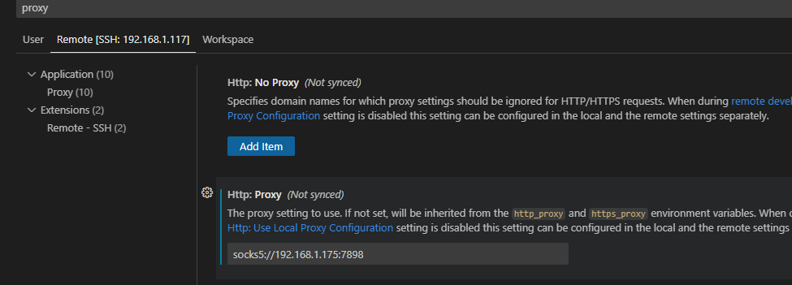

---
tags:
  - Vscode
---
## vscode 开发，远程服务器走代理


- 需要选择 Remote 的配置

## json 配置
- 使用 Ctrl+Shift+P 打开 Open Remote Settings 添加代理信息
```json
"http.proxy": "http://192.168.1.xxx:7899",
"http.proxyStrictSSL": false,
```